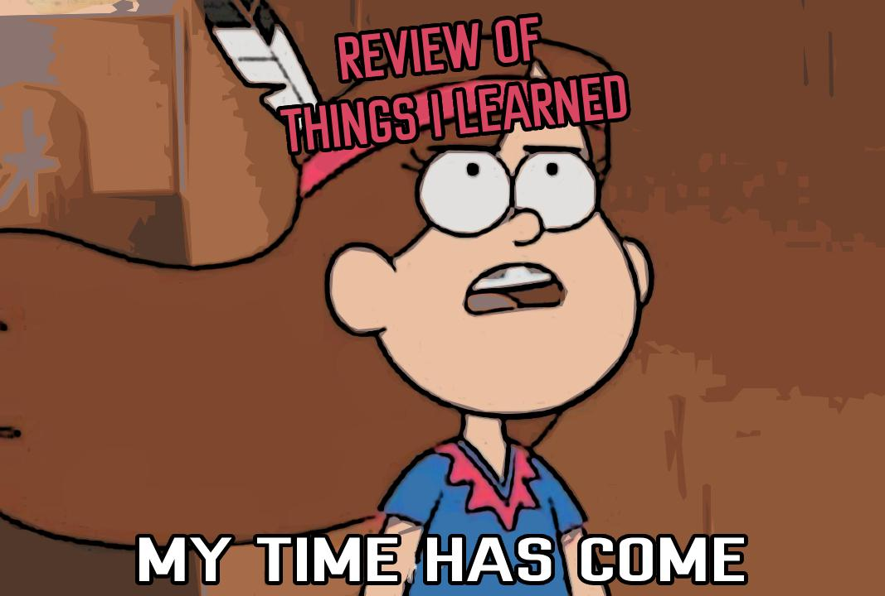
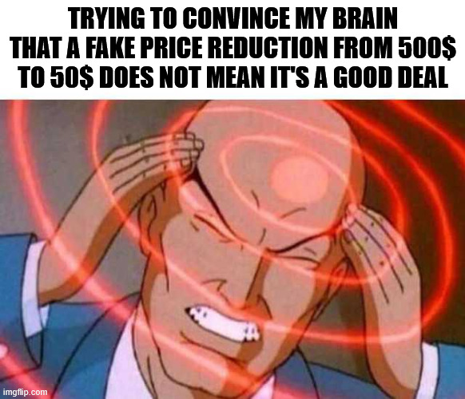
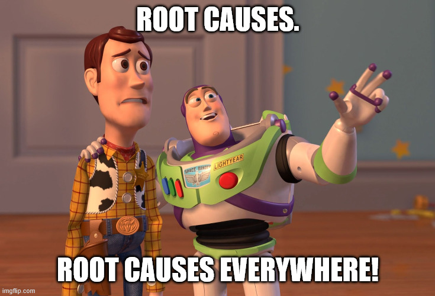
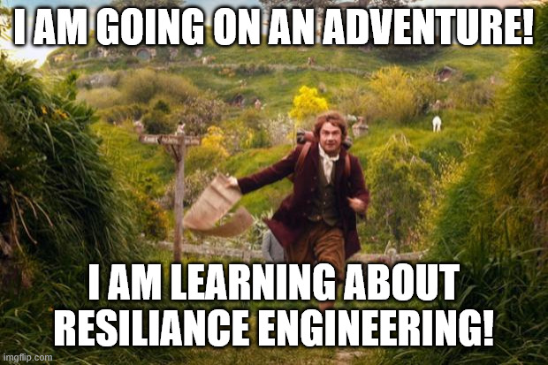

+++
title = 'Five Learnings from 2025'
date = 2025-12-26T22:41:21+02:00
lastmod = 2025-12-27T08:51:00+02:00
description = "Looking back at 2025 and the five personal learnings that shaped it for me"
draft = false
tags = ["growth", "learning", "incidents", "discovery", "ai", "biases"]
author = "bjoern"
comment = false
toc = true
image = "2025_learnings_cover.jpg"
+++

With 2025 closing, it is time to take a look back. 
One of my favourite activities over the holidays is to reflect on what I have learned in the past year. 
And if there is one thing we all love more than learning new things, it is learning new things through a list!

Let's dive together into my five favourite learnings from 2025. 
I don't claim these to be original thoughts that you haven't seen elsewhere - In fact, I think the best learnings are the ones that challenge what I have done before and show me new approaches that have been proven to work by others.

## Lesson 1: Think Before You Act

When working in stressful projects, one of the most dreadful things is the deadline approaching without mercy. At the same time the amount of work not getting smaller. It always starts the same way: A plan is proposed, a deadline exists and the gut-feeling estimation says we are already off-track to hit the deadline. Failing to meet the deadline is not acceptable.

I have a fair share of these projects at work, so it was fairly easy to try different approaches to handle them:
1. Go with the first solution that comes to mind and execute on it
2. Prototype the project and iterate quickly, throwing away what works and what doesn't
3. Evaluate different approaches, with focus on one proposal and briefly evaluating alternatives
4. Invest heavily into discovery. Create multiple actionable plans, compare them against each other and choose a favourite to run with

Now, which option turned out to work best? 
For my specific cases, we saw better project performance for option 3 and 4. 
But that does not mean they are always the best fit - It depends on the project. 
The more complex a project is, the more likely you are to save time later when you invest more time in discovery initially.

You may realize that this shifts the problem to the question: How complex is the project? 
This you will need to answer yourself, as it differs between teams. For us, I use a simple set of questions:
1. Are changes in more than one service required?
2. Are multiple teams involved?
3. Is security-critical functionality affected?
4. Are high-rank stakeholders involved?
5. Do we need to do a big-bang launch?

The more often you answer "Yes" to these questions, the more complex the project will be. 
It's not a scientific measure, but more of a gut-feeling thing. 
Once I know where I am on the complexity scale, I know how much time I need to block for thinking before acting and building stuff. 

## Lesson 2: Big Bag Of Biases

During a stay in Austria, one of the books in our apartment was ["Thinking, Fast and Slow"](https://www.penguin.co.uk/books/56314/thinking-fast-and-slow-by-kahneman-daniel/9780141033570) from Daniel Kahneman. 
I had never heard of it and it was accompanied by some weird books of the type "Find success by finding yourself" and "Amazing magic tricks that you have seen before". I don't remember what caused me to start reading it. Maybe I wanted to see what other weird psychology-bullshit my host was into. However, I got hooked quickly - the whole concept of how we make choices was explained very well. 

While I have heard of biases before and experienced my own biases (for example during interviews), it is fascinating how our decisions can be manipulated. Both knowingly and unknowingly. One of the most interesting biases was [The Anchoring Effect](https://youtu.be/nYYkRaU0xh8?si=XPDLVZfCMUmbL023&t=236), because it showed me how desperate my mind is to find an answer using whatever numbers it has available. Even if they are random.

## Lesson 3: The Path Is The Goal (Sometimes)

While I was a big skeptic of using LLMs for anything in 2024, the last year has changed my perspective quite a bit. I am still not a fan and I still think this is not what some marketing teams want me to believe it is by far, starting from the [environmental impact](https://www.nature.com/articles/s41598-024-76682-6). 
I do see value in it for some use cases around programming (and writing my performance reviews).

However, this learning is not about professional work. It's not about getting the work done and moving on to the next work item.
It's about all the other things that, weirdly, AI is supposed to be useful for. 
Drawing pictures, creative writing, making movies. 

> You know what the biggest problem with pushing all-things-AI is? 
> Wrong direction.
> I want AI to do my laundry and dishes so that I can do art and writing, not for AI to do my art and writing so that I can do my laundry and dishes.
> ~ [Joanna Maciejewska](https://indiepocalypse.social/@AuthorJMac/112178826967890119)

I am not saying that there are no use cases for this. 
I am not saying any human will do a better job (though that would be a fun argument to have, talking about the soul of work). 
What I am saying is: If you are creating something, you feel the difference.

Over the last year I have drawn pictures, written texts and (to my own surprise) started to make music. 
I am far from mastery in any of these fields. I will likely never reach the higher levels.
But that is fine. 
I have also created music, texts and images with LLMs - When I just needed the result (often for a quick joke). 
But there is a huge difference in how I feel about "I made this" versus "I wrote the prompt for this". And I have learned that I enjoy the process a lot, even if it results in failure. 

And I say this despite knowing that feeding my thoughts into an LLM to write a text would get me more viewers. 
I tested this, the feedback was good but the impostor feeling was so strong... because it feels like I pride myself with work that somebody else has done. It's not my work. 
You can disagree with me on this - that's fine. After all, it's my learning list, not yours.

## Lesson 4: There Is No Single Root Cause

Have you experienced this moment before when you get a new piece of information and then suddenly several things that previously had no connection in your head become part of one big thing?

Somehow a [toot from Lori Hochstein](https://hachyderm.io/@norootcause) was washed into my timeline and his handle `norootcause` caught my eye. Oh boy. One of these people who claim that it is a waste of time to dig for the root cause of incidents and instead "fix the obvious problem and move on". As I am always in for drama, I checked his [blog](https://surfingcomplexity.blog/2025/05/04/you-cant-prevent-your-last-outage-no-matter-how-hard-you-try/) and it turned out the phrase `No Root Cause` was misleading me on purpose - because claiming to have identified a root cause means there is a chain of events that ends with a single thing that failed and ultimately caused an incident. The thing you look for when you go through the [Five Whys](https://en.wikipedia.org/wiki/Five_whys). 

But that is a very narrow view, and especially for complex systems there are always multiple factors that "failed" to result in an incident. [How Complex Systems Fail](https://how.complexsystems.fail/) explains this very well. 

This clicked for me. And it explained a lot of things I struggled with over the last months when doing incident analysis for my teams. One request from stakeholders was to point out a measure that would prevent most of these types of incidents in the future, which I had given up on - The incidents were so different, there was no single measure to prevent them. Of course not, because there is never a single reason for failure. Now, equipped with this new train of thought and some new keywords to search for, a new field of study opened up for me that I had not seen before. [Books](https://sidneydekker.com/the-field-guide-to-understanding-human-error), [podcasts](https://www.thisisfinepod.com/), [articles](https://www.thevoid.community/report) - It's all there, people have looked into this before. Of course they did! 

I think this is my most exciting learning this year, because it feels like I just started on this journey and there is so, so much more to learn here.

## Lesson 5: Don't Vacuum Cocoa Powder

This is a hands-on learning. 
And a cautionary tale.

While baking Christmas cookies, a full package of cocoa powder dropped from a shelf to the floor. 
It burst and the scene is hard to describe - to make things simple, imagine you fill a balloon with air and ashes and then pop it with a needle in the middle of a room. Yep, it was everywhere.

Now, to avoid the shitshow from spreading to the other rooms, quick action was necessary. 
Luckily I had the vacuum cleaner ready and within a few minutes the whole dark horror was gone. 
Kitchen saved, baking can continue. 

A day later when using the vacuum again, I noticed it still smelled like cocoa. 
Probably simple cleaning of the device wasn't enough, so I took it apart as well as possible without risking destroying it. 

It is everywhere. Yes, I am using simple present here, because the fucking powder is now EVERYWHERE. Every last nook and cranny is covered in dark dust that refuses to leave. My first thought when seeing this was "I should have used a wet towel and just wiped it" but alas, it was too late. I have cleaned the dust collector, the filter and as much of the inner workings as I could, but I will never get it out of there again. So until the day this vacuum dies I will enjoy the smell of old cocoa mixed with dust whenever I need to clean something.

## To Be Continued... in 2026?

Looking back, 2025 was an amazing year as much as it was stressful and sometimes frightening. 
I am beyond excited to sit here again in a year and recap 2026.

To all of you - Thanks for reading, it means a lot to me. Enjoy the holidays and have a safe and happy new year!