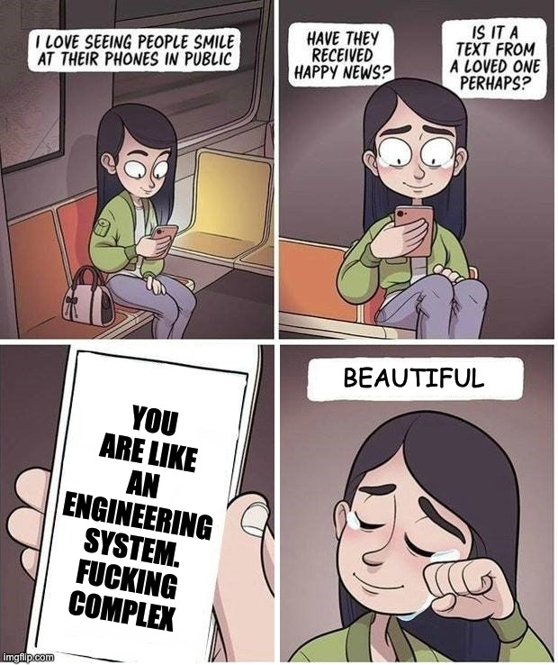
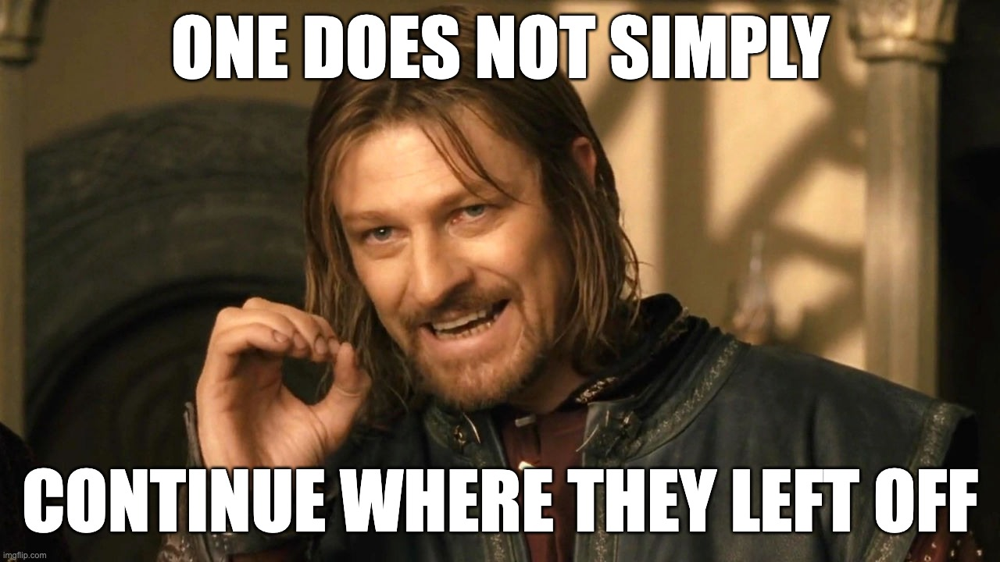

+++
title = 'Complex Systems Break'
date = 2026-02-26T13:35:22+02:00
lastmod = 2026-02-26T13:35:22+02:00
description = "Any system complex enough has the potential to fail. This matters for your personal goals more than you think."
draft = false
tags = ["coaching", "incidents", "coe", "resolutions", "goals"]
author = "bjoern"
comment = false
toc = true
image = "cover.jpg"
+++

I am not good at playing the guitar. 
Honestly, if you saw me, you would probably think I have no clue what I am doing, which isn't correct, but also not wrong. 
While I am writing these lines, my old guitar is standing left of me. 
It does not have eyes, yet I can feel the judging look... I didn't do my daily exercises yesterday. 
And there are only a few minutes left to get it done today. 

My goal for this year is to play at least five minutes on five days per week. 
That's not crazy, yet every now and then, I fail. You may know this feeling from classics like "This year I will become fit" or "I will eat less sugar in January". These resolutions often fail, because we fail. Probably because we don't have enough willpower.

Wait, that's bullshit. Scratch that, let's go back: 
These resolutions often fail, because we are complex systems and complex systems are bound to fail.
Yes, my dear freshwater pearl, you are a complex system.

## WTF Is A Complex System

You probably think "But Bjoern, I just checked in the mirror and I am fairly sure I am a human.".
I don't disagree on that, when I say you are a complex system I don't mean you are a machine. But you share some of the properties of complex engineering systems. 
To phrase it very simply: A complex system is a system where endless future states exist.

Let's look at an engineering system, for example a social media service. 
The service is used by humans, whose behaviour you cannot reliably predict. Some outside events may cause a dramatic inflow in users, or some users may decide to go bonkers with the service and request the front page a loooot. 
Or maybe they all stop using the service. You can have a vague idea, but you cannot reliably say what the system will look like and how it will behave in a year from now. Because it is interfacing with other complex systems - Us humans. 

We also have endless possible futures, most of them differ only a teeny tiny bit from each other. 
Others may shift dramatically. I don't want to go full butterfly-effect on you here, but my point is: If endless future states exist, some of them will be failure states. 

## Failure Isn't Optional

That means you don't choose whether you fail or not. Let's look at my guitar career (but the same applies for fitness and any other goal) - One reason I took a 6 day break from playing in January was simply because I was out of town and then sick for a few days. 
I did not plan to be sick, it just happened. If your plan is to go to the gym four days a week, what happens when your gym has to close for two weeks because of water damage? You surely did not plan that. 

These kind of events can throw you off. What is important is to not see them as terminal failure because you broke your streak. Instead, frame them as breaks. Or, if you fancy, as incidents. You try your best to avoid them, but eventually they happen. When a banking service has an incident, the engineers don't throw their hands up and say: "Well, that sucks, we tried our best to avoid it, but here we are. It was fun while it lasted, goodbye!"
Instead, they focus on bringing back the functionality as quickly as possible. 

You need to adopt the same mindset. Something threw you off, meh. Instead of sulking, shift the focus - How can you start again?
Is it simply grabbing your guitar? Doing a few push-ups right now? (Honestly, go for it and let me know if you can go beyond 10 in a row). 

You lost momentum, you can get it back. That's what makes the difference between a break and a failure. And we can go deeper into incident handling (and we will, in future posts) - Once your failures become breaks, you can work on making the breaks shorter. "Mean Time To Recovery" is a common metric in engineering incidents. While the "perfect" MTTR is zero (which means no downtime at all), we can be more realistic. My longest break so far was 8 days. Since then, I worked on getting it down, and now it is around 2 days. As a consequence, the overall number of breaks has increased, but so has the number of days where I succeed. The frequency has stayed the same, but their duration is shorter:
- Availability is up (more success days per total days)
- MTTR is down (breaks are shorter)

So if you cross off days where you have been successful, start to also pay attention to the days where you haven't been. How often does it happen and how long are the "non-streaks"? 
Worry less about them happening and more about them becoming a terminal state. 

Now go out and be complex, you little system!