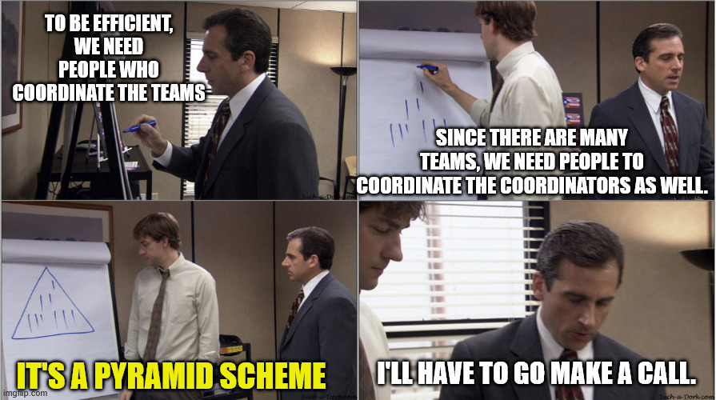
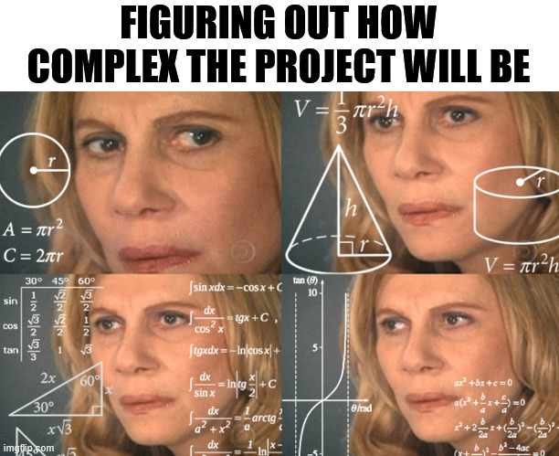
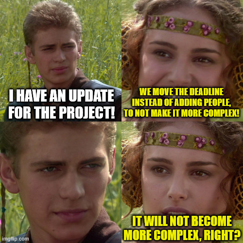

+++
title = 'Coordinating Complex Projects'
date = 2026-01-25T22:36:21+02:00
lastmod = 2026-01-25T22:36:21+02:00
description = "How to notice when a project will require special project management care"
draft = false
tags = ["project-management", "engineering", "communication", "management", "alignment"]
author = "bjoern"
comment = false
toc = true
image = "cover.jpg"
+++

> I want to get the task done today, but I am constantly in meetings.
> There are 2 more stand-ups after this one.
> I need to align the API contract with this team, then I need to check what the progress is on the sub-projects.
> And I need to report the status to our manager every day.
> We haven't even looked into how we can solve the result feedback problem yet, but we are expected to close it this week.

Understanding the complexity of a project is hard.
Having other people understand it can be even harder!

One part of the complexity is coordination effort. As soon as more than two people work on a project, somebody will have to coordinate their work. At the lowest level they can manage it themselves, but at some point you will need to have a person dedicated to coordinating.
Then, if you go further, you suddenly need people that coordinate the coordinators. I hope you see where this goes.



## Coordination Complexity Level

To get a good feeling of how complex coordination for a project will be, I use the following stupidly simple calculation for the "Coordination Complexity Level" (CCL, because all science things need an abbreviation):
```
CCL = (Distinct Systems + Distinct Teams) * People
```



Let's take an example. Our app "Cake for Cake lovers" is adding two new features:
1. A loading icon looking like a cake that gets eaten. Only requires a change on mobile clients (iOS, Android). A team of 2 engineers per platform and a designer, all from the same team.
2. Custom recipes that can be shared with friends. Requires changes on mobile clients (iOS, Android) and four different backend systems. A team of 12 engineers from 3 teams, one designer and a product owner will work on this.

The respective complexity levels for coordination would be `(2 + 1) * 5 = 10` for the loading icon and `(6 + 3) * 14 = 126` for the sharing feature. Looks like the second project will be more complex to coordinate.

This does not tell you anything about how technically complex the change is - It might be that the loading icon will actually take more time to build because getting the animation frame-perfect is a huge feat. But this is not what the CCL tells you. It is an indicator that alerts you to potential problems from the project. 

What consumes time in a project is not only "doing things", like implementing code. Architecture decisions need to be discussed, code reviews are necessary, the design might change due to feedback and unknowns pop up that require change of direction. The good old [glue work](https://www.noidea.dog/glue).

## Trust the process

The higher the CCL, the more glue work you can expect to be required. 
Since it usually is work that feels less satisfying and less visible, most people don't feel good doing it. 
It takes away a huge chunk of their time. Almost naturally, a few people from the group end up doing the majority of the glue work. 
At this moment comes a critical part - How does your team deal with these situations? Is there a process in place?

Having a process doesn't make the glue work go away. But it removes a big chunk of it, because you don't need to discuss it or figure out how to organise things. Remember the coordination pyramid from before? This is one potential option. 
Another could be how you track work. Assume your teams use a shared ticket system and every team member keeps their ticket up to date. Every ticket has required meta information (eg start date, expected due date). Suddenly you need one layer less of coordinators, because you can get the current status of the project from the ticket system. You don't need to ask every team member every morning what they did yesterday and what they plan to do today. You can focus on the work items that are at risk. 

Let's take another example. If your team gets a design and starts working on it immediately, they may find out in 3 weeks that one part of the designs is actually quite hard to do. But if we change the design slightly, it becomes a lot easier. However, another team already has invested work into the initial proposal, changing the design now means they need to redo everything. 
Alternatively, both teams can review the design in the beginning to clarify solutions and save time later. 

These ideas seem obvious, but if they are not expressed in a process that the team agrees on, you can only hope that everybody acts smart. And that is the biggest problem - I have heard teams often discuss that they don't want to be pressured into a process. They know best how to organise their work and be efficient. Yet a team often only sees the local optimum - Something that makes sense at the moment or that has worked in a different project before. But if your process works well for a CCL of 20, it does not mean it scales for a CCL of 150 or 275. 

## Coordinating in advance

If you invest time into deciding how you will coordinate work for a project before you start the project, you can save yourself (and the team) a lot of trouble later. 
But the most problematic projects are the ones that rise in coordination complexity over time - A current project started as an innocent CCL of 40 and has evolved into a 156 over 2 weeks. And I see that - there are three different standups, we need to constantly check-in with people on the current status and with less than a month to go-live the designs are still being changed. 



In my experience, the only way to manage these situations is to treat the small projects similar to big projects, not the other way around. The goal is to get people used to the process so that it creates no friction when you actually need it.

PS: I am aware how simple the CCL thing is. We can both laugh at it now, but if this ever takes off, let me tell you that I will wear a shirt stating I invented this shit.