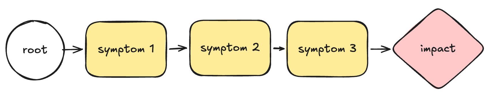
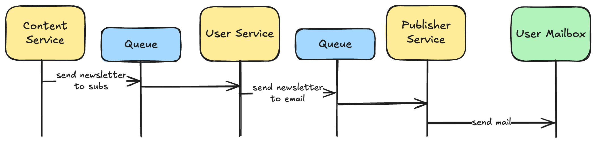

+++
title = 'Follow The White Rabbit'
date = 2026-06-02T21:56:22+02:00
lastmod = 2026-06-02T21:56:22+02:00
description = "Understanding how to unblock yourself when getting lost in an incident or a bug hunt"
draft = false
tags = ["incidents", "story", "method", "coaching"]
author = "bjoern"
comment = false
toc = true
image = "cover.webp"
+++

A while ago I was involved in a very frustrating incident. 
What made it so frustrating was not the fact that it happened a few minutes before I wanted to close my laptop.
Nor was it the impact for our users.
What almost made me rage-quit was watching the team being completely stuck. They were like Alice, trying to follow the white rabbit through wonderland.

> Alice: Would you tell me, please, which way I ought to go from here?
> The Cheshire Cat: That depends a good deal on where you want to get to.
> Alice: I don't much care where.
> The Cheshire Cat: Then it doesn't much matter which way you go.

## Where Do You Start?
When you notice a problem, you see a symptom and (often) already have a vague idea of what could be causing the problem here. We usually don't spend too much thought about it, but this symptom most usually is just one of many. 

Understanding the causal chain is crucial - The closer your symptom is to the root, the faster you will be able to understand what is wrong and how to mitigate the impact.

Let's look at an example: We have a newsletter publishing tool that sends emails to users.
Some users report not receiving any updates anymore. 
1. We can see from the logs that our publishing system never sent these emails. 
2. It also never received them as task.
3. Next, we discover that one of our Kafka consumers is lagging
4. The consumer is running, but looking into the logs there is one message that fails to be converted into a task
5. The message has an invalid email address, which makes the consumer throw an error and try again. All messages behind are waiting. A classic poison pill.

This is simplified, but as you can see it took us 5 hops to find the root issue. 
Now, assume instead of users reporting the issue we would have received an alert because the consumer is lagging. 
We would start at step 3 and have to do only 2 hops to find the root issue. We also have to figure out the other side to understand the actual user impact, but that is secondary.

## Being Lost

Where you start from heavily depends on your monitoring capabilities and what you actually thought of monitoring.
The example above assumes that you somehow have the right tooling in place to observe the chain of symptoms. 
But maybe you don't have logging for errors in place for the publisher - Then you are not aware of symptom 5. 
That's... bad, isn't it?

If you cannot build a chain because you lack observability over symptoms or your system is so complex that your symptoms might be hiding their impact, what can you do?

This is the state my team was facing. Being lost at times is natural. However, the one thing you don't want to do is: nothing. 
Things (usually) don't recover on their own when they are broken.
When you get lost, you need to take a step back and challenge what you know. 

## Nothing is working until you prove it does

Draw out every step (that you know of) of the process as it should be working.
If you start working backwards from the final impact, there will be too many options, so you have to narrow it down.

1. Outline the broken flow. It will feel like overkill, but draw a diagram. Doing so will make it easier to keep an overview. And it will usually also align people fast.
2. Draw a table with the columns "Unverified" and "Verified". Write down everything you know in the "Unverified" column
3. Find a way to confirm everything in the "Unverified" column
4. Every new information and idea goes into the "Unverified" column. Repeat step 3.

For the newsletter example this means:

We know some users claim they don't receive their update. We know it does not affect all users.
These two are actually assumptions, because they are reported by users. So we need to assert them.
We also know about the publishing flow, so we put every single step in the "Unverified" column.
Can we find proof that at least one user received an update? Yes? Then "We know it does not affect all users" is now verified. 

Next we focus on the users not receiving updates. Start asking questions: Do they miss specific updates or all updates?
Can we send one of them a test update? Do we have a way to get direct feedback?
How can we confirm the publishing service is actually sending updates?
Are these users really subscribed?

At this point experience plays a big role as well: asking good questions helps narrow down the issue quicker. 
However, the main idea is to make sure that you don't treat an assumption as fact.
Yes, maybe you believe the publisher is working correctly. But here we are, investigating a bug - That means reality does not match with expectations anymore. 

## This Is Not Root Cause Analysis

The process described above is not a tool to solve every issue, but it is a mental model to help. 
It is focused on finding a symptom that we can mitigate - In the case of our example it might be enough to ignore the faulty message. 

However, the actual root cause analysis should not end with "We had a faulty message". Why did we have a faulty message in the first place? There are a lot of other things to consider and ask - But this is not the goal of the white rabbit model. It exists to mitigate by confirming assumptions with data, not gut feeling.

## Catching the white rabbit

Handling incidents can be stressful. 
Stress can lead to confusion - A state you don't want to end up with, because it makes the pressure worse. 
Most of the time you will not need the white rabbit model. Most of the time you know what to do next.
However, if you ever end up being lost, you know how to find your way back now.