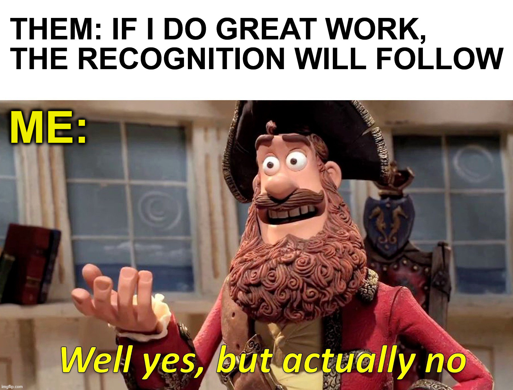
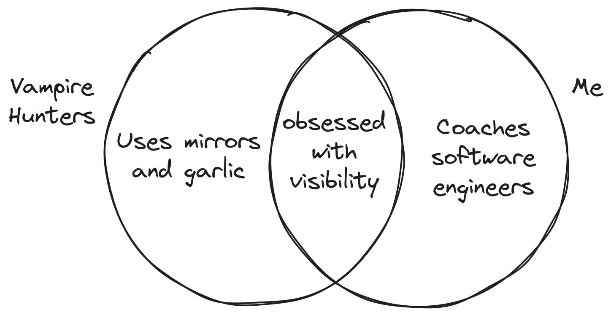

+++
title = 'Good Work Isn't Rewarded'
date = 2026-08-17T17:37:00+02:00
lastmod = 2026-08-17T17:37:00+02:00
description = "Cleaning up with the idea that doing a good job is enough to get you promoted"
draft = false
tags = ["coaching", "visibility", "growth", "learning", "myth"]
author = "bjoern"
comment = false
toc = true
image = "cover.jpg"
+++

When I coach people, there is one clear statement that signals how likely a person is to get promoted soon: "If I do good work, it will be recognized and a promotion will follow".

No, it will not. 
There are two assumptions in that statement:
    1. Your doing great work. 
    2. Your work is recognized.

To make this thought experiment easier, let's fix statement 1 and say you are doing great work. 
We even go one step further and state that your work is better than the work of others [1].
That leaves us with the task to verify assumption 2 - Is your work recognized? 

## Be Your Own Product

A past manager once gave me the recommendation to be my own brand. 
Following this idea, what if I am my own brand and my work is my product? 
What needs to happen so that others spend money on the product?

Looking at traditional businesses, which products of a given category do you buy when there are multiple offers?
Hopefully the best, but you don't know that because you actually don't know all the products that exist. 
You just know all the products advertised to you.

That is a serious lack. 
Imagine I am starting a business (again) - I start a new donut shop.
I need to get people to buy my donuts. 
Some folks will see my shop on the street and come in and buy. Yes!

But that is not enough. I need people that pass by the next street to also take a detour every now and then to my shop.
I put a sign up on the neighboring streets. 
Since my baked goods are amazing, people who buy will tell their friends, if they happen to talk about the topic.
Otherwise, people will not know my shop even exists.

To reach a bigger audience, I am either lucky and go viral (which means somebody is advertising for me) or I put out good words about my product myself. Only one of these paths is within my control [2].

The same is true for your work. 
Likely your colleagues (the people on the street) notice your good work. 
Maybe your manager also comes by every now and then and sees it. 
Can you risk this being a "maybe"? And even if so, what about your manager's manager? 
Have they ever heard of you?

## Do Good And Speak About It

Advertising is a necessary evil if you want to increase your odds of success. 
You cannot expect others to look more at you, but you can bring more of yourself to the table. 

Similar to real-world products, advertising your work is not about bragging. 
It's not about being the loudest. It's about being seen.
People who brag and are not delivering what they claim to deliver are very easy to see through. 
When one of my reports tells me about something great they did, I don't take it at face value - I confirm it. 
Good work leaves a trail. If you have the starting point for an investigation, you can follow it easily.

What you need to do is giving people that starting point. 
A few years ago I had a similar conversation with a friend, who said that it is not about boasting yourself. It's about doing good work and then speaking about it. Good work is the foundation. Then you make it visible.

## Appendix
### Actions For Visibility

I will use this short section not leave you hanging with just the general idea of *why* you need to be visible, but also give some ideas for *how* you can be visible.

A few basics of leaving a trail of your work a fairly straightforward:
1. Give/write clear updates
2. When you take a decision, make it visible. It will appear as if you inform stakeholders (which is the secondary intent) but also serves as "Please see, I have decided to do X" message
3. Publicly thank people for helping you or working with you on a project. This sends a message of acknowledgement for both them, as well as for others to see that you are humble and that you finished a piece of work
4. Find a sponsor. Be proactive and find an influential person who can help you with advice, but also push you into projects when staffing is decided

And whenever you communicate on done work, make it clear what impact the work has. This helps others understand not just what you did, but also what changed because you did it.

### Footnotes
- [1] No offense, probably it is, but is it better than what the others are doing? We are all heroes of our own stories and the person who we know most about is ourselves. But that means you don't actually know what the others are doing in detail and whether you do better work than them
- [2] I am oversimplifying in the article to make the point that you need to care for yourself and cannot expect others to magically see all that your are doing. Reality is more nuanced - Creating visibility for contributions is also a matter of team culture and a managers job. But these areas can be out of your direct control. 
