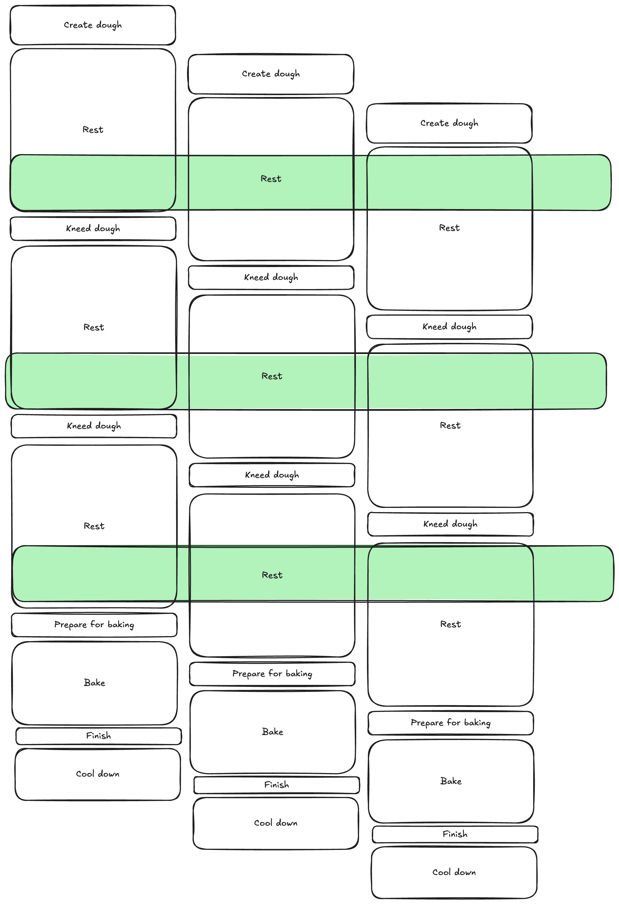
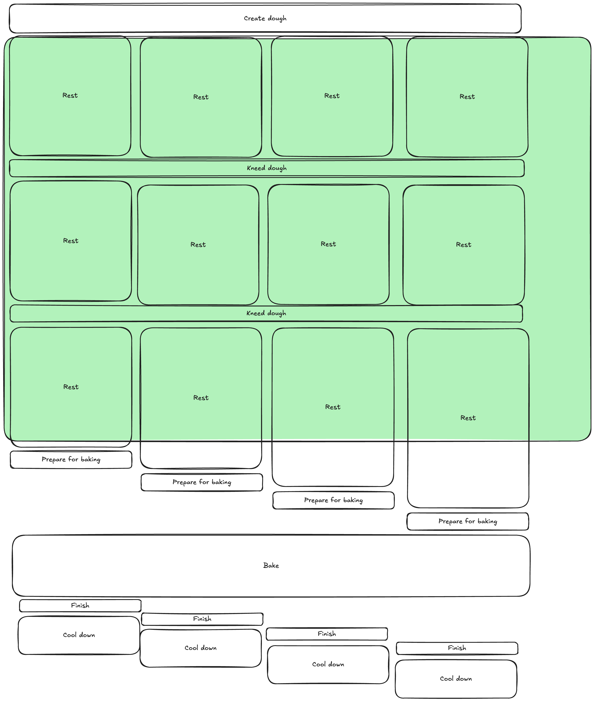
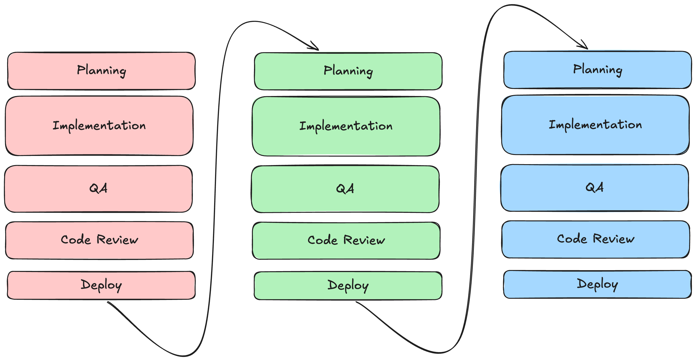
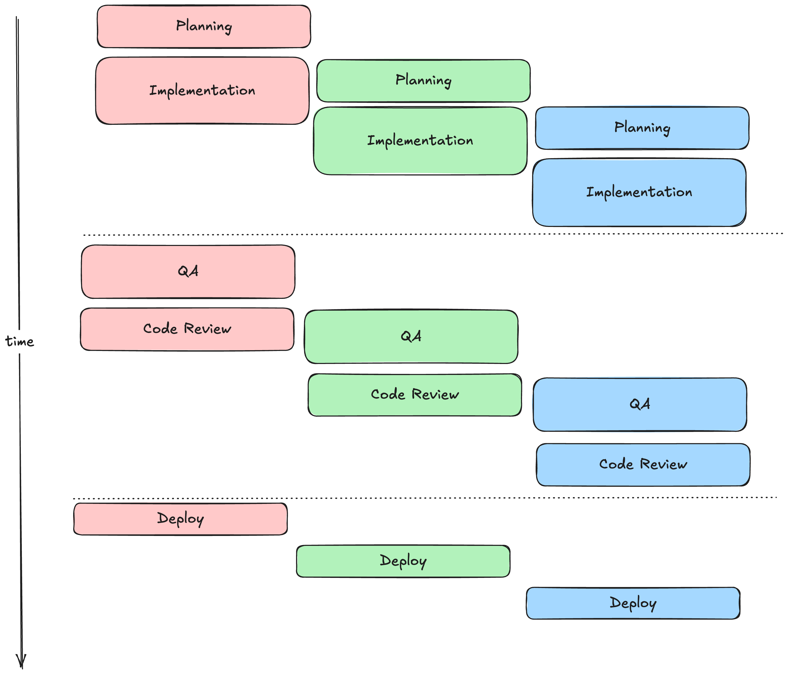

+++
title = 'Increasing Productivity With AI'
date = 2026-07-22T11:55:22+02:00
lastmod = 2026-07-22T11:55:22+02:00
description = "AI tools will increase the productivity of everybody a lot and there is endless potential for more...? A check-in with reality."
draft = false
tags = ["ai", "story", "process", "claude", "engineering", "ai-coding", "copilot"]
author = "bjoern"
comment = false
toc = true
image = "cover.webp"
+++

The big selling point of AI is that it will make our lives easier by making us more productive.
It will increase the output of value per person. 

What does that mean and can it? 
Let's do a thinking game by baking bread!

## Productivity

Productivity defines how efficiently goods are produced. 
Or, to make it sound more scientific: it is the number of output units per input unit.

Let's look at the traditional craft of baking bread. 
We open up a bakery!

In the beginning, every step is done manually by our baker, Alice. The amount of bread a single baker can produce in a week would define their productivity. The simplified workflow is as follows:

1. Create dough (30min)
2. Give dough time to rest and rise (2h)
3. Knead dough again (15min)
4. Give dough time to rest and rise (2h)
5. Knead dough again (15min)
6. Give dough time to rest and rise (2h)
7. Prepare for baking (15min)
8. Bake in oven (1h)
9. Remove from oven and give finishing touch (5min) 
10. Cool down (30min)

Each piece of bread has to go through this workflow. 
That means it takes roughly 9h to create a piece of bread - a full working day.
Assuming 9h shift per day for 5 days a week we get 5 pieces of bread per week.

And our bakery is a hit, people love our bread!
Being good capitalists, we now want to understand how we can produce more bread.
We have the following options:

1. Hire another baker
2. Increase productivity for Alice
3. Motivate Alice to be more efficient (just kidding...)

Hiring another baker would be straightforward math - If one baker produces five pieces of bread per week, we get 10 with two bakers, 15 with three, ... you see where this is going.

## Improve the workflow

Hiring more bakers is simple and can be done quickly, but also has serious downsides. Besides the additional salary we have to pay, we will sooner or later hit some other limits: the bakery can not hold infinite employees. We can increase the limit with smart planning (eg different shifts to decrease overlap) but sooner or later the trouble comes back. 

We want more. We want our bakery to go public eventually, so a linear growth curve does not work. 
Let's look into making each baker more productive - Can we maybe get 10 breads per week out of Alice?
Yes!

To do that, we need to revisit the workflow. For the time being, we don't want to fiddle with the steps themselves, because we believe that taking more time for the process increases quality of our bread. And, more importantly, our customers believe that as well. 

We need to adhere to employee rights, so Alice cannot work more than 9h per day (otherwise we could easily double the output by having her work two shifts in a row per day).

Instead, we critically look at steps where actual work is expected from Alice. Out of the 9 steps, only 5 steps are manual work (steps 1, 3, 5, 7 and 9). This takes 1:20h - a fraction of the total time! During that time, Alice can already start making new bread. We are moving from a sequential pipeline to a parallel pipeline!

We cannot fully fill out all free blocks with manual work, or Alice would need to work way longer. That's a no-go, as we already stated. So we have her take 3 breaks of 30min each over the day. 
With this new way of working we get 15 breads per week with only Alice! 3x - That's a huge success!

## Remove friction

3x is not enough. Next, we need to check the manual work Alice is doing. This is the part where input is converted to output, so how can we maximise this further? At the moment, Alice is doing everything by hand. 

We will make two big investments: We are buying a machine that kneads the dough and a bigger oven that can handle multiple breads at the same time. This has the following impact:

1. Can create more dough at the same time (up to 10x)
2. Can knead dough automatically
3. Can bake up to 10 pieces of bread at the same time

This is a game changer - Not only because we can handle up to 10x, but more importantly because we just automated several steps!
The manual steps left to be done by Alice are:

1. Put ingredients into the machine and start process (15min)
2. Put bread into oven (15min per bread)
3. Remove bread from oven (5min per bread)

While preparing for the oven and the finishing touch are now clearly becoming limiting issues, the time that Alice is not required to be present has increased to over 7h! 
Even if the sequential work for preparing the oven increases to 10x, that's still less than 3 hours. 
In total the manual work now is ~3.6h - If we time it properly, we can get a second load into the dough maker and get 20x increase! 100 breads per week, just with Alice!

## Towards 100x

We have optimized the workflow, even getting a bigger machine and oven with more capacity will probably not get us much further than 20x. How do we go to 100x? We can try to further automate, but as long as we keep a human in the loop, there will be a natural limit. We can get two machines and ovens working in parallel, we can try to reduce the time necessary to prepare for baking and maybe we end up with 100x.

But once we get to 100x, that is the new baseline and we will try to 100x that again. 
We will never be satisfied. 
Growth cannot have a limit. 
Alice is in the way of Growth.

As long as we need Alice, Alice is a problem.
While Alice is a problem for productivity, she is also a quality gatekeeper. 
With every step we automate, we reduce quality. Some steps result in very minor decreases, others bigger drops.
There is a reason why bread from the supermarket tastes different than from a traditional bakery. 
The reason is humans. The reason is Alice.

## Alice goes Software

Sadly, we don't run a bakery. 
Most of us work in software engineering. 
But the challenge is the same: we are asked to be more productive.
If only we had a machine for dough...

Open the stage for AI! 
The magic thing that will increase productivity by 30%, no, 50%, no, 80%!
Maybe even more, because it will allow us to remove humans from the loop entirely!

Let's dial back the hype a notch. 
GenAI is interesting and makes many tasks faster. But what does that mean for our throughput?

Assume we have a basic workflow that includes planning work, implementing code, testing, getting code reviewed and then deploying the changes. To keep it simple, we assume all goes well in the first pass - tests pass, reviewers happy, no issues. Yes, I am aware how unrealistic that sounds, but it's a mental model.

One key difference from the bakery is the required time per step - It varies wildly. 
Some flows are fully executed within an hour, others might take days. 
Similarly, the distribution varies - One sequence has 50% writing code, another might have only 5% but a lot more planning. 
However, to make the model easier, we assume writing code takes 30% of the time [[1](https://www.microsoft.com/en-us/research/wp-content/uploads/2019/04/devtime-preprint-TSE19.pdf)].

Let's automate the implementation - We assume after planning the LLM one-shots the implementation correctly (again, unrealistic). This would mean we save at most 30% - which assumes the developer will not have to review the generated code for validity.

We quickly run into the same situation as with Alice in the bakery - Yes, we are faster, but there is a hard limit to how much we can squeeze out here. 
At most the time of implementation. 
To be more productive, we need to automate the other tasks as well. Or make them faster. But as long as we keep the human as quality gatekeeper, there is a limit. 

## Alice stays in the loop

My last statement indicates that the best way would be to remove the human from the loop. 
And there have been quite a few attempts that prove that it is possible. 
But in the same way that a fully automatically created food tastes weird, the products created only by AI are weird. 
And what does it even mean "removing the human from the loop"? Because there still is somebody mixing ingredients into the machine. Somebody is hitting the first prompt. And the final product will be used by humans. And they will judge. 
No matter how we look at it, we will always have Alice in the loop.

After all, we are not discussing magic here - We are discussing another tool. 
Can it make our work faster? Yes. Can it increase output? Yes. 
Will it change the way we work? Probably on the same level as the first version control systems, which had fundamental impact on how we collaborate and share work. 
But it will stay a tool. As with any tools, their success depends on the user - a human. 

Alice looks like a problem if you only crunch the numbers.
But Alice isn't in the way of Growth - Alice is part of the Growth.