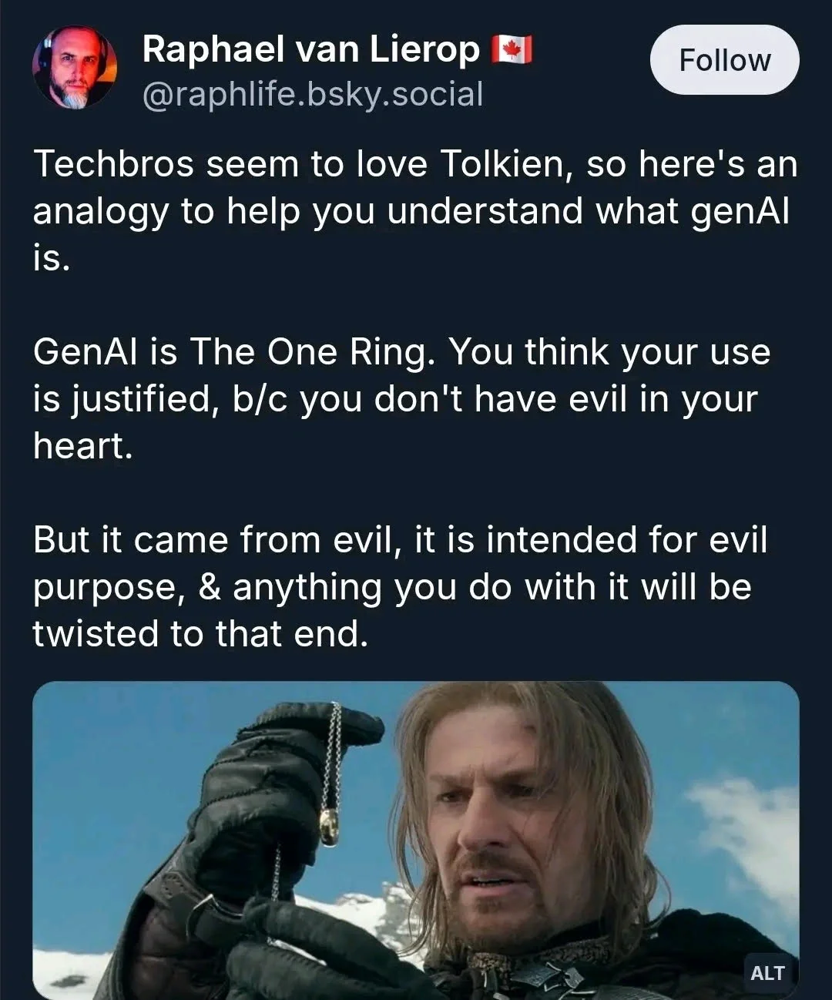

+++
title = 'Is GenAI The One Ring?'
date = 2026-08-31T18:26:21+02:00
lastmod = 2026-08-31T18:26:21+02:00
description = "Comparing GenAI to the most famous ring of power. Will GenAI rule them all?"
draft = false
tags = ["ai", "ethics", "genai", "claude", "chatgpt"]
author = "bjoern"
comment = false
toc = true
image = "cover.jpg"
+++

I recently came across a post with a very interesting claim - that GenAI is the same as The One Ring from Lord Of The Rings. 

> GenAI is The One Ring. You think your use is justified, b/c you don't have evil in your heart.
>
> But it came from evil, it is intended for evil purpose, & anything you do with it will be twisted to that end.

Before we dive deeper into this, a  content warning - You are free to continue reading, but if you haven't seen the Lord Of The Rings movies or read the books, this article will not do much for you. See it as invitation to watch the movies.

## One Ring

> One Ring to rule them all, One Ring to find them, One Ring to bring them all, and in the darkness bind them

This is a sharp attack on the "GenAI is nothing but a tool, what matters is how you use it". 
The sticking with "tool" idea, the key message of comparing it to The One Ring is clear - It does not matter if you use GenAI for "good" or "bad" use cases. No matter what you do, it will have (evil) consequences [[1](https://deadsimpletech.com/blog/no-such-thing-as-just-a-tool)].

I will do a lazy thing - I will not compare "good" and "bad" use cases for this discussion. We put aside discussions about where it is morally acceptable to use GenAI and where not. Instead, we will talk about everything before the moment you decide to use or not put on THE RING.

## It came from evil

Stating that it came from evil is an argument that, at first, I disagreed with. The underlying technology was neither new nor easily assigned the label "evil" [[2](https://www.geeksforgeeks.org/blogs/history-and-evolution-of-llms/)]. Then again, the generative AI we use today is not what was built in 2018 [[3](https://llmtimeline.org/#year-2017)] - much like The One Ring is not just some Mithril. More than the material is needed - it needs to be shaped, it needs to be imbued with magic.

In the same way, a LLM needs to be trained with data. This is where the touch of evil starts. From destroying books to get material untouched by GenAI [[4](https://www.404media.co/we-tracked-a-shipment-of-rare-books-it-ended-at-an-amazon-ai-training-facility/)] over to collecting data illegally and without attribution [[5](https://sease.io/2024/09/the-dark-side-of-llms-illicit-data-use-and-cybercrime.html)] (or in very stupid and costly ways [[6](https://people.kernel.org/monsieuricon/creepy-crawlies)] to the infrastructure required to train a new model [[7](https://arxiv.org/pdf/2409.11416)].

This last point, the infrastructure, deserves a bit more attention. Not because it is worse than how the training data is "collected", but because it fits the comparison to The One Ring so well. If the technology is the Mithril and the training data is the magic, then the data centers are Mount Doom.

Unlike many other things that we access through the web, GenAI has very visible implications for our physical world. Energy consumption [[8](https://www.carbonbrief.org/ai-five-charts-that-put-data-centre-energy-use-and-emissions-into-context)] and prices increase [[9](https://www.npr.org/2026/01/25/nx-s1-5684321/trump-ai)], valuable water is consumed [[10](https://www.thetechedvocate.org/why-ai-data-center-protests-are-turning-into-a-global-movement-over-water-theft/), [11](https://knowablemagazine.org/content/article/technology/2026/how-much-water-do-ai-data-centers-use), [12](https://www.theregister.com/on-prem/2026/08/24/us-datacenters-tripled-their-water-footprint-in-10-years/5291564)] and, much against Moore Law, memory prices are increasing [[13](https://www.tomshardware.com/pc-components/gpus/lowest-gpu-prices-tracking)]. I only realised the last issue when I wanted to upgrade the HDD of my NAS and was surprised to learn that prices had increased where I would have expected them to be lower. 

So, "evil" is one of the core materials of GenAI. Rationally speaking it didn't have to be that way, but this is the timeline we are in. Sucks.

I find it hard to argue that LLMs are not alike to The One Ring with regard to their creation. 
But surely that's how it turned out to be, doesn't mean their usage is for the intentions of some dark lords, eh?

## It is intended for evil purpose

 We both know where this will go. Is it intended for evil? Yes. 
 
The more exciting question is "how?", because the answer is nuanced and complex. A lot of arguments around whether GenAI is good or bad focuses on what it is used for. Is it a use case that benefits society [[14](https://arxiv.org/html/2501.11496v1)] or one that broadly harms? As I mentioned earlier we will not go down this path. Because GenAI is a tool and much more revealing than what the tool is used for is WHO uses it.

First, we need to step away from our neat comparison to The One Ring a little bit. The One Ring was forged by Sauron, who had very clear evil intentions in doing so. He's the major villain of the story, after all. It's simple and clear - Sauron is evil. 
Whatever he does has evil purpose. 

In our world, two things make the whole story complicated:
 1. There is no 1 to 1 mapping from Sauron to one person or one company
 2. Real humans are rarely only evil, though we can define "evil" as "benefit yourself on the cost of others" to make the world a bit more black and white

To figure out who out Sauron is, we need go understand who wins if GenAI wins. Quite obviously the creators of models have an interest, but they have yet to make it it profitable [[15](https://isaiprofitable.com/)]. But when in a gold rush, don't dig for gold - sell picks and shovels [[16](https://www.wheresyoured.at/the-case-against-generative-ai/)]. This is quite similar here, looking ar Nvidia or the fossil fuel industry [[17](https://www.chevron.com/newsroom/2026/q2/chevron-signs-20-year-power-agreement-with-microsoft-for-west-texas-data-center)]. This is not really about GenAI, it is about computing. The more compute is needed in the world, the better for these companies. And GenAI turns out to be extremely hungry for more compute. 

Then, there is the other end of the chain, people that can benefit from providing models or interfaces. As mentioned earlier, training a model is a complex process that requires tons of data. Depending on what you throw into that data pool, the capabilities and behaviour of the resulting model will be affected. 
What doesn't sound too concerning first quickly becomes noteworthy when you take into account how peoples opinions adapt depending on what information they consume [[18](https://doi.org/10.1038/s41586-025-09771-9), [19](https://www.theguardian.com/world/2026/aug/26/fake-thinktank-israel-ai-propaganda)]. To be blunt: Whoever controls the training data also controls the political view the resulting model will amplify [[20](https://www.nature.com/articles/d41586-026-01486-9)]. It is similar to other media outlets [[21](https://www.techpolicy.press/tracking-elon-musks-political-activities/)] in that regard.

Summing all that up - No, the technology is not intended for evil. But yes, how GenAI is currently developed, marketed and pushed into society can easily be labelled "evil".

## Anything you do will be twisted

The influence of The One Ring goes beyond just how it was forget and what Sauron intended it for. Its twisted magic also affected not only whoever was holding the ring, but even people around them.

Fear not, GenAI is not far behind in terms of impact radius. 
If you don't want anything to do with GenAI, you are gonna have a very hard time these days. Like Frodo was at times forced to put on the ring, GenAI output is forced on you.
It's in your search engine, your browser, your phone, in advertisements, in code your colleagues submit. 

Living a life without GenAI is impossible, because generated artifacts will get to you in real life as well. A local non-profit in my neighborhood has shifted creating all its flyers and material with ChatGPT (and is quite proud about it). If i continue to support them, whether I voice my concerns or not, I will support this practice. 

This is just about where you encounter the products of GenAI - Why is it twisted? Besides the earlier points about the looming intentions behind it, GenAI is making promises that affect a lot of areas of our lives. Be it a CEO dreaming about replacing all workers with AI [[22](https://www.youtube.com/watch?v=SPQNPJ0CEPo)] or raising privacy concerns [[23](https://dailysecurityreview.com/cyber-security/thousands-of-grok-ai-chats-leaked-transcripts-indexed-publicly/), [24](http://privacyinternational.org/explainer/5353/large-language-models-and-data-protection)] (this one is a real unfunny rabbit hole once you start thinking about how devices already exist that promise to record and organise every conversation you have, without any way for you to object it).

But why stop with these concerns and issues when we can go deeper? The most troublesome thing with The One Ring was how it obsessed its wearer and occupied almost every waking thought. Right, my precious?

GenAI doesn't fall short here either. How would you like your thoughts to be twisted to the point where you lose grip with reality? If this doesn't sound like something you would enjoy either, welcome to the fellowship. 

As it turns out, talking to a (thankfully) non-sentinent stochastic parrot can have sever impact on your psyche [[25](https://pmc.ncbi.nlm.nih.gov/articles/PMC12863933/), [26](https://www.reddit.com/r/AIPsychosisRecovery/)]. I personally see this as one of the most frightening points - That you cannot trust the response you get and at some point you have to question yourself to make sure you don't get lost in a psychosis.

This is an issue even on the non-psychosis level. If you cannot trust the output, it means you need additional cognitive effort to confirm. While at the same time the tool happily tries to convince you that you do not need to confirm. 

One of my favourite uses cases: I was refactoring a system that I never touched before. I was using an agent to learn more about that system and iterate ideas and solutions. However, the agent constantly tried to push me back to a solution that seemed plausible. Yet I knew it would break at scale, which was also very easy to confirm. This was really tiring, where the tool claims to do the opposite and make my work easier.

Ready for more? So far we talked about "good" people using GenAI for good. It is worth mentioning that people, creative as they are, of course also use GenAI for illegal activities and betrayals. What's more, using GenAI makes it a lot easier to commit fraud, which means the threshold is lowered. Before, you needed criminal energy and some kind of skill (be it photoshop, coding, ...). Now, criminal energy is almost enough and people with skills get a huge boost for whatever illegal activities they set out to do [[27](https://newsletter.pragmaticengineer.com/p/ai-fakers), [28](https://www.forbes.com/councils/forbestechcouncil/2025/06/23/how-deepfakes-are-disrupting-kyc-and-financial-security/)]. And don't forget about AI being used as a weapon [[29](https://oit.gatech.edu/us-military-leans-ai-attack-iran-tech-doesnt-lessen-need-human-judgment-war)] or defense system (whether we deem
that effective or not).

## Your Personal Ring Of Power

Summarizing, GenAI pretty much lives up to the idea of The One Ring. However, in Tolkien's epos, the heroes managed to defeat evil by tossing the ring back into the fire where it was forged. This will not work for GenAI.

I strongly believe that the technology exists and it will continue to exist. We cannot undo it. Even if the whole bubble bursts, GenAI will continue to exist, although likely in another form. 

Given that, it is worth thinking how we will deal with it. What would you do with a ring of power? 

Given that you know about its nature, but also what powers it gives you, my hypothesis is that you will use it. I don't blame you. Most people think they are strong and can resist and yes, the Gandalfs and Aragorns exist. But they are rare. Some of you may think now "Probably I am Boromir", but let me stop you there - Don't think of Boromir as weak. I will add a section about that in the end. 

No, I think some of us may be the heroes of the fellowship, some may be Saruman and side with evil, some (sadly) are Smeagol - falling prey to the will of the ring and not being able to exist without it anymore. 

And the rest? We are not named yet. We have touched the ring, we have heard its call. And we have to decide what we will do with that power. Who do you want to be?

## Choosing Sides

There is no neutral ground in this story. Which doesn't mean it's a black or white type of story either.

Sometimes using GenAI makes sense. I don't argue about its usefulness. The same way that in some situations it was useful for Frodo to put on the ring and disappear. 
Other times we cannot avoid using GenAI. Which does not mean you have to accept. You are powerful on your own.

By reading so far, you have planted the seed. In the future, when you enter a prompt, think if this is a moment where putting on the ring is necessary - or if it is just convenient. Also, check for AI-free solutions of your daily tools. I don't need an AI-answer in my search results and many engines now offer search without AI [[30](https://noai.duckduckgo.com/)]. 

And if you really want to join the resistance - many of the core issues of GenAI are not exclusive to GenAI. They are systemic problems that we as society need to solve. [Enshitification](https://www.enshittified.com/home) will be the next topic you should look into.

## Was Boromir Weak?

Before we close, a word about Boromir. 
Boromir is often seen as the failure of the fellowship. The weak human, tainted by evil, who falls prey to the ring.

Which does a disservice to this character. Imagine the survival of your people being on your shoulders, the people that defend middle earth from orcs every day. Seeing how much stronger the forces of evil become, while your population becomes less and less. Your stand tall, but you fear the end cannot be avoided every day.

And suddenly the most powerful magical artifact in history appears before you, mere meters away. An artifact so mighty, it would end all your sorrows. You don't have evil Intentions. You want to save the lives of millions. Now you can.

But your companions deny this. And you get their point, even if their plan is insane - you will loose everything anyways, might as well put everything into the crazy plan and walk into Mordor. 
For months of the journey you struggle. At one point, the ring is in your hands! You can hear its calling, the promises! Yet, you give it back. 

You resist. Until one fateful day you fail. You grab for power, you do what must be done. And get denied by a halfling. In that moment you realize the evil of the ring and what it made you do. A few minutes later you die - head high and defending your comrades, your values. 

People behave as if they are Aragorn and "in reality they are Boromir" - friends, you wish you were Boromir. If on your best days you are a little like Boromir, the world would be a better place. And yes, this article low key exists so I can write about this amazing character. 

Thank you very much for reading. 

## Footnotes
- [1] [deadSimpleTech - There's no such thing as Just a Tool](https://deadsimpletech.com/blog/no-such-thing-as-just-a-tool)
- [2] [Geeks for Geeks - History and Evolution of LLMs](https://www.geeksforgeeks.org/blogs/history-and-evolution-of-llms/)
- [3] [LLM Timeline](https://llmtimeline.org/#year-2017)
- [4] [404 Media - We Tracked a Shipment of Rare Books. It Ended at an Amazon AI Training Facility](https://www.404media.co/we-tracked-a-shipment-of-rare-books-it-ended-at-an-amazon-ai-training-facility/)
- [5] [Sease - The Dark Side of LLMs: Illicit Data Use and Cybercrime](https://sease.io/2024/09/the-dark-side-of-llms-illicit-data-use-and-cybercrime.html)
- [6] [Konstantin Ryabitsev - Creepy Crawlies](https://people.kernel.org/monsieuricon/creepy-crawlies)
- [7] [Li, Yuzhuo & Mughees, Mariam & Chen, Yize & Li, Yunwei Ryan. (2024). The Unseen AI Disruptions for Power Grids: LLM-Induced Transients](https://arxiv.org/pdf/2409.11416)
- [8] [CarbonBrief - AI: Five charts that put data-centre energy use – and emissions – into context](https://www.carbonbrief.org/ai-five-charts-that-put-data-centre-energy-use-and-emissions-into-context)
- [9] [NPR - People are protesting AI data centers, and it's scrambling political lines](https://www.npr.org/2026/01/25/nx-s1-5684321/trump-ai)
- [10] [Tech Advocate - AI Data Center Protests: A Global Movement Against Water Theft](https://www.thetechedvocate.org/why-ai-data-center-protests-are-turning-into-a-global-movement-over-water-theft/)
- [11] [Knowable Magazin - How much of a problem is AI’s water use?](https://knowablemagazine.org/content/article/technology/2026/how-much-water-do-ai-data-centers-use)
- [12] [The Register - US datacenters tripled their water footprint in 10 years](https://www.theregister.com/on-prem/2026/08/24/us-datacenters-tripled-their-water-footprint-in-10-years/5291564)
- [13] [tom's HARDWARE - GPU price tracking 2026 — Lowest price on every graphics card from Nvidia, AMD, and Intel today](https://www.tomshardware.com/pc-components/gpus/lowest-gpu-prices-tracking)
- [14] [Vincent Koc - Generative AI and Large Language Models in Language Preservation: Opportunities and Challenges](https://arxiv.org/html/2501.11496v1)
- [15] [Is AI Profitable Yet?](https://isaiprofitable.com/)
- [16] [Ed Zitron - The Case Against Generative AI](https://www.wheresyoured.at/the-case-against-generative-ai/)
- [17] [Chevron signs 20-year power agreement with Microsoft for West Texas data center](https://www.chevron.com/newsroom/2026/q2/chevron-signs-20-year-power-agreement-with-microsoft-for-west-texas-data-center)
- [18] Lin, H., Czarnek, G., Lewis, B. et al. Persuading voters using human–artificial intelligence dialogues. Nature 648, 394–401 (2025). https://doi.org/10.1038/s41586-025-09771-9
- [19] [The Guardian - Fake US thinktank set up and funded by Israel sought to game AI for propaganda](https://www.theguardian.com/world/2026/aug/26/fake-thinktank-israel-ai-propaganda)
- [20] [Nature - State media control shapes LLM behaviour by influencing training data](https://www.nature.com/articles/d41586-026-01486-9)
- [21] [TechPolicy.Press - Tracking Elon Musk’s Politics and Power](https://www.techpolicy.press/tracking-elon-musks-political-activities/)
- [22] [The Atlantic - AI was never about helping us](https://www.youtube.com/watch?v=SPQNPJ0CEPo)
- [23] [Daily Security Review - Thousands of Grok AI Chats Leaked, Transcripts Indexed Publicly](https://dailysecurityreview.com/cyber-security/thousands-of-grok-ai-chats-leaked-transcripts-indexed-publicly/)
- [24] [Privacy International - Large language models and data protection](http://privacyinternational.org/explainer/5353/large-language-models-and-data-protection)
- [25] [Pierre JM, Gaeta B, Raghavan G, Sarma KV. "You're Not Crazy": A Case of New-onset AI-associated Psychosis. Innov Clin Neurosci. 2025 Dec 1;22(10-12):11-13. PMID: 41635747; PMCID: PMC12863933.](https://pmc.ncbi.nlm.nih.gov/articles/PMC12863933/)
- [26] [reddit - r/AIPsychosisRecovery](https://www.reddit.com/r/AIPsychosisRecovery/)
- [27] [Pragmatic Engineer - AI fakers exposed in tech dev recruitment: postmortem](https://newsletter.pragmaticengineer.com/p/ai-fakers)
- [28] [Forbes - How Deepfakes Are Disrupting KYC And Financial Security](https://www.forbes.com/councils/forbestechcouncil/2025/06/23/how-deepfakes-are-disrupting-kyc-and-financial-security/)
- [29] [Office of Information Technology - US Military Leans Into AI for Attack on Iran, But the Tech Doesn’t Lessen the Need for Human Judgment In War](https://oit.gatech.edu/us-military-leans-ai-attack-iran-tech-doesnt-lessen-need-human-judgment-war)
- [30] [DuckDuckGo - No AI](https://noai.duckduckgo.com/)
