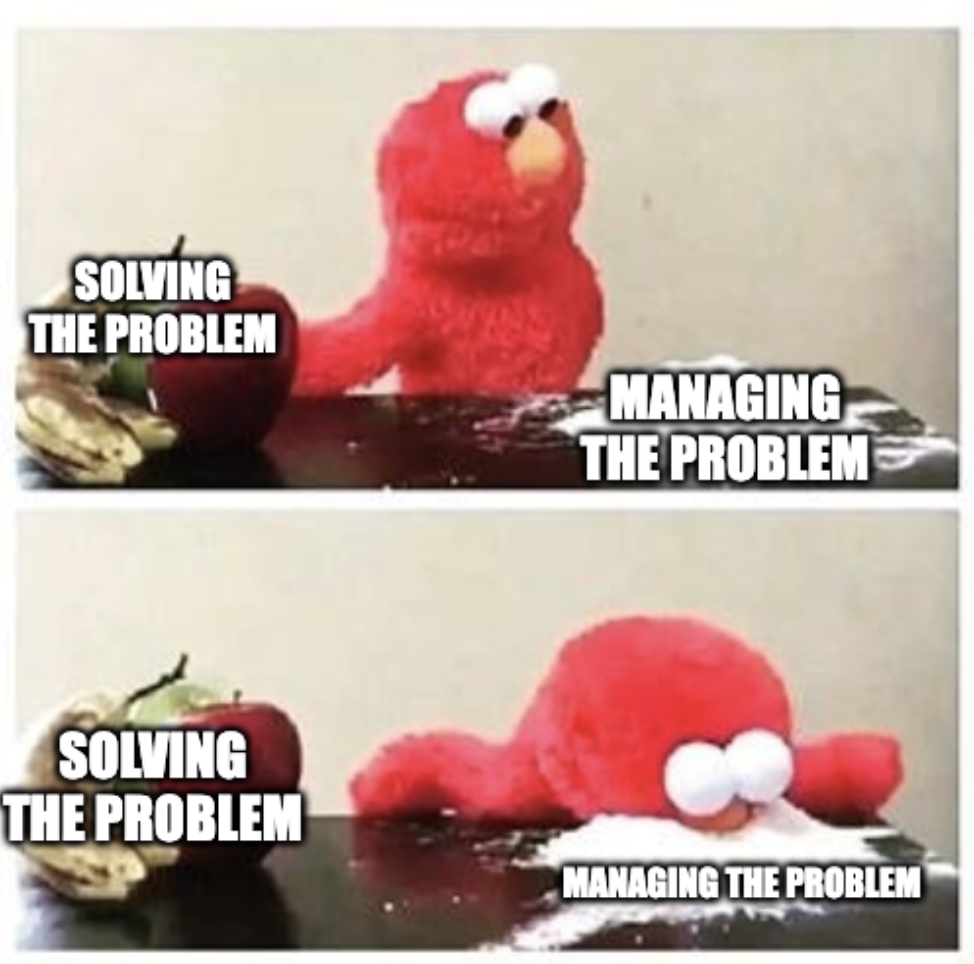

+++
title = 'Managing Problems'
date = 2026-10-02T22:34:21+02:00
lastmod = 2026-10-02T23:52:40+02:00
description = "Explaining when to manage a problem and when to solve it"
draft = false
tags = ["coaching", "engineering", "advice", "method"]
author = "bjoern"
comment = false
toc = true
image = "cover.jpg"
+++

I don't get a lot of sleep lately. I am constantly a little tired and around 5pm, I start being VERY tired. 
The problem statement is as straightforward as it could be - I don't sleep enough. 

Now, what am I doing about this?
I am optimizing the little sleep I get. 
I take creatine as a supplement (shoutout to scientifically proven supplements).
I do micro-naps.
I reduce screen exposure before going to bed, to improve sleep quality.

In other words: I address the symptoms of my sleep deprivation instead of sleeping more.
I *manage* my problem instead of *solving* it.

## Problem Managers

I bet you have been in a situation before where you faced problem and you knew how to solve it. It was just too much work right then. Feels familiar?
You probably did some band-aid fix, promising yourself to fix it later. 
And the band-aid never fell off, so all good...?

It may sound negative, but it's not. Or at least not necessarily.
There is a huge difference between managing a problem and solving a problem.
While **solving** addresses the cause, **managing** treats the symptoms to reduce their impact.

Both strategies can be valid, depending on the context.
Solving usually is more complex or/and takes more effort - or it is unclear what the actual problem is. 
In my case, I am well aware of *why* I sleep less. And while I could theoretically do something about it, in practice I have very good reasons not to. In my case, treating my symptoms makes more sense for me.

Sometimes a problem ceases to exist over time. 
Imagine a backend service that has a bug. 
Every week we need to manually correct the database entries for ten users. Fixing the issue would take about 3 weeks. 
However, we already know that in 3 months the whole service will be refactored and the problem will cease to exist in the first place. Holding out until then may make a lot of sense. 

Responding to an incident falls into the "managing" category as well. 
The first order of business during an incident is to "stop the bleeding" - nullify the impact of whatever happened.
This may mean switching third-party providers or deactivating a feature temporarily. 
Sometimes it may mean fixing an underlying technical cause, but this is then a means to an end.
You don't sit in an incident and decide to go full in on root cause analysis and fixing, you need to reduce impact fast.
You manage it.

## Problem Solvers

However, only managing problems will only get you so far.
Every problem we decide to manage creates what we commonly refer to as **debt**.

Most debt needs to be paid at some point and usually you cannot control when. 
Worst case all your debt needs to be addressed at the same time. 
It may also create new problems that you need to address - imagine the edge case mentioned before increases from 10 users per week to 100 users per day. Suddenly your engineers don't spend 30min once a week, but daily to address this. 
Or the planned refactor gets descoped and will be done next quarter. 

Sooner or later you sit neck deep in toil work. 
Managing has its place, but the choice must be conscious. 
For each problem you must decide: will I solve it or manage it?

The default choice should always be: Solve the problem. 
Only if this does not work for a reason that is convincing (and be honest to yourself and your team), then managing the problem is a strategy to look at. And it should always be temporarily - Make a clear plan for which conditions must be true for you to evaluate again. 
Some commonly used conditions I have seen in real life:
1. Check again in 1 week
2. If the number of bug reports doubles
3. If we touch this feature again

The last one is a bit tricky. Usually solving the problem takes effort and when we touch a feature again, we work against some kind of deadline. Then, solving the problem might be put on the long road again. And again. And again. Meh. 

## The Trap Of Lower Effort

One of my favourite failures was with a feature where users reported issues consistently. 
There were various smaller root causes, so I decided that instead of addressing each of them, we start by introducing an automatic process that auto-heals the user data. Then fix the root causes whenever we can spare time.

Would new failures show up? 
100%, we didn't fix anything after all.
Would we be able to quickly address them? Yes, that's the goal. Increase user satisfaction be being responsive and fast.

3 days of effort were spent on this idea. We tested a prototype on a few reports and it worked. 
Spent 3 days again to roll out to all operations agents. 
And it didn't do shit for other use cases. In some weird way of life, the "fix" worked only for certain use cases, but not for all others. And for the use cases that it **did** help for... well, we could have solved the root causes in 4 days (which we did).
So 6 days spent for a worse UX, 2 more than needed for better impact. 

And the part that really hurt? It took another day to remove that process again. Ouch.
What looked like a smart strategy in the beginning turned out to be a waste of time. In this case we could have tested the prototype against more use cases. 

Well, we have hindsight bias here, because we know the outcome already. When you have to make the decision, you will not know.
But what I am telling you: managing the problem most of the time looks easier and more controllable. Keep in mind that neither might be true. When you make your decision and you decide to manage the problem, make sure to have clear stop conditions.
