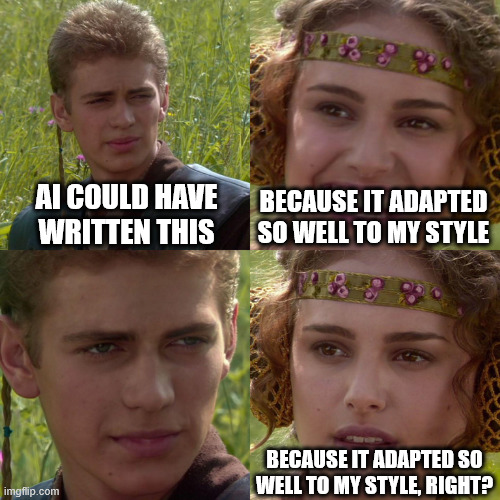
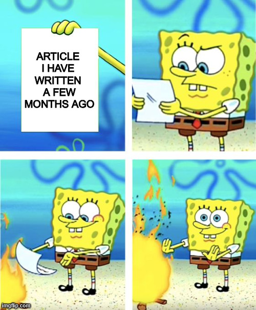
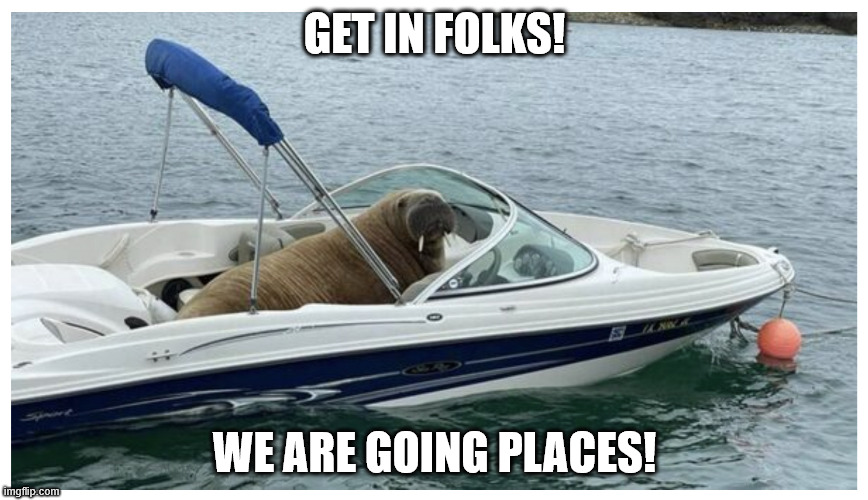

+++
title = 'Code And Cake'
date = 2025-04-12T05:52:00+00:00
lastmod = 2025-04-12T05:52:00+00:00
description = "Finding my writing voice"
draft = false
tags = ["writing", "meme"]
author = "bjoern"
comment = false
toc = true
image = "cover.webp"
+++

It's has been a full year since I started my blog. 
About time to write a "Hi welcome to by blog" piece!

Writing was something I wanted to do for a long time, but it felt like such a huge task that I kept procrastinating.
What could I write about? Would it be enough to actually have a blog running? Would I have enough time?
And what if nobody likes it?

Looking back now, finding something to write about actually wasn't that hard once I got started. 
I have since writen 15 articles, which was a lot of fun. 
Yet looking through them now they are... super generic.
Like wow, I fully stand behind the content, but I didn't enjoy reading them again. 
And how much does that say if I am not enjoying reading my own stuff?

## Everything-ChatGPT

One of the key moments was my last article, which started as content preparation for a workshop. 
Since it was a workshop about using AI-support tools, I tested some of the prompts and workflows with these notes and it started to shape into something that I deemed worth sharing.
I was quite impressed at first: not only did it work quite well, the tone also was fairly close to my previous articles.
Looks like the model did a good job there! Published and away with it!

Over the next weeks I came back to this thought more than once. 
And I think I got it backwards - It's not that the model did a great job replicating my writing style. 
It's that my writing style has become so generic that it was no big deal to create something similar with a LLM.
Just another fish that swims in the big sea of "LOOK AT MY POST IT WILL REVEAL HIDDEN TRUTHS TO YOU WE ALL KNOW"-LinkedIn.
Things I wouldn't enjoy reading that much. 

Now I am contributing to it.

I mean, just look at it, I started adding "conclusion" sections to my articles. What am I, a scientist writing white papers?

How did that happen? 
Because I want to be professional! 
And apparently I interpreted that as: Reduce humor, no sarcasm, memes yes please but keep them low and follow certain structures to keep the readers engaged. 
But "engaged" does not mean you are having fun while reading. It does not mean you learn anything. 
It just means you keep reading. 

## Finding My Voice

This is not me and I don't want to keep doing that. 
But then, what do I want to do? 

I want to have fun. I used to have more fun.
I want people to learn things. I used to teach through fun, memes, laughing and serious underlying messages.
And if I have fun, I don't need 10k monthly readers. To be honest, I don't need 100. 

I have another blog with a podcast that is extreeeemely niche and runs since 2015. 
Average listeners per month? 31. But I enjoy it a lot (well, 80% of the time).

Where has my "drive" gone? 
Why did I stop being me?
Can I just start again?

Fucking yes!

## Code And Cake

We never spoke about why this whole thing is called "Code And Cake". 
Let's change that. 

When I started doing interviews for my current company, I noticed a lot of candidates where more nervous than me during the calls (funny, wasn't I the impostor here?).
To help them, I concluded the first part of the interview with the sentence: "And after that we turn things around and you can ask me whatever you want to know - Be it about engineering culture or what's my favourite cake, it's really up to you. The cake answer will take a lot of time though."

This usually came as a surprise and caused some laughter in most use cases, after which a lot of the stress was visibly gone. 
It worked so well, that it become my go-to phrase. And by doing that, the cake question also became a symbol to me - That we can be serious, we must be serious most of the time, but it does not mean we can't have fun and enjoy it. 

Every serious discussion, every serious piece of code, goes well with a slice of cake. 

## More cake please

That's where we stand, but where do we go from here?

Very simple - I will just continue writing, but play around with it more. 
It will probably be weird sometimes and some things will feel awkward (hopefully not to you).
But since you tagged along for this entire post, I assume you are in for that. 
The principle of sharing learnings will stay. I will just throw more fun into the pot and stirr it strongly.

Let's see together what comes out of the oven.

