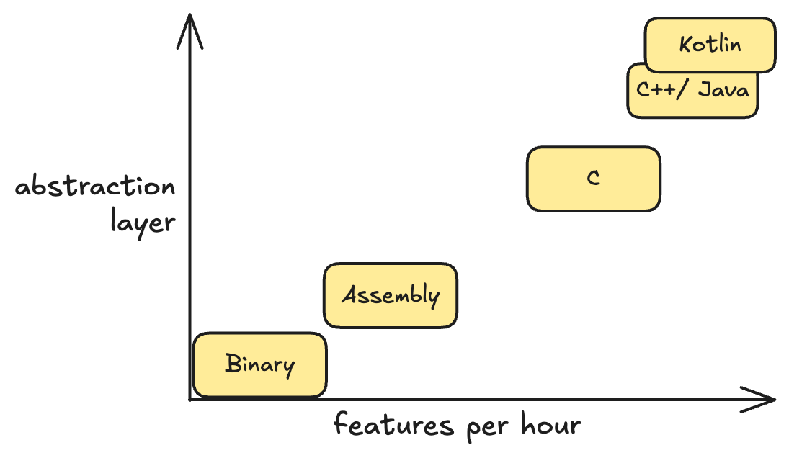
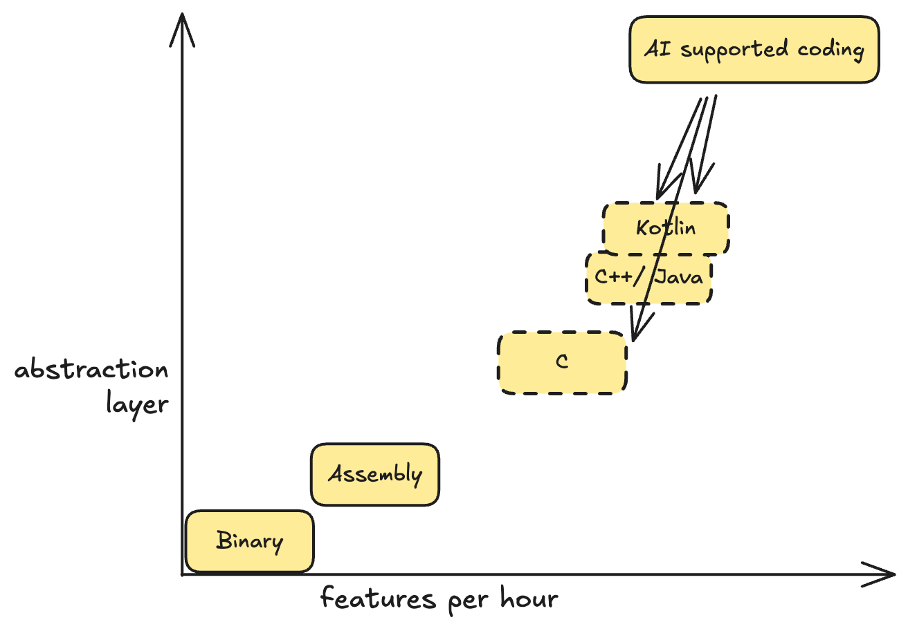

+++
title = 'Can AI Replace Me?'
date = 2025-03-03T14:12:00+01:00
lastmod = 2025-03-03T14:12:00+01:00
description = "When AI-supported coding is great and when not"
draft = false
tags = ["chatgpt", "coaching", "engineering", "ai-coding", "copilot"]
author = "bjoern"
comment = false
toc = true
image = "cover.webp"
+++

Isn't it amazing how many of our daily problems we can solve using AI these days?
Especially the field of software engineering, where you need to transform product requirements to code, seems like a perfect use case to fire up an LLM to do the heavy lifting.

Considering that, it's no surprise to see articles like "Is there a future for software engineers?" or "How close is AI to replacing developers?" pop up in our feeds. 

But how close are we? Do I still need to hire junior engineers?

## The next higher level

When I studied computer science, one of my professors insisted on us learning to code basic programs in Assembly.
Their reasoning was that it is nice to know "modern" languages like C95. But if you don't understand what happens under the hood, you will make mistakes. 

Interestingly enough, another professor said the same when they taught us C95, but this time the "modern language" was Java. Guess what my third professor explained when teaching us the basics of Java... 

The morale of the story is - All these languages do is they are creating a more and more abstract layer to the actually executable code. 
With Assembly, you don't have to write in zeros and ones, but you still are limited in how you can express yourself. Transforming an idea into code takes a lot more effort to write.
That means we can compare them by how abstract the languages are, compared to writing binary code, and how many working features a developer can output in the same timeframe.

The appeal of higher level languages is that you no longer need to care about the low-level concepts as much as before. 
Creating a hashmap? Fairly straight forward in Java, will require some work in Assembly. 

LLMs are not changing that. 
Instead, they are taking another step, abstracting things to a new level and allowing them to output more in less time.
Which doesn't mean that you can forget about the level below that - Because similar to Java code transforming into Bytecode, the LLM will transform a prompt into code. 
You still need to understand what you are doing, you still need to confirm that what the LLM is giving you is what you wanted. 
The more you understand what is going on a level lower, the faster you will be able to find and fix issues that arise. 

## Constraints, constraints, constraints

Since LLMs are transforming input into output, that means they have the same constraints that other high level languages have. And maybe some more. 

The most important thing to understand: The LLM does not think.
We call them agents, but they have no agency. 
While the chat interfaces and ways the models respond make it often seem like we are talking to another human, it is extremely important to always remember that this is not the case.

My mentor likes to say "Talk to them like you talk to a Junior engineer" but I disagree with that. A junior engineer will eventually understand what I mean - LLMs can be fairly stubborn regarding that. A human (typically) also has a way better memory to remember things and, most importantly, connect dots - Which is what we call learning. 

If you tell an LLM to do something specific and remember to not do something else, you cannot count on it remembering this constraint next time. You need to somehow make sure the constraints are always present. There are ways to do this, e.g. by putting coding guidelines into your repositories. 

But it does not change the fact that for the next few years, you will be better at writing code with prompts, if you understand how to prompt. 
Which is what we generally call "prompt engineering". 
The "engineering" part there is not a coincidence. 

Also, how useful a model is will depend a lot on it's training set. If you need to achieve things that have not been done before, like high-performance systems, an LLM is very unlikely to be of use - Because it is training on openly available data and if you try to get something from it that isn't there, good luck. Like we said before, learning isn't really a thing for LLMs.

## So? Will AI replace me?

It depends. It depends on what you are currently doing - If you are a "transforming engine", getting product requirements from tickets and implementing them without any feedback required, then yes. This job will likely fade in the future. 
If a single engineer in this position can achieve as much as 5 engineers, why have 5 engineers? 

On the other hand, if your job includes shaping the requirements, to discuss what is and isn't possible, to design systems (or if your company just has a shit load of work to do) then the answer is a different one. Then more focus will be put away from transforming and moving to defining constraints, discovering unknowns and understanding how to scale systems. 

And lastly, having an LLM to support your coding is exactly that - It supports. 
There are tons of cases, e.g. for a small one-line change, where typing a working prompt is slower than changing the code directly. From my point of view, the engineers who are currently most productive using LLMs know their code well and have a good feeling for when a prompt (and potential follow-up prompts) save time versus when they consume more time. 

This also means that we will need fresh engineers, who then work their ways up to the top. I think AI-coding will be disruptive to software development, but more in how we work rather than working instead of us. 

## Get aboard the ship

In conclusion, I don't see AI-supported coding going away anytime soon, if at all. 
Rather, it will present itself as a new way of working. 

The best engineers won’t be those who resist change but those who embrace it, mastering the art of working alongside AI rather than being replaced by it. 
This is your moment to sharpen your problem-solving skills, refine your system design expertise, and level up your ability to harness AI’s power efficiently.
Learn how to craft better prompts, understand the underlying constraints, and explore how AI can amplify your impact.
