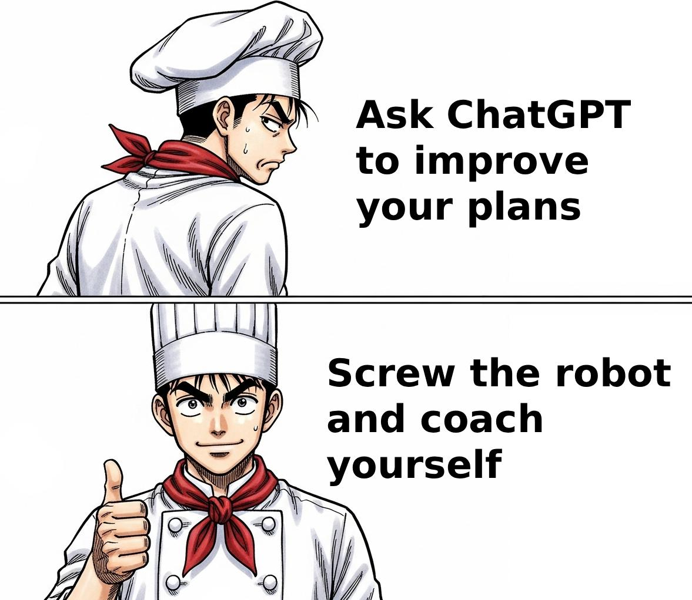
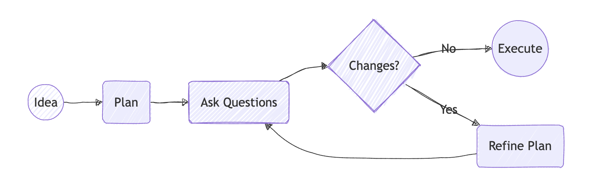
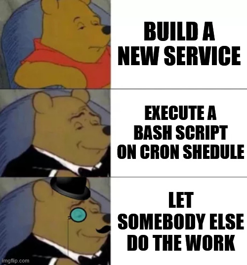

+++
title = 'Asking Critical Questions'
date = 2025-08-17T08:26:21+02:00
lastmod = 2025-08-17T08:26:21+02:00
description = "Become your own best critic and improve your ideas"
draft = false
tags = ["coaching", "growth", "learning"]
author = "bjoern"
comment = false
toc = true
image = "cover.jpg"
+++

The human brain can be a wonderful thing. And it can be tricky. When I recently played around with a few AI tools, I noticed that they can be very helpful during brainstorming.
I express an idea and prompt the model to ask me critical questions about my input.

It was great, the first few prompts pushed out questions where I was honestly surprised how helpful they are.
I repeated this for more ideas and plans. And, bit by bit, I noticed a pattern: the tool sucks, but my brain is great at giving these generic questions meaning.

## Sneaky AI

The model wasn't actually good at being critical (surprise!). Which makes sense, after all it doesn't "understand" what I am proposing.
What I perceived as deep questions at first were nothing more than a set of general questions, tweaked a bit to apply to my prompt.

Because these questions were so general, I started giving them meaning and applying them to my problems and ideas. I was doing the actual work. Lazy model... on the other side, it means I don't need the model. I just need somebody to ask me these questions.

## Be your own critic

I also realized that these questions are awfully similar to the ones I would ask the engineers in my team for their ideas. 
Which is great, because it means there is no secret behind them - You can take any idea and make it better quickly by asking yourself the same few questions. 

Oh, look at that, I removed the need for another party in the ideation process!

The plan is very simple and works the same way for analyzing how a past project could have improved or how you can increase chances of success for a future project. You start with something you have done or plan to do. Then you go through the list of questions and try to answer each question as honestly as you can. Be critical, but don't be mean. If you don't know an answer, note that down as well - It means you should invest some effort to figure out the answer.

## Focus on Outcome

I recently thought about an automated way to hit all user-facing APIs for a service on our test environment. 
My goal was to create a report regularly, that indicates breaking changes in the flow. 
My first idea was to write a new service that calls a defined set of endpoints, keeps track of the state and then continues.
If something failed, an alert would be triggered.

I was excited about this idea, though it would take some time to build this thing.

Going through the questions, I realized that this is too complex - I could also write a bash script that cURLs the endpoints and execute the script with a cronjob. No service setup, no boilerplate code. Instead of 3 days of work, this would take me a few hours (and probably a few more to address the issues I find on the way). Or potentially a few good prompts.

However, when I continued going through the questions with this updated plan, I realized that I have heard this idea before! Another team already built a script that goes through a different flow once a day, automatically. They were doing it for a different purpose, but with a small tweak I could implement my target flow and have their script generate the reports as well - And I would be done. This would take me around an hour of work. Engaging with the team and talking about the change I also learned that they liked the idea and offered to implement it for me. Suddenly my cost sunk to a 15min talk.

Not going for the first plan has saved a considerable amount of time with the same outcome. It's less shiny, less to brag about, but the outcome is the same. I also admit that it is less fun, but I can invest the time elsewhere.

## Ask critical questions
The following section contains a list of questions that I regularly use to double-check on my own ideas:

### Goal-setting
If your goal is not clear to you, you will have a hard time understanding whether your plan actually goes into the right direction. 
- What problem are you addressing?
- What is the goal? Can you describe it in a single sentence?
- What will change if you succeed? Can you measure the change?
- How do you know you reached the goal?
- What is the condition to cancel the project and not invest more effort?

### Investment
Often it is important to understand the costs of a change - Sometimes it might be not worth the effort. Also, we tend to think more extreme and over-value the best and worst outcomes, while the most likely outcome is neither.
- What is the best possible outcome? 
- What is the worst possible outcome?
- What is the most likely outcome? 
- How can you shift odds towards a better outcome?
- What is the return of investment? Is the likely outcome worth the effort?

### Handling Failure
It is important to understand the impact of failure. Could it block a potential promotion, or would it only waste time?
- Which assumption are you making that, if incorrect, results in failure?
- What happens if you stop?
- What happens if you finished, but don't reach the goal?
- How do you define failure?

### Support
Almost all changes with high impact cannot be done alone. Understand who is with and against you, as well as their motives, is critical to shape your plan and increase the odds of success.
- Who are you supporting with this change?
- Is anybody supporting you? If yes, why?
- Is anybody opposed to this change? Why?
- How can you get more support? Is it worth it?
- How can you decrease opposition? Is it worth it?
- Instead of doing it yourself, can you support somebody to do it?
- Is somebody else doing something similar right now?

### Context
History teaches us so much. Check if somebody has attempted something similar before. Was it successful? What have they learned?
- Has anybody attempted to do this before? What was the outcome?
- Is there anything to build upon or do you start from scratch?

### Timing
Some changes have a critical time window in which they make sense. If your problem will fade in the near future, this influences your decision on whether it is worth doing it now or not.
- Why is the change needed?
- Is the change needed now?
- What happens you post-pone a few months? Would it change costs?
- How long will you work on this?
- Which external factors can influence your plan?

### Complexity
To me, this is the most important part. If you make your change more complex than necessary, this will influence every other aspect.
- Are you making things more complicated than necessary? 
- Is there a way to reach the goal more efficient?
- How would this work if it was simple?
- If you slightly change your goal, can you simplify the plan?

## Conclusion

Asking yourself critical questions is a skill that can feel like magic, because it helps you focus on the weak points of your ideas. It will be uncomfortable to ask yourself hard questions, but if you don't do it, somebody else will (and that might feel even more uncomfortable) or, worse, nobody does and you end up in situations that wasted a lot of time and energy.