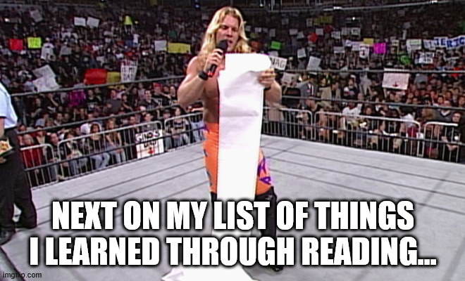
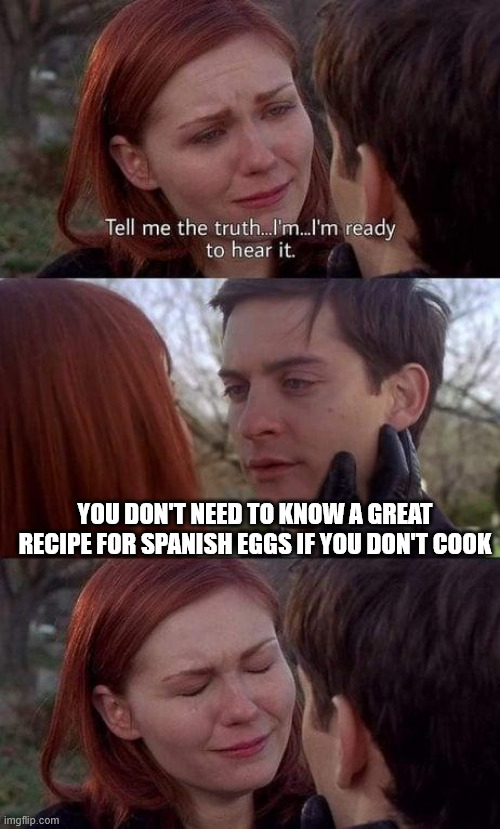
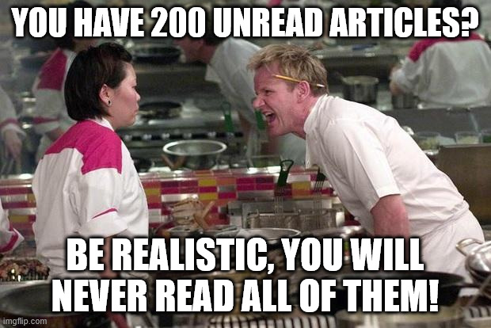
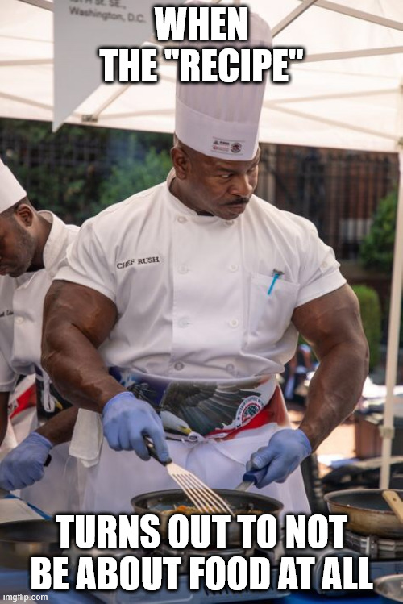

+++
title = 'Recipe: Crunchy Curated Reads'
date = 2025-04-21T06:00:00+00:00
lastmod = 2025-04-21T06:00:00+00:00
description = "Unlocking reading as driver for growth by using newsletters efficiently"
draft = false
tags = ["coaching", "growth", "newsletter"]
author = "bjoern"
comment = false
toc = true
image = "cover.jpeg"
+++

Hello chefs, 

today we will be making some crunchy curated reading lists. 
They match perfectly with a desire to grow and are quick and easy to make.

Here is what you will need:
* 15-60 min per week
* an e-mail address (RSS reader might also work, but could be more work to set up and find things)
* the mental strength to mark things as read without reading them
* time to reflect on what you want to learn

To be efficient, let's dive into the recipe directly and talk about the what and why afterwards.

1. Decide whether you want new reading material to be pushed to your inbox or if you are on the more anonymous side using an RSS reader. It does not really change the recipe, but most publications today focus on getting email subscribers, finding the RSS feed will require a little more work
2. Find a starting point, a publication or even a curator that matches your interests, and subscribe
3. Over time, you will probably find more and more things to subscribe (e.g. through recommendations from your first subscription)
4. Make sure you subscribe only to so many source that you can follow up. If you start just skipping through articles, you will learn less (if anything) than compared to taking some time to think about it
5. Only read the things that sound interesting. Be brave and delete/mark as read what doesn't sound like it will benefit you. Don't aim to 100% anything here

> Tip for RSS readers: You can get the RSS feed for any substack publication by appending `/feed` to the base URL.
> For example, to get the feed of this publications, use `https://codeandcake.substack.com/feed`

## Why?

Every good recipe traditionally comes with a super long story that sometimes has nothing to do with it. 
I remember vividly how my grandmother... no, jokes aside, you should really invest some time into reading.

Learning is fundamental to growing, and reading is one of the best ways to learn. Being able to read and write has changed how we process information as humanity. Almost all skills can be taught by reading. You won't master them, but it's a start. 

To me, that concept still is astonishing, how much wisdom you can unlock by just ... reading.

Reading has only one downside - it takes time. And time is the only resource that you can only invest, but never receive. This brings up a very simple question for every written piece - Is it worth reading? Is it worth my time?

## Interesting versus Insightful

There are millions of good pieces out there. So many books worth reading, so many articles worth opening.

You need to constantly ask yourself:
- Does this "just" sound interesting or can I actually learn something?
- Will something stick with me? Yes this is basically the same question as above, I want to double down on it.
- Is there a chance I will enjoy reading it? (In this case it's fine if you don't learn anything)

For example, reading an article about how exactly the atomic clock works is interesting to me. And I will probably learn something. I will keep that for a day, maybe a month. But if I can't make use of that knowledge (and be it just to tell it to others) it will fade. It may still bring me joy and be worth it, but when I have a huge backlog of things I want to read, I better pass on this one.

An article about different strategies to run a database migration? This is something I may actually make use of soon. The chances are higher I can apply some insights and translate them into learnings for myself. Bonus points if it is an enjoyable read.

### Make Decisions Fast

Back in university, I asked my professor how he was able to read dozens of science papers every week. His recommendation was very simple:
1. Read the conclusion first
2. If the conclusion seems interesting, read the abstract
3. If both abstract and conclusion are interesting, put it the "read this week" stack
4. Once filtered through all papers, reduce the "read this week" stack to 3 papers at most by stack ranking them

You don't have to be that strict, but you get the idea: decide fast if an article is worth reading. If not, don't read it. Avoid the need to complete.

## Curated Lists

With the sheer amount of literature available via the internet, it is impossible to "read everything". Luckily, you don't have to. There are services and people who are curating content for you. So instead of going on a hunt for the next fresh article, you can trust these people to offer a good selection to you.

This is very helpful, but shifts the problem a bit. Instead of finding good reading material, you now look for good curators. A match highly depends on your context. Following somebody that recommends literature to become a better leader probably makes less sense than following a curator for hands-on engineering articles if you are early in your career.

### Recommended curators
- [Programming Digest](https://programmingdigest.net/) is delivering a short list once a week, along with a summary of the article in question. Articles are mostly targeted at individual contributors, sharing use cases and insights into software technology.
- [Leadership in Tech](https://leadershipintech.com/) from the same publisher as Programming Digest, but focused on engineering leadership and managers
- [arXiv Digest](https://arxivdigest.org/login), a curated selection of the latest preprints from arXiv, a repository of electronic preprints in the fields of physics, mathematics, computer science, quantitative biology, quantitative finance, and statistics.
- [software lead weekly](https://softwareleadweekly.com/), featuring the best articles on leadership, management, and engineering culture.

### Recommended newsletters
While writing this article I realized it isn't so easy to find curators these days. 
To get you started anways, here are some individual newsletters I recommend:

- Engineering
    - [RDEL - Research Driven Engineering Leadership](https://rdel.substack.com/)
    - [Lenny's Newsletter](https://www.lennysnewsletter.com/)
    - [The Human Engineer](https://thehumanengineer.substack.com/)
    - [Fight For The Human](https://www.fightforthehuman.com/about/)
    - [The System Design Newsletter](https://newsletter.systemdesign.one/)
- Physical and mental health
    - [Arnold's Daily Newsletter](https://arnoldspumpclub.com/blogs/newsletter)
    - [Rooted & Rising](https://adrianaev.substack.com/)
    - [Jeff Nippard Fitness](https://jeffnippard.com/pages/newsletter)

## Become a curator

Following others is a great start and over time you will become a curator yourself. 
Curating your own list of newsletters, blogs, and other resources can help you stay focused on what truly matters to you and your professional growth.

### Why Become a Curator?

1. **Personal Relevance**: By curating your own list, you ensure that the content you consume is highly relevant to your specific interests and goals.
2. **Focused Learning**: Curating allows you to focus on high-quality content that aligns with your learning goals, making your reading time more efficient and productive. It also reduces noise from other sources.
3. **Sharing Knowledge**: As you curate valuable content, you can share it with your peers, colleagues, or a broader audience, contributing to the community.

## Keep Reading

The key message of this article is: Be conscious of the things you read and why you read them. If it is for joy, there is nothing wrong with it. I spent 3 hours with an old adventure book from 1982 yesterday. I will have forgotten most of it next month, but I enjoy it so much (and this enables me to read it again in 3 years, I am almost certain I have read it before a few years ago. Yay!). Just be conscious about what helps you grow, what sparks joy and what does neither.

When your goal is to be efficient, start by thinking about what would help you. Switch from just consuming what is being thrown at you to selecting what makes sense. Even if this means skipping some articles and newsletters. If you miss something, that is also fine. I believe the right thing will come to you at the right time.
This also includes regularly going through your subscribed newsletter and removing what isn't matching your interests anymore or doesn't add value now. 

## Actionable Steps

1. **Identify Your Goals**: Determine what you want to achieve with reading.
2. **Be Selective**: Prioritize reading material that is insightful and applicable to your context.
3. **Allow for Joyful Reading**: Make time for reading purely for enjoyment without guilt.
4. **Reflect and Apply**: Regularly reflect on what you read and find ways to apply the knowledge.

Just keep reading. You will keep learning.

