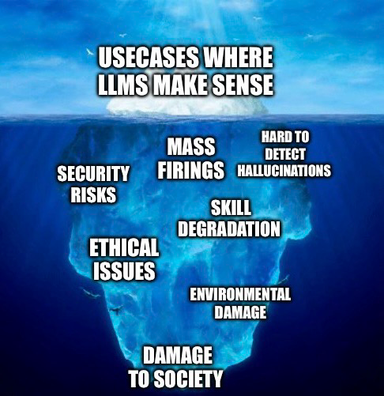

+++
title = 'Cupcake #1: AI'
date = 2026-05-17T15:47:21+02:00
lastmod = 2026-05-17T15:47:21+02:00
description = "Newsletter: On whether AI will have an impact on our future"
draft = false
tags = ["newsletter", "ai", "llm", "cupcake"]
author = "bjoern"
comment = false
toc = false
image = "cover.webp"
+++

Aside from writing about life and engineering myself, I also regularly consume things other people have written. Very often I am astonished by the crazy or cool stories that one can find out there - the internet has become a darker place in recent years, but there are still bright spots of light out there.

Going forward, I will use this section to share things that excited me once per month, along with some personal thoughts. When possible with a focus, but time will show how we can make the best out of it. Let's go!

## Cupcake May 2026 - AI

It is impossible to take two clicks in the web without stumbling across the AI topic. 
Whether it is creating an image, your browser offering to summarize a websites content or discussions about AI agents changing our ways of working forever - It is omnipresent. And every topic that takes that much mental space in peoples brains has many facets that want to be discussed. These 8 links are pieces I recommend reviewing:

1. [Research-Driven Engineering Leadership - How can engineering leaders assess their AI maturity?](https://open.substack.com/pub/rdel/p/rdel-136-how-can-engineering-leaders)
2. [Hiddenlayer - Malware in trending hugging face repo](https://www.hiddenlayer.com/research/malware-found-in-trending-hugging-face-repository-open-oss-privacy-filter)
3. [Kent Beck: Genie Tarpit](https://open.substack.com/pub/tidyfirst/p/genie-tarpit)
4. [AI as a Fascist Artifact](https://tante.cc/2026/04/21/ai-as-a-fascist-artifact/)
5. [Maggie Appleton - Gas Town’s Agent Patterns, Design Bottlenecks, and Vibecoding at Scale](https://maggieappleton.com/gastown)
6. [Steven Langbroek - Programming Still Sucks.](https://www.stvn.sh/writing/programming-still-sucks-fqffhyp)
7. [The Pragmatic Engineer - Did capacity shortages turn Anthropic hostile to devs?](https://open.substack.com/pub/pragmaticengineer/p/the-pulse-did-capacity-shortages-0e6?utm_medium=cake)
8. [GitHub Copilot Moves to AI Credits on June 1: Here’s What Changes](https://byteiota.com/github-copilot-moves-to-ai-credits-on-june-1-heres-what-changes/)
9. [AI autocomplete doesn’t just change how you write. It changes how you think](https://www.scientificamerican.com/article/ai-autocomplete-doesnt-just-change-how-you-write-it-changes-how-you-think/)

My personal stand at the moment (which I am ready to change when presented new facts) is that the LLM part of AI, which so far is in 99.9% of cases what people talk about when they talk about "AI", is a super interesting technology with interesting use cases. How we can use this technology and what new ways of thinking are needed is rabbit hole that I enjoy looking into [[5](https://maggieappleton.com/gastown)].
However, at the same time where I see it actually adding value is a minority of what we as society are currently using it for (or better: wish to use it for). 

I could say "Putting aside all ethical and environmental issues" but you cannot put them aside. You need to keep them in mind whenever you make a statement, because otherwise you close your eyes and don't see what is going on, but what you wish was going on. 
Walking through dream land will only work for a while [[6](https://www.stvn.sh/writing/programming-still-sucks-fqffhyp), [7](https://open.substack.com/pub/pragmaticengineer/p/the-pulse-did-capacity-shortages-0e6?utm_medium=cake), [8](https://byteiota.com/github-copilot-moves-to-ai-credits-on-june-1-heres-what-changes/)]. How valuable is an agent that can solve some problems actually, if you suddenly end up paying the same as for a human? The technology is still interesting, but is it still as valuable to you? 

The discussion will move more and more towards the same question we ask for engineering orgs since years - Is this productive?[[1](https://open.substack.com/pub/rdel/p/rdel-136-how-can-engineering-leaders)] Do we actually gain something? What costs do we pay immediately (month per month) and which costs will we have to pay down the line in form of a new type of tech debt [[2](https://www.hiddenlayer.com/research/malware-found-in-trending-hugging-face-repository-open-oss-privacy-filter), [3](https://open.substack.com/pub/tidyfirst/p/genie-tarpit)]?

To be blunt - I don't see LLMs as our big grasp for the future as a society. I think they are a huge threat, if we don't figure out how we can integrate them into our lives without being at constant risk of a model changing our way of thinking [[4](https://tante.cc/2026/04/21/ai-as-a-fascist-artifact/), [9](https://www.scientificamerican.com/article/ai-autocomplete-doesnt-just-change-how-you-write-it-changes-how-you-think/)]. That is not to say it does not offer anything and can't make our lives better - There are great ways to use them for learning and other valid use cases, as I said initially. Good ideas exist. So do the challenges.