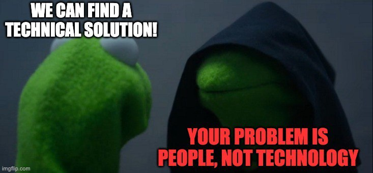
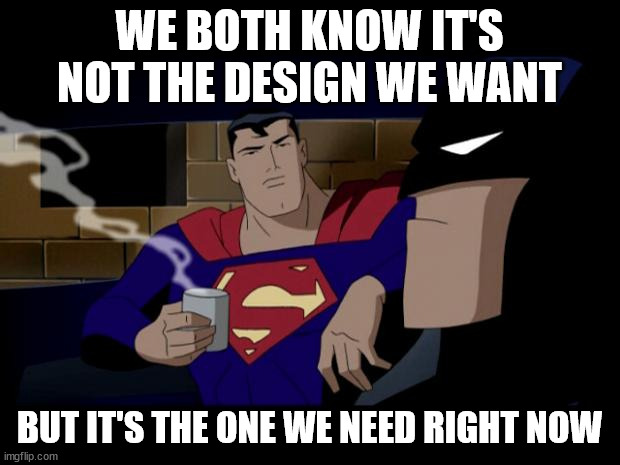

+++
title = 'Designing for Deadlines'
date = 2025-01-18T14:57:00+01:00
lastmod = 2025-01-18T15:00:00+01:00
description = "Crafting Solutions Within Real-World Limits"
draft = false
tags = ["system design", "architecture", "engineering", "devexp", "deadline", "project management"]
author = "bjoern"
comment = false
toc = true
image = "cover.jpeg"
+++

Imagine yourself in a system design interview. 
You have just received the description of the system you are going to build and now an almost blank canvas stares at you.
You can build whatever you want. You have 60 minutes.

## Interviews are not reality

While this exercise is good for many reasons, it always bugs me when there is nothing to start with. 
No existing infrastructure, no other systems that have requirements. 
That's so far from reality. 
Unless you are among the first engineers in a start-up, you are guaranteed to have some limitations. 

Some of them are obvious.
Maybe there is this other service, which can only broadcast its information via a websocket stream.
Or you can only use a specific kind of queue. 

Others are hidden from plain sight. 
Imagine you can choose between different data storage types, but your team only has experience with one of them. Guess what will be chosen if the project timeline is tight? 

And that is the biggest issue. 
In the interview, while you are limited in time to come up with a design, there is no time limit for how long it would take to build said design. The points mentioned above are only an issue, if you have limited time.
With unlimited time, you can take a course to learn about the technology you want to use. You could make changes to the other systems in the eco-system. 

But you don't have unlimited time. 

## Deadlines save the product

While it seems like removing all deadlines would be the solution, this is not the point to take away.
Deadlines exist for a reason - If you release your product months after a competitor, they may have snatched away a big market share already. Missing the deadline for a legal requirement can also result in reputational and financial losses. 

This means two things:
1. Investing effort into reducing set-up time for components increases the solution space
2. You are not asked to design the best technical solution. You are asked to build the best technical solution in the current context, given a limited amount of time. 

## Invest in short-cuts

In an environment where quite a few services already exist one of the first questions is "Should we build a new service or add it to an existing service?". 
While there are great arguments for either decision, another question must be answered first: Do we have time to build something new?

Existing services have the advantage that the infrastructure setup is already done. 
In a project that is already at risk of missing the deadline, spending a few days to set up a new service is too costly. Then there is no decision to make - Building inside an existing service is the only viable option. 

If time has been invested to make the setup of a new service cheap (e.g. a new service can be created and deployed to production in less than a day) that opens up new possibilities. 
If creating a new database takes a few minutes and can be triggered by the engineers, that's a different story than being blocked and waiting for an infra-team to create it... sometime soon.

## Build for context

Building the best technical solution for the current context doesn't mean ignoring future changes that may come. 
It means to acknowledge that we can't foresee what will happen - And build a design having that in mind. 

When I was at an offsite a few years ago, a more senior engineer talked about how we will need to design our system for future changes without knowing what these changes may be. At the time this struck me as an odd thing to say - If you don't know future requirements, how can you design for them?
The key is to design not for a specific requirement, but being open to change according to a requirement without needing to refactor everything. 

Consider the following simplified example: You have a service that manages user submitted pictures. These pictures are either publicly available and can be found via search, or they are private and can only be accessed with their link. 
Assuming we model this as a single entity, we could have a boolean property `is_public`. 
If it is true, the image can be found, otherwise not. This satisfies the requirement, nice. 

However, we know from experience in other domains that this is not actually a binary state. What if the picture should be searchable for some people but not others? It's not a requirement now, nor are there any plans to make this happen - But modelling the property as a type that allows for multiple values (e.g. a enum string or an integer) gives us more flexibility in the future. 

In high level system design, the same thing applies. Maybe there is a direct connection between two services now. But if I can already see the potential creation of another service that will join the communication, a restful connection might not be as good as an async connection.

## Conclusion

System design is as much about context as it is about creativity. 
While interviews simulate ideal conditions without boundaries, real-world constraints like deadlines, existing infrastructure, and team expertise shape our decisions. 
Striving for perfection in a vacuum isn't the goal; building the best possible solution within these boundaries is.

Investing in tools and processes that reduce setup times can dramatically expand your options. This isn’t about cutting corners, it’s about designing with flexibility and future changes in mind, while staying realistic about what can be achieved within given constraints.

Ultimately, great system design balances present needs with the unknown future, embracing the limitations of time as a guide, not a hindrance. By preparing for flexibility, we can build systems that adapt gracefully, meeting today's demands without sacrificing tomorrow's potential.