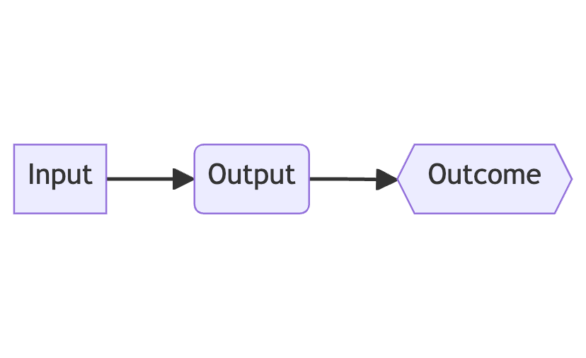
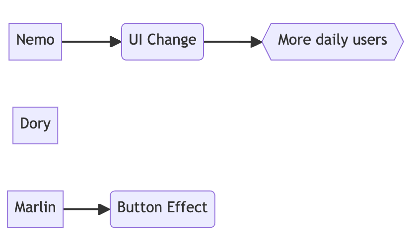

+++
title = 'Do More With Less'
date = 2024-07-05T12:00:00+01:00
lastmod = 2024-07-05T12:00:00+01:00
description = "Maximizing resources to be more productive as a company"
draft = false
tags = ["management", "strategy"]
author = "bjoern"
comment = false
toc = true
image = "cover.jpeg"
+++

In recent months the tech sector has seen a massive increase in cost-cuttings and layoffs [1], often paired with the statement to "do more with less" [2]. 
This also affected my current workplace and in a recent discussion with a manager from a different company I answered "We are currently trying to do more with less". Which was answered with friendly criticism: "What is it supposed to mean in the first place? Every task needs a minimum amount of people. Having less people just means you will get less done. It is a fake argument to fire people and demand the remaining teams to deliver the same projects without problems. It is a recipe for burn-out and low morale!"

Being fully honest, I did not know how to respond at that moment. I felt like there was an underlying assumption which I could not grasp, but it was different from my view on things. So did both - I agreed and disagreed. 

## What are we talking about?

On my way home I kept thinking about this conversation. Until I realized that the difference in point of view was probably at the very beginning - The definition of "More" and "Less" when attempting to do "More with less".

The issue is that with the subject missing, everybody can interpret the sentence as they see fit. To resolve this, we can just add the subjects and be explicit. In the context of the discussion the explicit description of the second half is "with less employees". I think the even better fit is "with less money", as this include time and non-people costs like infrastructure costs. 

The more interesting question is how we use "more". From my perspective, there are two very different words that make sense:
1. More Output
2. More Outcome

While I was speaking about "Deliver more outcome with less money", the other manager was speaking about "Deliver more output with less money" and specifically with fewer employees.

## Output versus Outcome

While output focuses on how many things are produced, outcome is about the effect of these things. You can make a very nice chain from your input to outcome.

The tricky thing is: This is not a 1:1 relation. You can have a ton of input and output, but maybe just a small outcome. 

Let's look at a simplified example. We are developing a nutrition app, where users can track their calories. In our example we look at 1 month. We have 3 teams, Nemo, Dory and Marlin, so our input is 3. Team Dory is working on two features at the same time, which causes a few communication issues and delays both projects. The other two teams deliver on time. Out output is 2.
Team Nemo built a new user interface for logging that reduces the taps needed to track food by 60% and increases daily active users by 15%. 
Team Marlin built a new effect for buttons, showing a faint glimmer every now and then. The analytics show that users are 2% more likely to click the buttons when they have the effect. It is nice, but it does not affect the metrics. 
So only team Nemo produced something of value.

While we had 3 teams working for the same time, only one produced something with tangible a outcome. It is a simplified example and we could now start to argue that Dory will deliver two projects later or that the actual outcome of team Marlin is a learning. But that is not the point here - The point is that we have decided to do "More with less", to maximize outcome. 

From the corporate perspective we can now decide - Do we need 3 teams if two don't support the KPIs we are looking for? If we are on a tight budget or even making losses, this might be a good decision to save the company. If we have a budget, then we should ask ourselves why the other two teams did not produce a tangible outcome. Did we set the wrong north stars? How are the teams structured, are they set up for success? Was it an issue with prioritization? Is a team maybe dealing with so much TOIL work that they cannot make any progress on other topics?

There is usually no easy answer, but it is worth assessing the situation. 

## How To Do More With Less

We know about output, outcome, but how can we use that to actually do more with less?
It depends on how much time we have and want to invest. If we are tight on time, then we need to figure out which projects and initiatives have the highest chances of moving the needle. What is most likely to produce a positive outcome? This may mean taking short cuts, setting aside topics that are personally important or starting discovery on a topic from scratch to make sure that we focus on the right problem. It may also mean that we move people between teams to allocate them to where they can have more impact. 

These things are temporary and not sustainable over longer periods of time. But what if time is not a major problem? 
If we can afford to invest resources and time into long term planning, then other things could help. Improving CI/CD pipelines - If your developers spend hours per week waiting for a local build to finish to test their changes, that is dead time. If you remove this wait time, they will have less context switches and be more productive. They may finish their project sooner and start the next afterwards. Alternatively you need two people to work on the two topics and have them finish in the same time because they are constantly blocked. 
Working on communication, hiring another manager to split a big team into two more functional groups. There are many things we can do with the goal of being in a better position next year. You optimize with the goal to make the people you have as productive as possible instead of hiring more and more people. 

## Do More With Less, but not forever

Doing more with less is a transition, not a permanent state. There is a minimum input you need to achieve anything. But the idea is to use every person to their maximum, to increase their productivity, In a way that is healthy and maintainable. 
But to get there you need to define what you want to have "more" of and what you will give "less" for it.

## References

- [1]: [The Crunchbase Tech Layoffs Tracker](https://news.crunchbase.com/startups/tech-layoffs/)
- [2]: [CBS News - U.S. companies announced over 90,000 job cuts in March](https://www.cbsnews.com/news/unemployment-jobs-cuts-layoffs-march-2024/#:~:text=Companies%20are%20cutting%20jobs%20as,Challenger%20said%20in%20a%20statement.)
