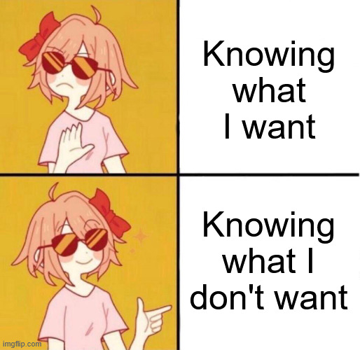
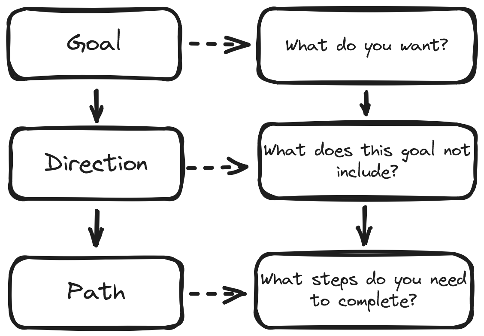

+++
title = 'The Five-Year-Plan'
date = 2025-06-29T20:22:21+01:00
lastmod = 2025-06-30T07:38:00+01:00
description = "A personal collection of actionable steps to unearth the goals you want to achieve"
draft = false
tags = ["coaching", "growth", "learning"]
author = "bjoern"
comment = false
toc = true
image = "cover.webp"
+++

Hey chefs,

today we will be creating a growth vision, a way forward - a five year plan.

You may know traditional recipes for growth plans. 

How much mental work they are.
How easy it is to do them later (or never).

Today we will challenge this with a quiz that will help you pick up speed.

You will need the following things:
- 1 pen
- 2-3 pieces of paper
- a functioning brain
- 10 to 60min time

## Thinking is exhausting

The first time I wanted to write a growth plan for myself was late 2022.
My managers had recommended it to me and it made a lot of sense - unless I define actionable steps, I will just go with the flow and might end up in a place I don't want to be in. 
This not only applies to career, but to life in general.
If I want to grow muscle, I need to follow certain rules, set goals and challenge myself.
That's essentially the same.

I know that. 

Yet it took me until early 2024 to actually write a real growth plan.
Not the pseudo ones to show my managers and say "Yes look, I have a growth plan.".
I procrastinated more than a year. 
Despite knowing how important it was.

Why?
Because it was soooo much work. 
So much mental work to do, so exhausting. 
What helped me finally get it done was blocking 60min time, taking a piece of paper. a pen and starring at 
the blank paper until the boredom became more exhausting than writing a fucking growth plan.
I managed. But if you would ask me to do it again, I have to decline, because this was horrible.

Which makes me think - We agree that having a vision is important. 
Yet among all the engineers I coach, almost none of them has an actual, serious growth plan that takes them further than the next three months.

Recently I was reading "Thinking, Fast & Slow" by Daniel Kahneman.
The first chapter explained how some mental work triggers physical reactions, which
immediately connected with me. 
This was my problem - Writing my growth plan did not only feel exhausting, it WAS really exhausting.

## Goal first, Direction second, path third

Writing your growth plan is surprisingly similar to a shopping list.

When you buy groceries, you can stroll into the supermarket,
buy what looks good and then later think about what dishes you can prepare from it.
It would work, but very likely you will have bought some things you cannot use
or you actually need a few more things for the dishes you come up with.

What would be the most logical thing to improve this?
Think about what you want to cook before you go shopping. 
Write down all the things you need. 
Buy what is on the list. 
That's it.

The takeaway is: if you have a goal in mind, it is easier to see what you need to do to get there.
Figuring out what you want to eat may be hard though.
I usually browse a few of my favourite recipes blogs until inspiration kicks in.
That works for recipes. 

For growth plans it is not as easy, unfortunately.
A growth plan is extremely specific - it takes into account a specific environment, previous experience and personal goals.
You can take a look at other peoples growth plans, but my personal feeling is that it makes it easier to copy goals because they sounds reasonable.
Coming up with your own goals, going through the full thought process, is much more powerful.

My recommendation is to approach the exercise differently - instead of figuring out what you want, figure out what you don't want first.

As an example: 
I could write I want to become a great software engineer.
Vague, but okay. Defining what "great" means is hard.
On the other hand, I can quickly tell you what it doesn't mean:
- I don't want my knowledge of technology to become obsolete 
- I don't want to work in isolation
- I don't want to work on problems that are not challenging

Great, now I know what I need to avoid. 
And I can start building milestones towards these goals. 

I find these kind of lists easier to compile, but this is a personal preference.
If you are different, go for what works for you. 

## What should I eat?

You may have noticed that I skipped an important step. 
The previous example already had a goal (becoming a great software engineer).
What if I don't have one yet?

Instead of offering my own words, I want to share this excellent advice:

> Uncommon advice:
> If you don't know what to pursue in life right now, pursue yourself.
> Pursue becoming the healthiest, happiest, most healed, most present, most confident version of yourself.
> Then the right path will reveal itself.
>
> Source: https://substack.com/@alaex/note/c-108058833

What would the best version of your current self look like?
Every statement creates a requirement, which again creates more low-level requirements.
This allows you to define your short and long-term goals.

The statements do not only cover your professional life, think about everything you want to achieve in your whole life.
Work does not exist in isolation, nor do your other goals - Together they form you.
And they affect each other: 
- If you want to live in Spain, working for a company with 100%-in-office policy in Amsterdam would create a conflict. 
- If you want to run a marathon, you need to train. Working 12 hours every day screams conflict as well. 
- Getting a professional certification may require spending additional hours in the evening, which can cause conflicts with friends and family

Again, this is very personal and hard to give you guidance in written form.
Start with things you like to do.
Do you want to do more of them? 
Or get better?

### Example: Fitness

Let's go through an example.
I want myself in five years to be at least as fit as I am now.
Yeah, that would not really be reaching high enough, so I want to be fitter.

What does "fit" mean? 
It could mean a lot of different things.
For me it means being able to carry heavy weight and  being able to throw heavy weights in the air multiple times.
I want to be able to crouch, jump and do movements that put stress on my joints without hurting myself.
Or, to rephrase: I want to play with my kid. 

This goal does not require me to run long distances multiple times per week.
I don't need to do deadlifts, bench press and barbell squats.
I don't need to gain a lot of weight.
This helps me setting focus on how I need to train - If I am short on time, which I usually am, I can train with body weight and dumbbells at home and still make progress towards my goal.

The same logic applies to my work life.
I want to be a great engineering leader.
This means I benefit more from psychology insights, team building and system design courses
than from trying out new programming languages. 
I don't need to go very deep into how databases work.

Similar to the fitness goal, "don't need" does not mean "don't spend any time here".
But if I am short on time, I will gain more from focusing on my goals.

## Taste Test

At this point I heavily encourage you to try the thought process for yourself.
Think about what you like and how you define those things.
I also recommend to not just think about them, but write them down.
Putting thoughts into written words requires a structured way of thinking that can help you spot questions and empty spaces
that suddenly appear.

If you have somebody you trust, share your thoughts with them and request that they ask you critical questions (or use some LLM for it).
Remember, you are not doing this for your manager - your are doing this for yourself.