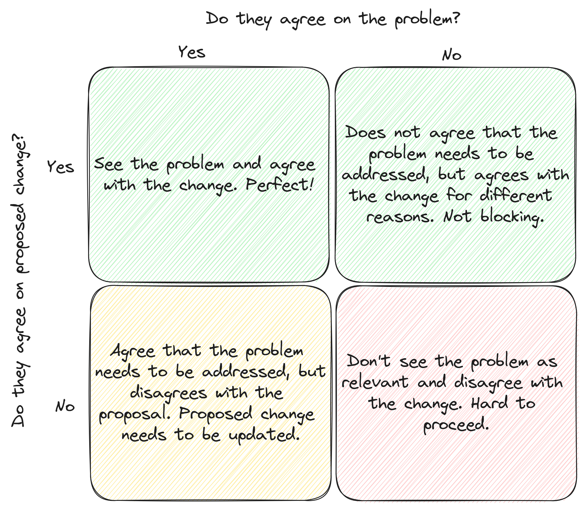

+++
title = 'Modelling Stakeholder Alignment'
date = 2025-01-05T15:58:00+01:00
lastmod = 2025-01-05T15:58:00+01:00
description = "Getting People to Agree To Change"
draft = false
tags = ["alignment", "solution", "leadership", "management", "communication"]
author = "bjoern"
comment = false
toc = true
image = "cover.webp"
+++

Over the past years, I have learned that finding a technical solution for a problem is less of an issue than getting people to agree on a solution.
Or, less often but even harder, to get people to agree on the problem itself.

The last few months I was working on an organisational change.
It started very ambitious with a high goal, but thanks to the support of my mentor we managed to boil it down to a much smaller change that still addresses an important problem we saw.
It was supposed to be the gate opener - Getting buy-in for this change would be the foundation for further changes in the future.

None of that happened, because I misunderstood a critical point: Who are my stakeholders and how to align with them.

## Who are my stakeholders?

When we wrote the document that outlined the problem and proposed the change, I assumed it would be for the people who have the power to approve the change.
I thought I can map the position of these stakeholders towards the change by two criteria:
- Do they agree on the problem?
- Do they agree on the proposed change?

For each of these there would be either "Yes" or "No", resulting in a small 4-box-grid.

As I learned later, this way of thinking was too black and white. 
There is a third answer to both questions: They don't care.
Which sounds meaner than it is, because it can be empowering.
"I don't care" means the answer can be moved in either direction.

It also means that the approach needs to be adjusted.
The updated grid has 9 boxes.

This looks different.
And it helped me understand why our proposal wasn't approved.
Of the three stakeholders one understood the problem and was indifferent to the change, one did not really see the problem as concerning but agreed to the change and one did neither care about the problem nor the proposal.
The last one later turned into a problem.

We assumed a group of close peers of the stakeholders to be the people we needed to align with.
They were supposed to convince the stakeholder.
We were successful, except for one person, who agreed to the problem statement but had a very different solution in mind - which both other main stakeholders disagreed with.

The third main stakeholder did not really care, their motivation was to avoid any additional work on their end.
Which makes sense, why would you agree to something that adds more work for you, if there is no problem from your perspective?
Having a single peer telling them that they did not agree with the change was enough to turn the "I don't care" into a "I disagree with the proposed change".

## How to use the model

While the model cannot give you a blueprint for resolving these issues, it can give you directions.
When your stakeholders dont care about the problem, you may have failed to point our why this is also a problem for them.
In this case rephrasing or analysing the situation from a different perspective could be helpful.

If they disagree with your proposal, it could be that they feel your changes don't address the actual problem.
Maybe they actually agree with the change itself, but don't see the timeline as realistic. 
Same thing if they disagree with the problem statement - Perhaps they know something that you are missing, but they assume you to know.
There can be dozens of good reasons to not agree with you. 
Try getting their feedback for what the issue is. 

As stated before, there is no general trick that will get people to agree with you and works every time.

## Motivation does not fit a model

The goal of modelling the problem with the 9-box grid is getting a better understanding of the effort to get people to agree with a proposal.
If your stakeholders are in the two lower rows, work must be invested.
The further down to the right they are, the more work will be necessary, which sometimes isn't worth the effort in the first place.

The 9-box model is as flawed as all models - It simplifies reality, so it cannot capture all details.
In reality, a stakeholder might be between two boxes.
There might be stakeholders in the same box with very different strategies to convince them.

The difficult part is that you must understand their motivation.
Do they want to avoid work?
Do they see their own position at risk with the change?
Do they have different beliefs?

Identify whose voice you really need.
You will very likely not find a solution that everybody agrees on, so make clear who you target to avoid losing time and energy where it does not matter.
Try to find ways to talk to them directly - I assumed one stakeholder to be indifferent to the proposal, until I had the chance to talk to them about it directly.
If you don't have a direct connection, you will need a proxy that needs to be aligned with you.

In my case, it meant that the organisational change we proposed is very unlikely to be implemented.
At the current point in time, none of the main stakeholders was truly convinced and one is even opposed to proceeding.
It was time to take a step back and focus on the learnings, rather than investing more time.

## Conclusion

When driving organizational change, understanding your stakeholders isn’t just important — it’s essential. Success doesn’t depend on having the best solution. 
It's about aligning motivations and knowing who truly matters in the decision-making process.

The 9-box grid provides a helpful framework to visualize where stakeholders stand and identify where effort is needed. However, no model replaces the need for empathy and communication. Understanding why people think, feel, or act a certain way allows you to adjust your approach and make meaningful progress.

In the end, focusing your energy on the voices that matter most (and understanding their motivations) will save you time, effort, and frustration, setting the stage for sustainable and impactful change.
