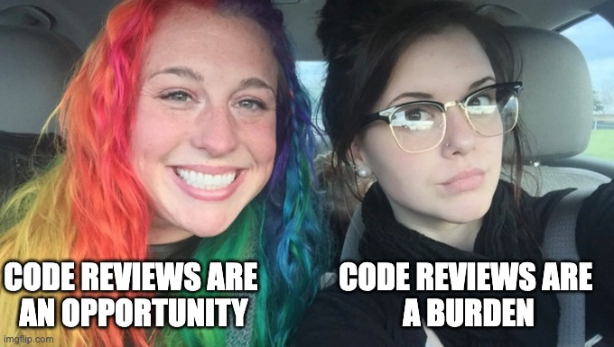
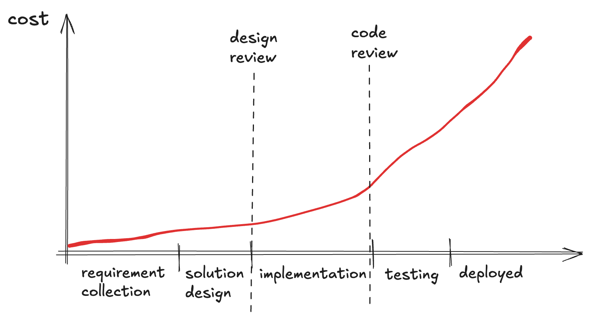
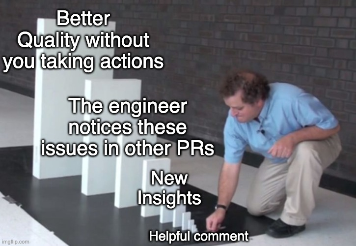

+++
title = 'Giving Helpful Reviews'
date = 2024-08-30T12:00:00+01:00
lastmod = 2024-08-30T12:00:00+01:00
description = "Using code reviews as opportunities to coach"
draft = false
tags = ["code review", "coaching", "engineering", "quality", "feedback"]
author = "bjoern"
comment = false
toc = true
image = "cover.jpg"
+++

Code reviews are an industry standard to improve code quality.
But they are more than that - Every code review is an opportunity to share learnings, coach others and help your team grow long term. In this article we will focus on the role of the reviewer and how you can make your reviews more supportive.

## Why Should I Care?

Code reviews feel like a burden.
A roadblock, that some process requires you to pass when you make a change. 
A distraction from your actual work when you have to review.
Going by this, it appears to be smart to briefly look over the changes and if nothing jumps at you: approve. 

Yet, it is worth investing time on reviews for at least three reasons:
1. Code reviews catch bugs early, which means the team has to deal with less issues later.
2. Chances are high  that you learn something from reviewing the code of others. Personal growth and unblocking others? Sounds like a fair deal.
3. Code reviews are a coaching opportunity, they allow you to help another person grow. We call this being a multiplier - Your work makes others more productive.  

We will look into a brief explanation for each of these and then what doing a helpful review means.

## Catch Bugs Early

Every issue that you catch during a design review or code review is a lot of time saved later [1].
If an issue happens on the production system and causes an incident, time is invested to mitigate the incident and then fix it. 
This can cause delay to other projects. 
Which in turn increases stress when the deadline suddenly is at risk. 
This has an impact on the team and thus also on you.

Imagine yourself setting some time aside to review a colleague's change.
You make yourself a tea, listen to some nice beats [2] and go through the changes. 
Maybe not what you wanted to do, but hey, it's okay and part of the job.

Now imagine yourself being pulled into a meeting with three other engineers. 
There is an issue with service X, users are reporting issues.
It is not clear what the issue is, but you have to find it as soon as possible and fix it. 

Yes, there should be more guardrails in this situation. 
The point is: fixing something broken is more stressful than preventing something from happening in the first place.
To be honest, this is not the argument I see as most valuable, but it has the highest ratio of input to outcome. 
You should care.

## Learning Opportunity

When you are new in a team, one of the fastest ways to learn a lot about your code base is reviewing changes from others. 
The same is true for reviewing code from more senior engineers. 

How are they approaching the problem? 
What does their pull request description look like? 
What test cases have they added and how are these structured?

You can learn a lot just by seeing how others are working. 
Even if you feel like you are not experienced enough to approve a change, you can leave a comment. 
Saying everything looked good to you gives others visibility that you reviewed. 
And through pull requests you have a snapshot in time.
Even if the change has already been approved, you can read it later and also see the comments that the reviewers have added and how the team interacts.

## Coaching Opportunity

From my perspective, this is the most important reason for doing code reviews as a senior engineer.
Catching bugs and learning sweetens the deal, but a great review can enable others to learn, allowing you to have impact beyond your direct work. 

Code reviews are a special kind of feedback and as such, they follow the rules of giving good feedback. 
That also means you have to get into the mindset - You are not only checking code, you are giving feedback to a colleague. 
To unblock them, to keep a high level of quality and to help them become better engineers. 
This means you don't approve a PR without reading it properly and your comments are either praise or direct, actionable feedback.

An advantage compared to other forms of feedback is that the context of your comment is clear - You can mark specific lines of code, which saves you from explaining what you are commenting on. There is no need to sugar coat things, but also no need to be aggressive or even insult - be friendly and helpful, provide a clear way forward. No "change this" or "this needs to be improved". Give the author at least one way that would help from your perspective. Even better, explain it and send a link to read upon the topic or see an example where else this has been done before. 

Doing a PR review everybody has their own process - Below you can find mine:

1. When starting the review, check the title and description. Ask yourself whether after reading them you already have an expectation for what you will see. 
If not, are you maybe missing context? Is there a ticket or a document linked that can help you? No? Then I strongly suggest to stop at this point - if you don't know the context of the change, you could miss a crucial point or add comments that are not helping the author. Reach out and ask for context to be provided!
2. If your team has a certain standard for how pull requests should look like (should there be a ticket ID on the title? Are specific labels expected?) this is your time to check if the author respected them and otherwise remind them about these standards
3. Some people like to go through the review in multiple passes. First, they check if the solution makes sense at a high level, because if not, there is no need to point out small bugs and typos - the author will need to change the whole thing anyways. Personally, I start by reading the changes to test cases and new test cases. If there are none, this is a bad sign because then the code is not covered. Knowing the context and reading test cases usually tells me if I agree with the high level approach. 
4. Having the context, do you see any important test cases missing? Are edge cases covered?
5. Going through the production code. Do you notice anything that was not covered by the tests? 
6. If the author has done something cool, tell them. There is no need to search for something positive in every review, but if you come across something that surprised you positively or that you will keep in mind, let them know. If you feel that a pull request should contain only comments about things to change, mention it in the main review comment or copy a permanent link to the section and send it to the author in a different channel. Most engineers love to do things in an efficient way, this can be positive reinforcement for them.
7. Focus on typos (if you use Github, I recommend using the suggestion mode to allow the author to quickly apply typo fixes).
8. Go through your comments and make the priority clear. If something needs to change for your to accept, state it (e.g. "Please change..."). If something is not important but you still want to point it out, start with `NIT: ...` (nitpicky). I am going with the Google definition of NIT here: "expressing that something could be better, but if it’s not very important" [3].

## Personal Advice

If you feel like requests for reviews are distracting you from making changes yourself, I recommend setting some time blockers every day to review and let people know about it. 
For example, if my review block is from 10am to 11am and somebody asks for a review at 4pm, I let them know that I can review the next morning.
This sets clear expectations, allows me to keep focusing and enables the other person to let me know if the change is urgent and needs a review as soon as possible.

I also recommend looking into anti-patterns for code review [4].
Being aware of what can slow down the review process helps you avoid these mistakes.

Lastly, don't try to review every pull request from your team (unless you are only 2 people in the team). 
Making yourself a bottleneck isn't good for the ownership of the team, because they constantly rely on you. 
And it isn't good for your own time as well. 
Try to review as much as you can while still feeling productive, but accept that there is a point where things will happen without you knowing every detail [5].

## Appendix

- [1]: [The Cost of Finding Bugs Later in the SDLC](https://www.functionize.com/blog/the-cost-of-finding-bugs-later-in-the-sdlc)
- [2]: [Spotify: Japanese Lofi](https://open.spotify.com/playlist/5QjgJ20xSbkyfDY2iPERtz?si=6a3ec64dbba8476c)
- [3]: [Google Code Review Standard](https://google.github.io/eng-practices/review/reviewer/standard.html)
- [4]: [Code review antipatterns](https://www.chiark.greenend.org.uk/~sgtatham/quasiblog/code-review-antipatterns/)
- [5]: [Eliminating hero culture in software engineering teams](https://leaddev.com/culture-engagement-motivation/eliminating-hero-culture-software-engineering-teams)
