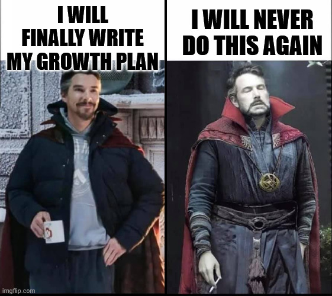
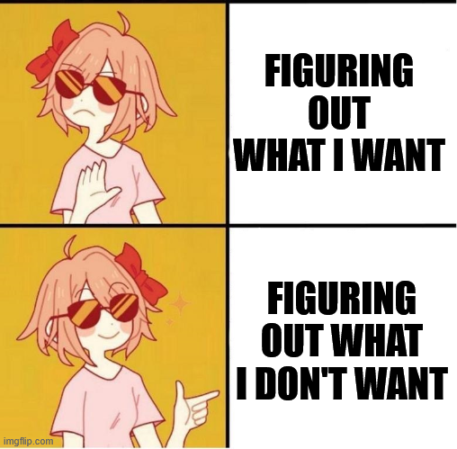
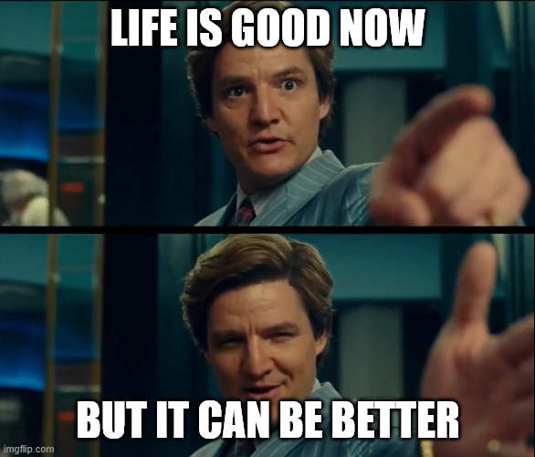

+++
title = 'Finally Writing My Growth Plan'
date = 2025-09-06T19:57:21+02:00
lastmod = 2025-09-06T19:57:21+02:00
description = "Stop floating through life and get a grip"
draft = false
tags = ["coaching", "growth", "learning"]
author = "bjoern"
comment = false
toc = true
image = "pexels-karolina-grabowska-4750270.jpg"
+++

Hey chefs,

today we will be creating an effortless growth vision.
You may know traditional recipes for growth plans. 
How much mental work they are.
How easy it is to do them later (or never).
Today we will challenge this with a quiz that is supposed to help you kick thinhs off.

You will need the following things:
- 1 pen
- 2-3 pieces of paper
- a functioning brain
- 10 to 60min time

## Thinking is exhausting

The first time I wanted to write a growth plan for myself was late 2022.
My managers had recommended it to me and it made a lot of sense - unless I define actionable steps, I will just go with the flow and might end up in a place I don't want to be in. 
This not only applies to career, but to life in general.
If I want to grow muscle, I need to follow certain rules, set goals and challenge myself.
That's essentially the same.

I know that. 
Yet it took me until early 2024 to write a real growth plan.
Not a pseudo one to show my managers and say "Yes look, I have a growth plan."

I procrastinaged more than a year. 
Despite knowing how important it was.

Why?
Because it was soooo much work. 
So much mental work to do, so exhausting. 

In the end I set a timer for 60 minutes, tppl a piece of paper and a pen and starred at 
it until the boredom became more exhausting than finally writing the fucking growth plan.
I managed. 
Would I do it again?
Oh god please, no!

So far, not really an inspiring story, I know. 
It was about time to refresh my growth plan, to update it again. Nooooo...

By luck I was recently reading "Thinking, Fast & Slow" by Daniel Kahneman.
The first chapter immediately connected with me: it explains how mental work can trigger physical reactions. 

This was my problem - Writing my growth plan did not only feel exhausting, it WAS exhausting.
I needed a new method.

## Goal first, Direction second, path third

Writing your growth plan is surprisingly similar to a shopping list.

When you buy groceries, you can stroll into the supermarket,
buy what looks good and then later think about what dishes you can prepare from it.
It would work, but very likely you will have bought some things you cannot use
or you actually need a few more things for the dishes you come up with.
Any ideas on how to improve this?

Think about what you want to cook first. 
Write down all the things you need. 
Buy what is on the list. 
That's it.

The takeaway is: if you have a goal in mind, it is easier to see what you need to do to get there.
Figuring out what you want to eat may be hard though.
I usually browse a few of my favourite recipes blogs until inspiration kicks in.
That works for recipes. 

For growth plans it is not as easy, unfortunately.
A growth plan is extremely specific - it takes into account a specific environment, previous experience and personal goals.
You can take a look at other peoples growth plans, but my personal feeling is that it makes it easier to copy goals because they sounds reasonable. They might not be the best goals for you though. 
Coming up with individual goals, going through the full thought process, is much more powerful.

My recommendation is to approach the exercise differently - instead of figuring out what you want, figure out what you don't want first.

As an example: 
I could write I want to become a good software engineer.
Vague, but okay. Defining what "great" means is hard.
On the other hand, I can quickly tell you what it does not mean:
- I don't want my knowledge of technology to become obsolete 
- I don't want to work in isolation
- I don't want to work on problems that are not challenging

I find these kind of lists easier to compile, but this is a personal preference.
If you are different, go for what works for you. 

## What should I eat?

You may have noticed that I skipped an important step. 
The previous example already had a goal. 
What if I don't have one yet?

Instead of offering my own words, I want to share this excellent advice:

> Uncommon advice:
> If you don't know what to pursue in life right now, pursue yourself.
> Pursue becoming the healthiest, happiest, most healed, most present, most confident version of yourself.
> Then the right path will reveal itself.
>
> Source: https://substack.com/@alaex/note/c-108058833

What would the best version of your current self look like?
Every statement creates a requirement, which again creates more low-level requirements.
This allows you to define your short and long-term goals.

The statements do not only cover your work, I suggest that you think about everything you want to achieve in your life.
Work does not exist in isolation, nor do your other goals - Together they form you.
And they affect each other - if you want to live in Spain, working for a company 
with 100%-in-office policy in Amsterdam would create a conflict. 
If you want to run a marathon, you need to train. 
Working 12 hours every day then screams conflict. 
Having a partner or a family may change the way you assess a job that requires a lot of traveling.

Again, this is very personal and hard to give you guidance in written form.
Start with things you like to do.
Do you want to do more of them? 
Or get better?
What are things you do at the moment, but don't enjoy?
Do you want to do less of them?

### Example: Fitness

Let's go through an example.
I want myself in five years to be at least as fit as I am now.
Ideally fitter.

What does "fit" mean? 
It could mean a lot of different things.
For me it means being able to carry heavy weight and being able to throw heavy weights in the air multiple times.
I want to be able to crouch, jump and do movements that put stress on my joints without hurting myself.
Or, to rephrase: I want to play with my kid. 

This goal does not require me to run long distances multiple times per week.
I don't need to do deadlifts, bench press and barbell squats.
I don't need to gain a lot of weight.
This helps me setting focus on how I need to train.

The same logic applies to my work life.
I want to be a great engineering leader.
This means I benefit more from psychology insights, team building and system design courses
than from trying out new programming languages. 
I don't need to go very deep into how databases work.

Similar to the fitness goal, "don't need" does not mean "don't spend any time here".
But if I am short on time, I will gain more from focusing on my goals.

Both of these goals are not separated from each other.
I have only one life, so I need to find a way to progress them at the same time.
This is why it is important to take your personal life into account when writing your growth plan.

## Taste Test

I heavily encourage you to try the thought process for yourself.
Think about what you like and how you define those things.
I also recommend to not just think about them, but write them down.
Putting thoughts into written words requires a structured way of thinking that can help you spot questions and empty spaces
that suddenly appear.

If you have somebody you trust, share your thoughts with them and request that they ask you critical questions.
Remember, you are not doing this for your manager - your are doing this for yourself.

PS: I very heavily resisted using a mental image for this article that I still want to share - Starting from what you don't want is much like a sculptor who first takes away the pieces from a marble block that they don't need. Yes, I am somewhat proud of this.