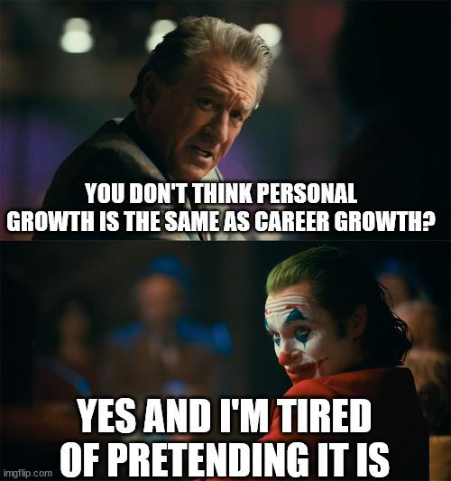
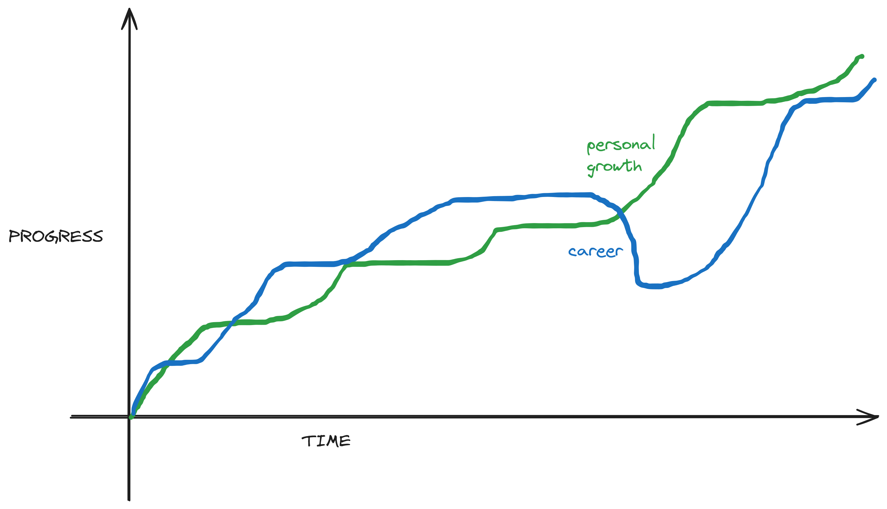
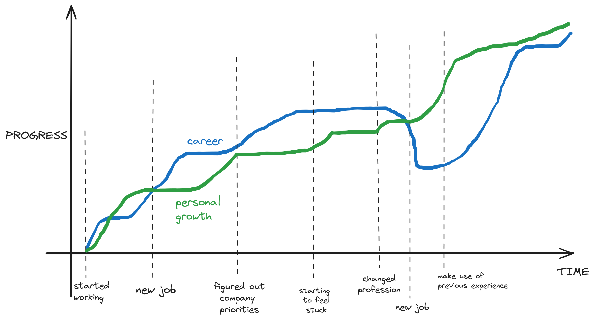
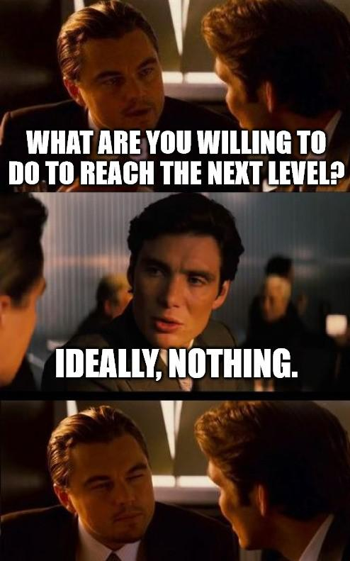

+++
title = 'Your Growth Plan is not a Career Plan'
date = 2024-10-21T09:00:00+01:00
lastmod = 2024-10-21T09:00:00+01:00
description = "A guide for creating a plan that helps you reach your goals"
draft = false
tags = ["growth", "career", "advice", "mentoring"]
author = "bjoern"
comment = false
toc = true
image = "cover.jpg"
+++

“Where should I go?...That depends on where you want to end up.” - Lewis Carroll

Part of my job is to review growth plans for the people I coach and mentor.
Something I notice regularly is the missing balance between their personal growth and their career growth.
Even worse, when we talk about this, people don't see a difference between a personal growth plan and a career growth plan!



## Why are they not the same?



The reason why they are often seen as one and addressed as "Growth Plan" is that personal growth and career growth are highly intertwined. 
Progressing your career can enable new opportunities for personal growth (for example becoming a manager). 
Similarly, personal growth can enable career growth - Learning and displaying certain skills will make you a top performer and promotions are more likely.
But there are a few significant differences:

- Goal setting. Personal growth has the long term goal in mind and is often more vague, whereas career growth is focused more on short term goals and quite specific.
- Direction of progress. Your personal growth can't go into the negative, you don't "unlearn" things. Granted, you may forget, but it is a lot easier to bring back things from memory than to learn them - So I don't see this as a step back. On the other hand, in your career your can have set backs where you make negative progress (e.g. being fired and then starting a new position lower than your previous one).
- Requirements. For personal growth, you ask yourself which skills your future self will need. For your career, you ask which skills the team or your manager will need most in the next months. The answers can be very different.
- Learnings. Repetitively doing things I already know how to do will not help me grow personally, but it can help my team be more productive. This means I will have a better negotiation standpoint during performance reviews and chances to get promoted are higher. On the other hand, learning a new skill will not automatically make me more productive.

Most importantly, I highly recommend splitting the two concerns for one reason: You can advance one without the other.
Learning a new skill (e.g. a mobile engineer getting into backend systems, getting data engineering knowledge,...) will not result in immediate career progress. It might even be a step back ( but hopefully enables new career opportunities long term).
Similarly, when everything is focused on career growth, eventually there will be a point in time where your skills can no longer back your position up anymore.
You sacrificed your learning needs too much and will hit a hard wall.
For some people the only way to cope with this is spending more and more time, because they never learned to deal with the problems of their career level in a sustainable way.

## Am I doing it wrong?

Every growth plan should be split into two sections: your goal and the things you need to do to achieve this goal.
What I often see is a goal that is set on career progress, with no action items supporting this goal.
Let's look at a shortened example:

```
Goal: I want to become a senior engineer

Action items:
- Be a leader for the team
- Be tech lead for one bigger project
```
There are a few issues with this plan, but most importantly the action items don't align with the goal.
If your focus is on career growth, you don't need to be a leader for the team.
You need to be recognised as a leader for the team. 
This changes the focus because it means you not only need to be a leader, you also need to think about how others will be aware that you are doing this. 

Second, usually the role of a tech lead for projects is decided by the manager. 
This means you have no control over achieving this - But you can position yourself to be selected as tech lead. 
In that way, becoming a tech lead is the goal, not the action you take. 
If it happens, it means your efforts were a success. 
And you can focus on creating an opportunity for yourself.

Lastly, the list focuses on two points.
Which can be good, but both of them go into the same direction (leadership). 
It is very likely that you are missing something here.

## How do I make it right?



In the best setup, both plans come together in harmony.
Growing personally is what is required by the company to deliver more and it is rewarded.
But this is not the default and I would even argue that this is rare in our industry.
If you feel stuck, it might be worth changing your perspective and ask yourself the following questions:
1. Am I missing critical skills to advance to the next level?
2. If I am not missing the skills, do people know that I have the skills?
3. What am I willing to do to bridge the gap?

Actually, I highly recommend asking the first question to your manager and a few trusted peers.
If they answer with things you are missing and you actually miss them, cool.
If they answer with things you already do, why do they not know?
These kind of small surveys (I prefer to have them async to give people time to think about it) can offer amazing insights.

If you see that there is some skill missing, your growth plan should have a clear focus on personal growth for the next months.
You need to learn, but make sure to drop in a few side quests for career growth - For example make sure to let others know that you learn a new skill!

If you have the skills, how can you make people more aware of that fact?
Are there any situations where it needs to be obvious?
Can you brand yourself as an expert for the skill?
This goes heavily into self promotion and might feel awkward to think about.

Lastly, when you plan how to tackle the challenge, be very honest with yourself how much you are willing to give.
Often, a "I can't do this" is a hidden "I am not willing to do this".
Which is fine.
Every person has their own principles and you have to check in with yourself if what is required goes against them or not.
For example, learning a new skill might require you to invest time outside of work.
For me, that would be a challenge, as one of my principles is not to sacrifice family time.
That means instead of giving an additional 3 hours every day for a few weeks/months I would probably invest and hour per day and accept that my progress will be much slower.
Similarly, if you feel that self-advertising is not something you want to do under any circumstances, that is fine.
But we both have to accept that if we are not giving what it takes, we might fail to reach the goal.



## Example Growth Plan

The previous part was pretty high level, let's make it more concrete and look at my personal growth plan from October 2023.
It was written with heavy focus on career growth (as you can see from the goal) with a scope of 6 months.

```
North Star:
I want to be a person that has a positive influence on others, acting as role model both in technical and cultural values.
While doing this, I will not compromise time with my family, thus achieving great impact without using more time than agreed by my contract.

Current Goal:
I aim to become a Staff Engineer.

Focus Points:
1. Improve time management and focus on projects with higher outcome
	- Check in current priorities every 2 weeks with my manager proactively
2. Increase my visibility outside the team
	- Ask at least one question in the bi-weekly System Design meeting
	- Create public artifacts (newsletter, documentation, share interesting articles)
3. Improve my technical knowledge
	- Read newsletters on management and engineering leadership
	- Do at least 2 system design challenges
```

I start every growth plan with stating my north star (which also changed over time).
Then I state my current goal - This sets the focus of the plan, and it is either a career goal or a personal growth goal.
Lastly, the meat of the document, I state 3 to 5 bullet points for what I need to change over the next 6 months.
Each point then has either a short description or sub points on how I plan to complete the focus point.

As I said before, I am a believer in personal growth and career growth supporting each other.
I focused on career growth earlier this year, now my focus is on personal growth.
Make sure you don't get stuck in a single direction too long - If you are not making progress, this could be an indicator that you are missing something.

This growth plan is just an example - It works for me, but it does not mean you have to do it like this.
If you find a method that has more success, use it (and please let me know, maybe it helps me too!).

## Creating your own plan

Creating a growth plan can be done alone, but I heavily recommend finding somebody to pair up with.
The other person's responsibility is not to give you guidance, but to ask you critically.

- What is it you want to achieve in the next 12 months?
- What do you need to get there?
- How will you know you are making progress? How can you measure success?
- What are the 3 most important things that you need to get done to make progress?
- Are there any dependencies? Is there anything that requires help from others?
- What are you not willing to do to get there?

The following section is not a guide, but more an inspirational list of items that I have seen work in the past for people.
It is also heavily biased towards engineering careers.

Ideas for personal growth:
- Get a mentor and/or coach. You can get better without them, but if there is a bridge over a river, why would you swim?
- Learn adjacent skills. [roadmap.sh](https://roadmap.sh/roadmaps) is a great source of things to learn for engineering, but looking into basics of other jobs, etc marketing or design can be amazing as well
- Give a tech talk
- Join community meetings and exchange with others
- Reflect on how you prioritize your work. Can you find ways to put more time towards the higher impact topics?

### Ideas for career growth

- Support your manager support you ([The Magic Loop](https://www.lennysnewsletter.com/p/the-magic-loop))
- Connect with other managers. The "how" is important and depends on personal situations. If decision makers for promotions know your name and face and associate it with a positive feeling, your manager has less fighting to do for you. Also, don't do this without telling your manager.
- Represent the company. If the company has a blog, consider writing or supporting an article.
- Support your team to be more productive. If you manage to have them achieve more without suffering too much yourself, you are multiplying! Figure out which processes have issues (e.g. if you have a lot of TOIL work, try to fix the underlying issues) and find solutions - But not alone. Make sure to involve your team into the process, so that they are aware you are doing this for them. The last thing you want is secretly fixing issues on the side.
