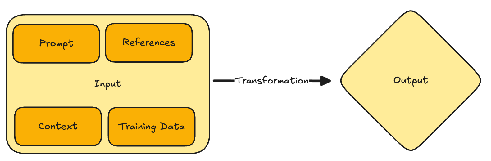
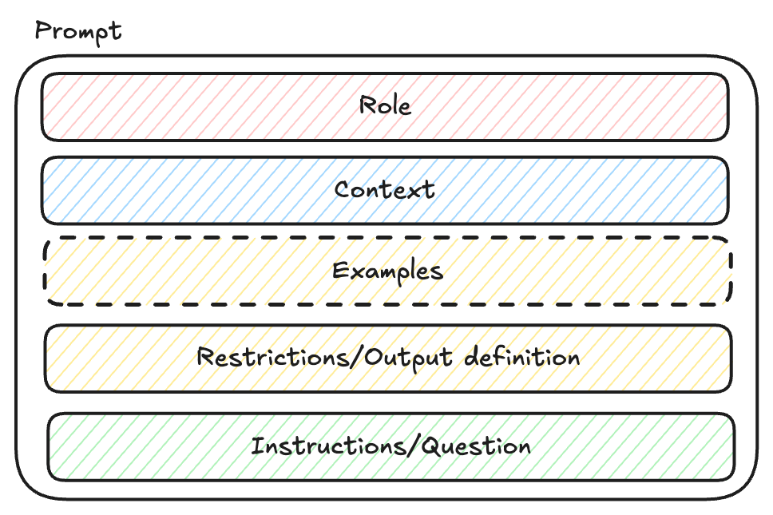

+++
title = 'Productivity Boost With AI'
date = 2025-03-10T12:06:00+01:00
lastmod = 2025-03-10T12:19:00+01:00
description = "Basic guide on how to leverage AI-support for increased productivity"
draft = false
tags = ["chatgpt", "coaching", "engineering", "ai-coding", "copilot", "prompt engineering"]
author = "bjoern"
comment = false
toc = true
image = "cover.jpeg"
+++

> Disclaimer: This guide is a by-product of a workshop I organised.
> I originally did not intend it to be published by the time I started writing, but it turned into a great overview into the topic that is worth sharing. 
> Due to this, this article has been created with the support of an LLM to try out some techniques. 

## Introduction

Welcome to this guide on leveraging AI to enhance your productivity. Whether you're a product manager, mobile engineer, web engineer, or backend engineer, this guide will provide you with the basics and some tips and tricks to integrate AI into your daily workflows. 

## Why Use AI?

AI can help automate repetitive tasks, provide insights, and assist in decision-making processes. By using AI, you can focus on more creative and strategic aspects of your work, ultimately boosting your productivity and job satisfaction.

## Getting Started with AI

### Understanding AI

AI, or Artificial Intelligence, refers to the simulation of human intelligence in machines. These machines are programmed to think and learn like humans. One popular type of AI is the Large Language Model (LLM), which can understand and generate human-like text based on the input it receives.

#### The Concept of AI

It's important to note that the concept of "true AI"—a machine with human-like intelligence and reasoning capabilities—has not been fully realized (yet). While LLMs can appear to be intelligent, they are not true AI. They are sophisticated tools that generate responses based on patterns in the data they were trained on.

#### Limitations of LLMs

LLMs have certain limitations that affect how they can be useful:

- **Lack of Understanding**: LLMs do not understand the meaning behind the text. They generate responses based on statistical patterns rather than comprehension.
- **No Logical Reasoning**: LLMs cannot perform logical reasoning or deep thinking. They cannot make decisions or draw conclusions like a human would.
- **Context Limitations**: LLMs rely heavily on the context provided in the prompt. They cannot access external information or remember past interactions beyond the current session.

#### Examples of True AI vs. LLMs

**True AI Capabilities**:
- **Complex Decision Making**: A true AI could analyze multiple factors and make complex decisions, such as diagnosing medical conditions or strategizing business moves.
- **Emotional Understanding**: A true AI could understand and respond to human emotions, providing empathetic support or counseling.
- **Learning and Adaptation**: A true AI could continuously learn from new experiences and adapt its behavior accordingly.

**LLM Capabilities**:
- **Text Generation**: LLMs can generate human-like text based on the input provided. For example, they can write emails, articles, or code snippets.
- **Summarization**: LLMs can summarize long documents into concise summaries, making it easier to digest large amounts of information.
- **Translation**: LLMs can translate text from one language to another, facilitating communication across language barriers.

**Effective Use of LLMs**:
- **Example**: Suppose you need to draft a project proposal. You can provide an LLM with key points and context, and it can generate a well-structured proposal. While the LLM cannot understand the project's nuances, it can produce a coherent document based on the input provided.

### Basic Principles

To make communication easier, in the following parts we will refer to LLMs as "AI", despite this not being the same as stated above.

- **Outcome depends on input**: The quality of the AI's output is directly related to the quality of the input it receives.
- **Input**: The data or prompt you provide to the AI, which includes context and training data.
    - **Prompt**: The input text that is sent to the model to trigger a response
    - **Context**: The collection of prompts and answers in the same conversation with the model
    - **References**: Files that are attached/referenced in the prompt (e.g. a meeting transcript)
    - **Training Data**: The data the model has been trained on
- **Transformation**: The process the AI uses to analyze and generate a response. Note that AI does not perform logical reasoning or deep "thinking"; it transforms input based on patterns in the training data.
- **Output**: The result or response generated by the AI.



## Practical Use Cases

### Great Use Cases

- **Summarize a Text**: Convert a long document into a shortened message for platforms like LinkedIn.
    - **Example Workflow**: Provide the AI with the full text of a blog post and ask it to summarize the key points in a concise format suitable for a LinkedIn post. This can save time and ensure that the most important information is highlighted.
    - **Example Prompt**: 
    ```
    Please create a post from the article that can be shared on LinkedIn. 
    You are a successful influencer and engineering leader, who is driving valuable discussions. 
    Start with a single strong sentence and end with a joke about ducks in a pool. 
    Use a placeholder in the text that can be used to add a link to the article.
    ```
- **Restructure Input**: Transform meeting transcripts into meeting notes or RFC documents.
    - **Example Workflow**: After a meeting, upload the transcript to the AI and request it to generate structured meeting notes or an RFC document. This helps in organizing information and making it more accessible for future reference.
    - **Example Prompt**:
    ```
        I will send you a transcript of a meeting. In the meeting, several engineers discussed an architecture design for a feature that will be worked on with two different teams. Björn is representing the Lifecycle team, Richard and Calvin are mobile engineers and Neeraj and Aishwarya are backend engineers for the Junior team. The feature is called "Junior" or "Child account". 
        Using the transcript, please create a summary with the following structure:
        - Overview
        - Problem Statement
        - Proposed Solution
        - Discussion
        - Action Items

        Thank you!
    ```
- **Auto-complete Text**: Use AI to finish writing a piece of text based on the initial input.
    - **Example Workflow**: Start writing an email or a report and let the AI suggest completions for sentences or paragraphs. This can speed up the writing process and help overcome writer's block.
- **Compare Texts**: Identify differences and similarities between two texts beyond simple token matching.
    - **Example Workflow**: Provide the AI with two versions of a document and ask it to highlight the differences and similarities. This is useful for reviewing changes in documents or code.
- **Generate Tickets**: Given a collection of RFCs/PRDs, split work into building blocks and generate actionable tickets.
    - **Example Workflow**: Input a detailed project requirement document into the AI and ask it to break down the tasks into smaller, manageable tickets for your project management tool. This helps in planning and tracking progress.
- **Sample Prompt**: "Please generate actionable tickets from the following project requirement document: [Insert document here]."
- **Change Tone**: Modify the tone of a message (e.g., "Make my message sound friendly, but assertive").
    - **Example Workflow**: Draft a message and ask the AI to adjust the tone to be more friendly or assertive, depending on the context. This ensures that your communication is appropriate for the audience.
    - **Example Prompt**: 
    ```
    You are amazing at removing unfriendly tone and aggressive parts of messages and transforming the tone. 
    Please change the tone of the following message to be friendly but assertive: 
    [Insert message here]
    ```
- **Write Performance Reviews**: Create performance reviews from a collection of notes, summarize reviews, and analyze feedback.
    - **Example Workflow**: Provide the AI with notes and feedback collected over a period and ask it to generate a comprehensive performance review. This can save time and ensure that all relevant points are covered.
    - **Example Prompt**:
    ```
        You are a successful engineering manager. One of your direct reports has given you a collection of notes for what they did in the past performance review cycle. You want to highlight what they did well in their job. 

        Use the files <FILE> and <FILE> to collection information about your reports work.

        Write summaries for the 5 most important projects. For each summary, use no more than 300 characters. 
    ```
- **Create Onboarding Documents**: Generate comprehensive onboarding documents for new colleagues.
    - **Example Workflow**: Input the key information about your company, team, and processes into the AI and ask it to generate an onboarding document. This helps new hires get up to speed quickly.
- **Support Ideation and Brainstorming**: Use AI to generate ideas and support the brainstorming process.
    - **Example Workflow**: During a brainstorming session, input the topic or problem into the AI and ask it to generate a list of potential ideas, solutions or as questions. This can spark creativity and provide new perspectives.
- **Coaching**: Provide shallow critical questions to guide thinking and decision-making.
    - **Example Workflow**: Use the AI to generate questions that challenge your assumptions and guide your thinking process. This can help in making more informed decisions.
    - **Example Prompt**:
    ```
        Ask me 3 critical questions that will help me think deeper. 
        You are a successful software engineering coach. You want to help me accelerate my career. To do that, we have written a growth plan: <FILE>. 
        Ask me three critical questions and for each question, provide an explanation of what the question means, as well as an example of how this could be answered.
    ```
    ```
        You are a staff engineer reviewing the attached document. Ask 4 critical questions that will help the author refine the document to make it more useful and easier to digest.
    ```
- **Code Reviews**: Use AI to assist in reviewing code for potential issues and summarizing changes.
    - **Example Workflow**: Input your code into the AI and ask it to review for potential issues or summarize the changes made. This can help in catching errors and understanding the impact of changes.
- **Generate Reports**: Automatically create reports from raw data.
    - **Example Workflow**: Provide the AI with raw data and ask it to generate a report with key insights and visualizations. This can save time and ensure that the data is presented in a clear and actionable format.

### Not-so-great Use Cases

- **Refactor Large Parts of Code**: While the model might do it's job, you still need to double check the output. Reviewing AI-generated code changes can be more mentally draining and error-prone than making the changes yourself.
- **Making Conclusions**: AI is not suitable for making conclusions or providing deep coaching beyond shallow critical questions.
- **Pair Programming**: AI cannot effectively act as a pair programming buddy.
- **Debugging Complex Issues**: AI may struggle with understanding and resolving complex debugging scenarios.
- **Coaching**: This one is both a great and bad use case. For shallow questions and for ideation, LLMs can serve the coaching part quite well. However, for more meaningful support, the lack to draw conclusions and limited context can leave you stuck. Having a conversation with a real human is a better investment of time.

### Evaluate the Use Case Critically

In general, I recommend always questioning whether what you intend to do makes sense using AI support. If it is a smaller task and you know exactly what to do, chances are high that just doing it yourself will be a lot faster.

While AI can be a powerful tool, it's important to recognize that it is not always the best solution for every task. Here are some points to consider:

- **Task Complexity**: For simple, straightforward tasks, using AI might be overkill. The time spent crafting the perfect prompt and reviewing the AI's output could be better spent just doing the task manually.
- **Quality Control**: AI-generated content often requires careful review and editing. If the task demands high accuracy or precision, relying on AI might introduce errors that take more time to fix than if the task were done manually.
- **Learning Curve**: Effectively using AI tools requires a certain level of expertise. If you're not familiar with prompt engineering or the specific AI tool you're using, you might spend more time learning and experimenting than actually getting work done.
- **Context Sensitivity**: AI models rely heavily on the context provided in the prompt and training data. If the task requires deep understanding or nuanced decision-making, AI might not be able to deliver the desired results without extensive guidance, which is time-consuming.
- **Resource Intensive**: Some AI tasks can be resource-intensive, both in terms of computational power and time. For tasks that need to be completed quickly, waiting for AI to process and generate results might not be practical.
- **Mediocre results**: Due to the nature of the training sets, if you need a very specialized solution, you might be better off working without AI support. The training data for AI models is a collection of thousands of examples, which means the AI generates responses based on an average of these examples. This averaging process can lead to generalized solutions that may not meet the specific needs of highly specialized tasks. For instance, if your task requires domain-specific knowledge or a unique approach, the AI might not be able to provide an optimized solution, and manual intervention could be more effective.
- **Learning Potential**: I generally don't recommend using AI-support for things you want to learn and care about. That's why I don't use AI support when writing blog posts, because I want to learn writing. And I enjoy it. It's a bit similar to how you can buy bread from a bakery, but eating self-made bread just hits differently.

### AI as a Productivity Black Hole

Defaulting to AI support can sometimes be a waste of time. Here are scenarios where AI might become a productivity black hole:

- **Over-Reliance on AI**: Continuously relying on AI for tasks that could be done manually can lead to inefficiencies. It's important to strike a balance and use AI where it truly adds value.
- **Iterative Refinement**: AI-generated outputs often require multiple iterations to get right. This iterative process can consume more time than anticipated, especially if the initial prompts are not well-crafted.
- **Debugging AI Outputs**: When AI generates incorrect or suboptimal results, debugging and refining the prompts/output can be time-consuming. This is particularly true for complex tasks where the AI's understanding might be limited.
- **Misalignment with Goals**: If the AI's output does not align with your goals or expectations, you might spend more time correcting and adjusting the results than if you had completed the task manually.

## Tips for Effective AI Use

### Prompt Engineering

The way you phrase your prompts can significantly impact the quality of the AI's output. Here are some tips:

- **Be Specific**: Clearly state what you need.
- **Provide Context**: Give the AI enough background information to understand your request.
- **Use Examples**: Show the AI examples of what you're looking for.
- **Structure Matters**: The structure of your prompt influences the output. Different wording and order can lead to different results.
- **Basic Building Blocks**: Include instructions, role, context and references, and expected output format in your prompts.
- **Placement of Instructions**: Put instructions at the beginning or end of the prompt.
- **Separate Instructions from Context**: Clearly distinguish between instructions and context/references.
- **Politeness**: Use "Please" and "Thank you" to tap into the more friendly parts of the training set.
- **Don't trust**: Always, always double check the output. Trust me, I have lost hours for not doing that, a hard-learned lesson.



#### Zero-shot vs One-shot vs Few-shot Prompts

##### Zero-shot Prompting
**Explanation**: Zero-shot prompting involves giving the AI a task without providing any examples. The AI relies solely on the instructions given in the prompt to generate a response.

**Upsides**:
- **Simplicity**: Easy to create and use.
- **Efficiency**: Requires less input data, making it faster to implement.

**Downsides**:
- **Accuracy**: May produce less accurate or relevant results due to lack of context or examples.
- **Reliability**: Higher chance of misunderstanding the task or generating incorrect responses.

**Example**:
```plaintext
Translate the following sentence to French: "Hello, how are you?"
```

##### One-shot Prompting
**Explanation**: One-shot prompting provides the AI with a single example of the task to guide its response. This helps the AI understand the format and context better than zero-shot prompting.

**Upsides**:
- **Improved Accuracy**: Provides a clearer example, leading to more accurate responses.
- **Contextual Understanding**: Helps the AI understand the task better with minimal input.

**Downsides**:
- **Limited Context**: One example may not cover all variations of the task.
- **Preparation Time**: Requires some effort to create a relevant example.

**Example**:
```plaintext
Translate the following sentence to French: "Hello, how are you?" -> "Bonjour, comment ça va?"
Translate the following sentence to French: "Good morning, everyone."
```

##### Few-shot Prompting
**Explanation**: Few-shot prompting involves providing the AI with several examples of the task. This approach gives the AI a broader context and helps it understand the task more comprehensively.

**Upsides**:
- **High Accuracy**: Multiple examples improve the AI's understanding and accuracy.
- **Versatility**: Covers a wider range of variations and contexts.

**Downsides**:
- **Complexity**: Requires more effort to create multiple relevant examples.
- **Resource Intensive**: Can be more time-consuming and resource-intensive to implement.
- **Unintended Patterns**: You cannot control what the model infers from your example, it may notice patterns and apply them without you realising

**Example**:
```plaintext
Translate the following sentence to French: "Hello, how are you?" -> "Bonjour, comment ça va?"
Translate the following sentence to French: "Good morning, everyone." -> "Bonjour, tout le monde."
Translate the following sentence to French: "Thank you very much." -> "Merci beaucoup."
Translate the following sentence to French: "See you later." -> "À plus tard."
Translate the following sentence to French: "Good night." -> "Bonne nuit."
Translate the following sentence to French: "Have a nice day."
```

#### Chain-of-thought Prompting

**Explanation**: Chain-of-thought prompting involves using a series of prompts to guide the AI through a complex task step-by-step. This approach helps the AI break down the task into manageable parts, leading to more accurate and coherent responses.

**Concept**: Instead of asking the AI to solve a complex problem in one go, chain-of-thought prompting breaks the problem into smaller, sequential steps. Each step builds on the previous one, allowing the AI to process and generate responses incrementally.

**Examples**:

1. **Mathematical Problem Solving**:
    - **Prompt 1**: "What is the first step to solve the equation 2x + 3 = 7?"
    - **AI Response**: "Subtract 3 from both sides of the equation."
    - **Prompt 2**: "What is the result after subtracting 3 from both sides?"
    - **AI Response**: "2x = 4"
    - **Prompt 3**: "What is the next step to solve for x?"
    - **AI Response**: "Divide both sides by 2."
    - **Prompt 4**: "What is the value of x?"
    - **AI Response**: "x = 2"

2. **Writing an Essay**:
    - **Prompt 1**: "What is the main topic of the essay?"
    - **AI Response**: "The impact of climate change on polar bears."
    - **Prompt 2**: "What are the key points to discuss in the introduction?"
    - **AI Response**: "Define climate change, introduce polar bears, and state the thesis."
    - **Prompt 3**: "What evidence supports the thesis?"
    - **AI Response**: "Melting ice caps, changes in hunting patterns, and declining population."
    - **Prompt 4**: "How should the conclusion summarize the essay?"
    - **AI Response**: "Restate the thesis, summarize key points, and suggest future actions."

**Upsides**:
- **Improved Accuracy**: Breaking down tasks into smaller steps helps the AI generate more accurate and relevant responses.
- **Clarity**: Each step provides clear guidance, reducing the chance of misunderstanding the task.
- **Complex Task Handling**: Suitable for complex tasks that require multiple steps or detailed analysis.

**Downsides**:
- **Time-Consuming**: Requires multiple prompts, which can be more time-consuming than a single prompt.
- **Prompt Management**: Managing and sequencing multiple prompts can be challenging.
- **Context Retention**: The AI needs to retain context across multiple prompts, which may not always be reliable.

This approach is particularly useful for tasks that require detailed reasoning or multi-step processes.

### Experiment and Iterate

Don't be afraid to experiment with different prompts and approaches. The more you use AI, the better you'll understand how to get the best results.

## Resources

- [awesome-chatgpt-prompts](https://github.com/f/awesome-chatgpt-prompts)
- [LLM codegen workflow](https://harper.blog/2025/02/16/my-llm-codegen-workflow-atm/)
- [GPT-3: A Hitchhiker’s Guide](https://lambdalabs.com/blog/gpt-3)
- [Microsoft: Exploring and comparing different LLMs](https://github.com/microsoft/generative-ai-for-beginners/blob/main/02-exploring-and-comparing-different-llms/README.md?WT.mc_id=academic-105485-koreyst)
- [LLM Models Comparison: GPT-4o, Gemini, LLaMA](https://www.deepchecks.com/llm-models-comparison/)
- [What We Learned from a Year of Building with LLMs (Part I)](https://www.oreilly.com/radar/what-we-learned-from-a-year-of-building-with-llms-part-i/)
- [LLM From the Trenches: 10 Lessons Learned Operationalizing Models at GoDaddy](https://www.godaddy.com/resources/news/llm-from-the-trenches-10-lessons-learned-operationalizing-models-at-godaddy#h-1-sometimes-one-prompt-isn-t-enough)
- [Parts of a Prompt: Understanding the Key Elements](https://learnprompting.org/docs/basics/prompt_structure)
- [10 Techniques for Effective Prompt Engineering](https://www.lakera.ai/blog/prompt-engineering-guide)

## Conclusion

AI has the potential to significantly boost your productivity by automating mundane tasks and providing valuable insights. By understanding the basics and experimenting with different use cases, you can integrate AI into your workflow and focus on what truly matters.

Thank you for reading this guide. If you have any questions or need further assistance, feel free to reach out.

Happy productivity boosting!
