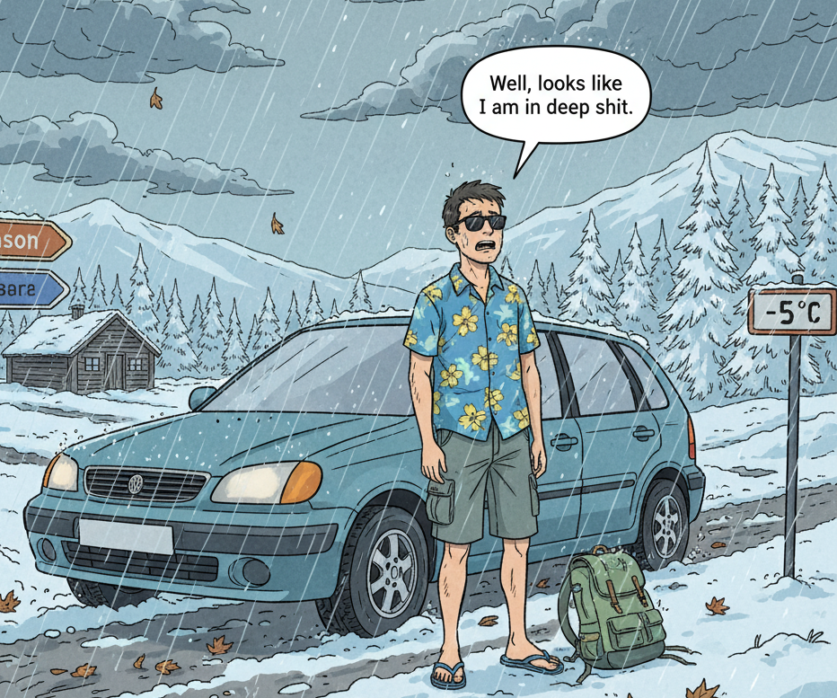
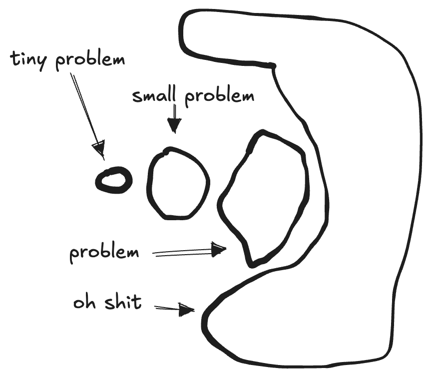
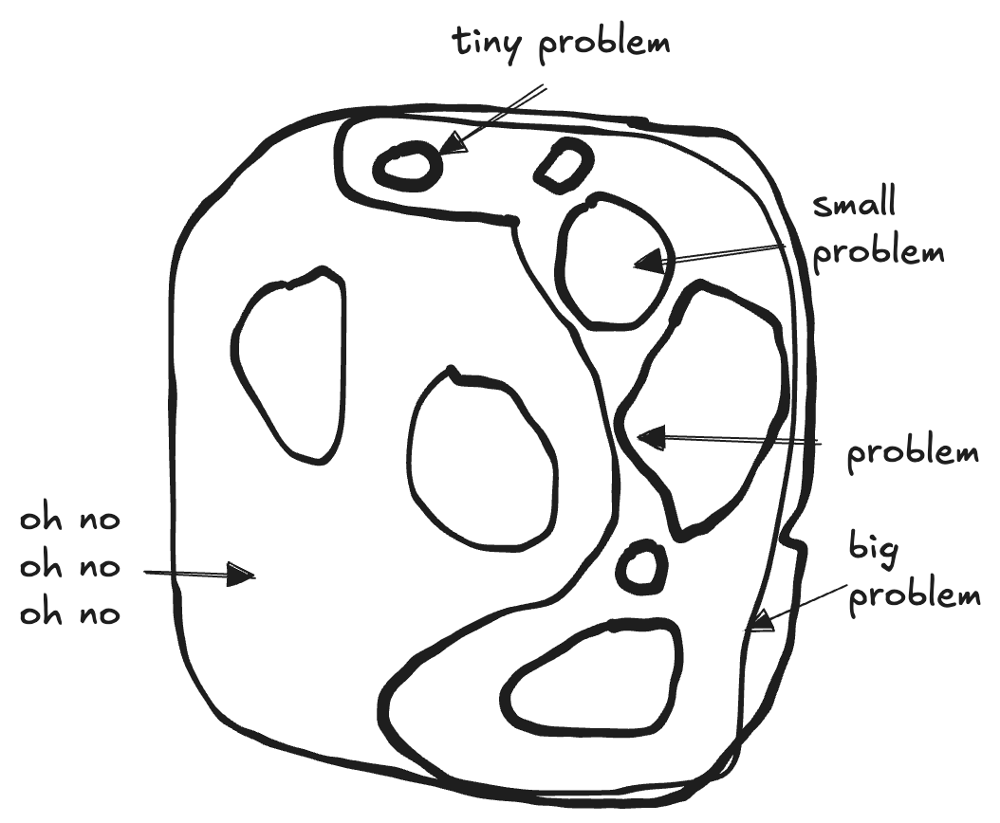
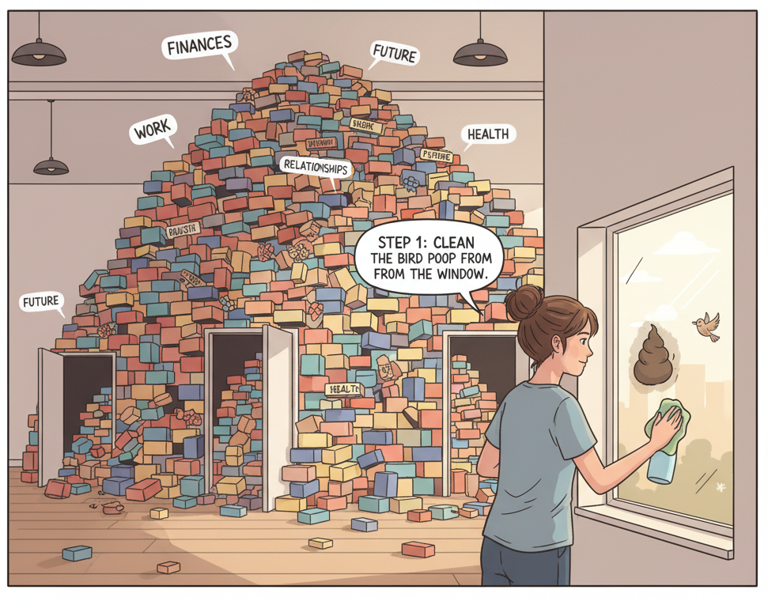

+++
title = 'That Is A Huge Problem'
date = 2025-10-01T10:25:00+02:00
lastmod = 2025-10-01T10:25:00+02:00
description = "Why cleaning the bird poop first can help you gain momentum to overcome bigger issues"
draft = false
tags = ["coaching", "engineering", "problem-solving"]
author = "bjoern"
comment = false
toc = true
image = "cover.jpg"
+++

Have you ever faced a problem where you thought: "Well, looks like I am in deep shit."?

I recently organised a trip to Northern Europe. 
It was straightforward, the locations looked nice and I had very little to worry about.
Until I noticed that I missed something in my planning - The weather forecast. 

I cannot explain how it happened, but I had planned a "summer in the north trip", not realising that I was not visiting
in summer. It would be autumn. Does that change anything?
Turns out fucking yes, a lot! 15°C less on average, 80% chance of heavy rains every day, and potentially even snow.
I don't have clothes suitable for that weather, the car has no winter tires, the locations were selected for beautiful outdoor environments and not with the idea of spending time indoors.

To quote myself: "Well, looks like I am in deep shit."

## Not All Problems Are Equal

I obviously had a problem. What do you do when you face a problem?
You find a solution, put the solution in place, and the problem is solved.
Wonderful!

If only real life would always be as easy. 

The issue starts with the scale of the problem. You can have small problems and huge problems. 
And of course something in the middle. To give an example:

- A window in your house is dirty. Tiny problem.
- The door of your house is broken. Still a small problem, although bigger issue than the dirty window.
- There is a hole in the wall of your house. Well, that's not a small problem anymore.
- Your house burned down. Escalating quickly, but that's undeniably a huge problem. 

Each of these problems needs a different solution to be addressed. 
While the dirty window can also be ignored for a while, the bigger the problem gets the more it will hurt to not act on it.

Now, life is life and of course we can throw another layer of complexity in there. 
Because usually problems are not isolated and kindly wait until you solve one before the next happens. 
So, a car crashed into the wall of your house, causing a huge hole and partially destroying the kitchen, which caused a small fire. Due to the "structural change" of the wall, your front door no longer closes properly anymore. 
And a bird pooped on your window.

## Biggest Impact first...?

The first step to fix all this is crying a little, because why the fuck did all of that happen?
Once you moved past the phase of despair, it's time to think about what to do. 

In my career, I have been trained to figure out the problem with the biggest impact and risk first and tackle that. 
However, when you face a huge problem that is actually a composite of multiple problems, this can feel overwhelming.
And I argue that you don't need to lay out a plan first - Just get started on whatever is the first thing you can and want to tackle. You face a huge pile of bricks; start with any brick instead of spending time deciding which brick to touch in which order. Even if that brick is "Clean the bird poop from the window".

Once you gained momentum, use that energy to tackle the next issue. Check what you can parallelize. 
For my travel plans, I could have started by making a list of clothes I would need and thought about what other things I may have overlooked. 
I am not saying this is wrong, but my time was very limited. So I ordered a bunch of clothes[1] that I felt like I might need. While they were shipped, I took care of the winter tires. 

While doing that, I realised what other things I would need. 
Now, two weeks later, I feel vaguely prepared. I just had to start somewhere. 

## Anything Over Nothing
It is important to realise when you are paralyzed by a problem or a lot of problems. In this case, it is better to do anything rather than doing nothing and thinking. 
Thinking an planning are amazing tools, unless they stop you from actually taking action. When you have a thousand issues, it does not really matter which one you do first, just do any of them.

### Footnote
[1] - I am not a fan of "just ordering stuff", knowing that I will likely send back most of it. However, in this situation I did not have the time to follow my usual preferences and habits. I still recommend to order as little as possible. 

