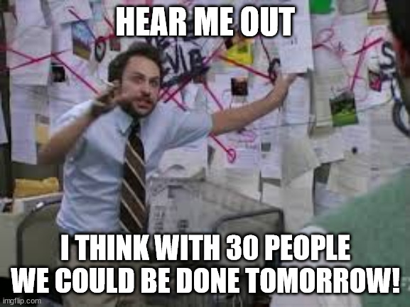

+++
title = 'I am not a resource. I am a tool.'
date = 2024-12-07T20:00:00+01:00
lastmod = 2024-12-07T20:00:00+01:00
description = "Why adding more people does not make the project faster"
draft = false
tags = ["leadership", "project management", "staffing", "management"]
author = "bjoern"
comment = false
toc = true
image = "cover.webp"
+++

When a project is too big to be done in time, there are four questions to ask yourself as project lead:
1. Is the project important enough to continue?
2. Can we add more people?
3. Can we cut scope?
4. Can we move the deadline?

When the first answer is "Yes" and the company is big enough, question 3 and 4 are not 
really considered and management jumps on the idea of adding more people. 
If the project takes 3 months with a team of 5 engineers, can we get it done in 2 months with 10 engineers?
If we have 15 engineers, can we deliver in a single month?

## People aren't resources

Adding more people to be more productive sounds right, but I think it is tackling the problem from the wrong point of view.
Because people aren't resources. 

In strategy games like Age Of Empires you can do this - You have your worker units and they are all equal. 
If one worker can chop wood, so can all the others.
It makes no difference who of them you send to the woods, they are all equally skilled to bring results.

Surprisingly, real people are not like that. 
Their skills will differ. 
Sometimes only slightly, sometimes dramatically.

> "If I have two engineers, both of them should be able to do it!".
That's true, but the difference in skill has a ripple effect. 
While Alice may need 2 weeks to finish their task, Bob is already done after one week. 
They will both finish. 
But at different speeds - and speed is what we are optimizing for. 
We want to deliver fast.

Depending on the project adding more people might have negative consequences and suddenly the project takes longer. 
There are tasks that cannot be broken down further without adding overhead. 
When multiple engineers work on the same code base, they produce conflicts that need to be resolved. 
This can introduce bugs, which take time to resolve. 
To mitigate this, more communication and synchronisation between engineers is required.
Which, you might have guessed it, takes more time.

That's why asking how many people are needed is not helpful.
The better question is: "Who do we need in the project to deliver in 2 months?"

## Use your tools wisely.

Once you realise that the success of a project very much depends on who you put on it, 
this will allow you to figure what to look for.
What exactly are we trying to do? 
Which kind of skills would a person need to be successful for the tasks?
If we break the tasks down, who could support them? 
Do we need somebody to manage parts of the project?

The next step is to see who is available and cross-check between required skills and available skills. 
If the project allows for it (in terms of additional budget), see who is not critical for the project 
but could pair with another person to learn new skills.
This will become invaluable for the next project - Because let's be honest, even for the most critical project, there will be another project afterwards.

In this regard, people are more like tools. 
You have the choice between different tools and they all come with their specific strengths and shortcomings. 
Sure, a hammer is a hammer but did you know there are [different types of hammers](https://en.wikipedia.org/wiki/Hammer)?
Do you need a sledge hammer or a bushing hammer?
A rubber mallet or a brick hammer?
Cross pein hammer?

They all do the same thing, but the results depends on what you hit with which one of them. 

If you have a project where you already know that a lot of unknowns are waiting for you, it will not help you 
to have people who are great at executing a plan - You need somebody to make a plan first. 
On the other hand, if the plan is clear and will not change, somebody who can implement solutions more efficiently 
than a person who is great at planning but slower would be a better fit.
If you need support from other teams the engineer who is friends with everybody is more likely to get results faster.

Being aware of these will increase the chances of success.

## Conclusion

Throwing more people at a problem does not automatically increase chances of success. 
Aiming for the smallest team with highest efficiency will reduce overhead and avoid communication issues.
It is important to understand what your problem is and what type of people you need to solve it.