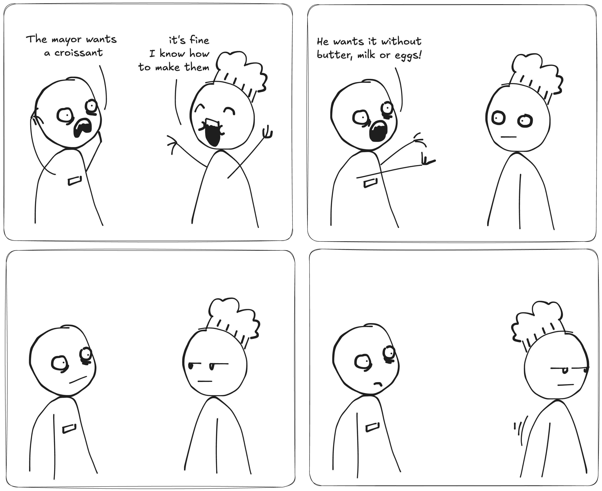
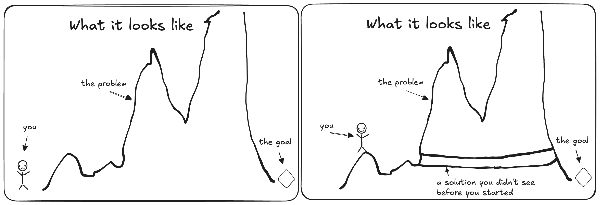
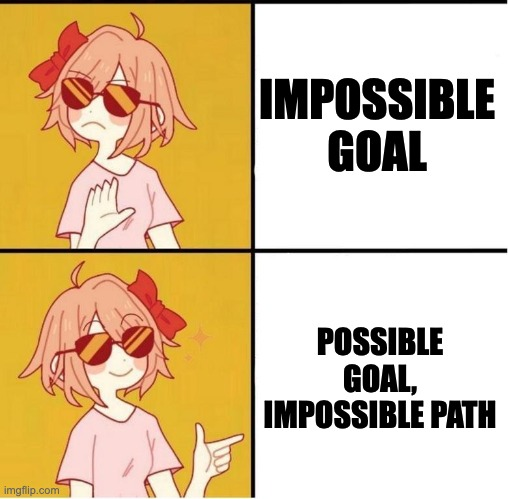

+++
title = 'The Impossible Croissant'
date = 2025-06-08T13:01:00+01:00
lastmod = 2025-06-08T13:01:00+01:00
description = "How to get done with tasks that cannot be done"
draft = false
tags = ["coaching", "project-management", "growth", "learning"]
author = "bjoern"
comment = false
toc = true
image = "cover.webp"
+++

It was an exhausting sunday morning in the imaginary bakery. 
I had just finished another tray of fresh pretzels and was looking forward to a short break and a cold glass of water. Standing so close to the oven for hours always made me appreciate the fresh, cold morning air even more.

However, things didn't go as planned.
A short phone call changed the plans for the day. I don't know who exactly called, but when the manager picked up, his face was speaking volumes. With a heavy sigh he put down the phone, turned over to me and said: 
"Tough luck, the mayor called."

Oh no. 
The mayor was a very nice person - most of the time. The other times he was very unreasonable and acted on impulses. That was usually when we were called.
"What is it this time?", I asked. Deep inside I didn't want to know.
"He wants a french croissant for lunch."

Huh, that was a welcome surprise. A croissant we can do. Not an easy pastry, but we will manage. 
After this small spike of happiness I realized there must be more - the manager would not have made that face about a croissant. There was a catch.

"He wants it without butter, milk and eggs."
There it was. I don't know why, but yet again another impossible task from the mayor. 
We could find a way without the eggs. We could use water instead of milk. The problem was butter. We needed some kind of fat, it is the key for the flaky layers of the croissant. Fuuuuuuuuck! 

Despair doesn't help. Let's get to work.

## That will not work out

Bear with me a little longer - there is a deeper message behind all of this.
But right now I deeply enjoy the story teller mode. So, what happened next?

It is an imaginary bakery after all. 
My plan was straight forward:
1. Replace the "french" from "french croissant" with "french-like"
2. Find alternatives
3. See what hits

The first problem was the request for a french croissant. 
The ingridient list is pretty much fixed for that, but at the same time I was told not to use some of the key ingredients. Soooo... it won't be a true french croissant anyways, why try. Cool, that removed some pressure.

Next was finding replacements - If no butter is allowed, I can use plant-based fat. Instead of milk, some water will work well enough - Yes, it's not the same, but this was fine. The egg was a bit more difficult, but there are alternatives as well. With this, I was able to bake a tasty french-like croissant. 

## From imaginary bakery to real projects

You may not have worked in an imaginary bakery like me (yet). 
But you probably know the situation - A project is given to your team and there is an aspect to it that makes it impossible. Now you need to make it possible.

A first reaction might be to despair. It's normal, I have been there, others have been there. 
I can't count how often I have said a project can't be done myself.
You stand in front of a wall of work that feels insurmountable.

The most important part is to not let that stop you.
In the beginning your information is limited. 
Once you get started, you will reveal new information. 
Some may be bad news, but some might be great news that offers you short-cuts you couldn't see before.

Humans are not very good at estimating the required work for complex tasks. 
But we have 100% accuracy in hindsight - I can tell you exactly how long each of my projects took the moment they were finished. The further you go, the more accurate your idea of what is left to do will become. 

## Impossible ways

The above section suggest that you just need to do it and the impossible task will magically work out.
That's not what is happening - you just discover a new way to reach your goal. You find your alternative to butter.

Every "impossible task" falls into one of two categories:
1. What - The goal is impossible
2. How - The goal itself is fine but the way to get there makes it impossible

Most problems fall into the second category:
- Delivering a feature within an extremely short timeline
- Lossing weight while maintaining the exact same fitness routine and diet
- Creating a mobile app that works on all devices but can only be tested on one phone
- Hosting a dinner party for 20 people with a budget of 5€

The list can easily be extended. 
When talking about these simple examples, the solution is almost jumping out: 
If the given way to reach a goal does not work, you must find another way.
Well, that was easy!

Of course it is not that easy. 
Finding a new way can become an impossible goal in itself, if too many fix points exist.
Especially project management is a classic challenge - there are many things to change to make a delivery happen.
But you don't have "all the money in the world" or unlimited time or an endless stream of smart people to jump in and help.

## Impossible goals

If the solution way cannot be changed in a meaningful way, there is one more thing to re-evaluate: are we solving the right problem?
The "what" is the issue.

I will never be able to flap my arms fast enough to fly. 

I will never be able to read other peoples minds.

I won't be able to build a secure social media platform within 1 week with no support (speaking for myself here, you may be smarter than me).

How to handle that? 
If you really have to make the croissant and the alternative bears personal costs for you, follow up with a "Why".
Why does it need to be that goal? 
Does the definition of the goal already contain a "how"? 

Flapping my arms to fly - sounds like the actual goal is flying, which is very much possible. Why is it fixed on doing it by flapping arms?

Why am I trying to read other peoples minds? Do I want to know how they feel about something or predict their reaction for something? There are other ways to achieve this (like monitoring behaviour) without peeking into their thoughts. 

Why do I have only 1 week to build a social media platform? Does it need to be secure? Would a prototype also work out for now?

This does not make any impossible idea suddenly possible, but it helps building a framework to understand when it is truly not worth to invest effort and when challenging yourself can be success.

> "It always seems impossible until it's done."
>        - Nelson Mandela
