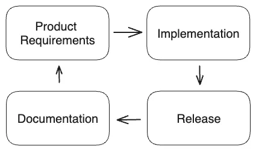
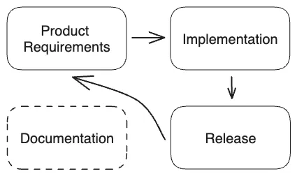
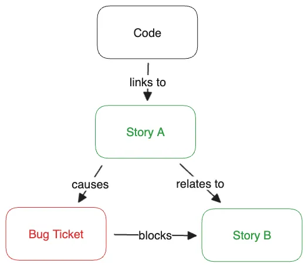

+++
title = 'Making Documentation A Routine'
date = 2023-07-18T10:00:00+01:00
lastmod = 2024-03-09T22:39:23+08:00
description = "Breaking the cycle"
draft = false
tags = ["documentation", "routines"]
# categories = ["docs"]
author = "bjoern"
comment = false
toc = true
image = "frontmatter.webp"
+++

*This article was first published in the [Trade Republic Engineering Blog](https://medium.com/trade-republic-engineering/making-documentation-a-routine-fd8137106d8d)*

[Most engineers agree](https://www.researchgate.net/publication/215566206_Necessary_and_Neglected_An_Empirical_Study_of_Internal_Documentation_in_Agile_Software_Development_Teams) that technical documentation is valuable to their job and that there is too little of it. Yet, we often struggle when it comes to creating documentation for our own work. When under pressure, documentation is moved to the mysterious time frame called “When done with this project and before the next one”.

From there it usually goes to the “Whenever we have time” bucket. After all, we don’t need documentation — the people who build it know how it works. So it ends up not being done at all. This cycle continues, until the engineers who build everything are not available. Suddenly, making changes becomes slow, difficult and the chances of adding bugs increase.

This article will explore how to break this cycle. We aim to lower the bar, to create the best results with least effort. To avoid making this post too long, we will focus on documentation that explains how code meets the business/product requirements. We will not cover automated documentation generation from code, as this is a whole topic on it’s own.

## Understanding The Problem

Product requirements change and when the requirements change, the code changes. It doesn’t make sense to start writing documentation until the implementation is finished. You would spend more time updating it than necessary. You will write the documentation once the release is done before the next project. Promised!

The problem is: after a release is before the next release. New requirements come in and there is no time for documentation. The new requirements would mean changes in the documentation anyways. So you postpone it until the next release is done. Then new requirements come in… wait a second, you don’t write any documentation at all!

One cause for this problem is that documentation does not seem to bring the same value as new features. So it looks like an obvious choice to not allocate any time for it. But does it really have no value?

## The Value Of Documentation

When talking about documentation, most people think of a text that explains how the internal processes of a system work in detail. Maybe some complex flow charts, that are quickly outdated. The truth is so much more: every note, every tutorial, every API description is part of your documentation. And yes, including your code.

This collection of knowledge enables people to understand your system faster, preventing them from introducing bugs. It can be your safety net when you have to defend decisions in front of stakeholders, explaining why you opted for design B instead of A and C. It can help you think about details and edge cases before you even touch the code. You don’t have to spend time explaining others how to achieve a certain task, which means it makes you more productive. It can be your time saver — and saving time means saving money.

Having documentation is amazing. And a fully documented project is better than a project where only the main ideas are described. But having only the main ideas is still way more helpful than having nothing. Let’s aim low! Having a full documentation is a nice goal, but first we need to get started. As most things in life that require work, it is easier to handle it in small chunks instead of a big task every now and then. If you think this sounds a lot like a routine, yes, it does!

## Creating A Routine

Nobody should ask “Will we write documentation for this feature?”. It should be the default to write it. This is why we want to make it a routine — A small process, that we complete on a regular basis, on the same level as having a coffee after lunch. As Arnold Schwarzenegger loves to say, “Don’t think, just do it!”.

The main concepts of turning anything into a routine are:

    Create a supportive environment
    Start small
    Accept failure and learn from it

The following will cover these concepts and give examples for how to apply them.

## 1. Create a supportive environment

You need to create an environment that supports your new routine. You want to set yourself up for success! The better you do this, the easier it becomes to keep your routine going. Imagine you find it hard to drink coffee in the morning, because your mornings are hectic and sometimes you just forget. Finding an empty cup on the table is a great reminder and having the machine set up so that you just need to press a button makes it quick and easy. You want the same for your writing process. Here are a few ideas on what you could do:

### Set a focus time

We need space in our calendars and triggers. This can be done by reminding yourself automatically with an alert or by creating 15 minute blockers in your calendar. Make it small, but often. My personal recommendation is to place it in the morning, before the first meetings have started. Silence your messenger and mail applications. This reduces the risk other other things becoming more important and you skipping your date with documentation.

### Plan your time

Having motivation and time does not mean much if you don’t know what you want to achieve. Every so often, use your focus time to write down what documentation you want to write, what your projects and team still lack. Having this as a list where you can cross off items is helpful, because in your next documentation focus time you don’t need to spend 10 of the 15 minutes thinking about what to do next — you already know what you want to write about.

### Act as a team

This one is hard, but lead by example. If you succeed, it will make it easier for others to follow you. Once they start writing consistently as well, you create a motivational flywheel: Being part of a team that agrees on the importance of documentation and puts work in it can be motivating and help you to keep going when you struggle. You can lift each other up!

## 2. Start Small

Similar to setting up a reinforcing environment, it is easier to begin with small steps than to run right from the start. Since your documentation is a collection of many documents and not just a single big book, it makes sense to think of it in smaller pieces. Every piece that you add to the puzzle makes the picture clearer for others.

The following section will give you some practical tips on how achieve more with less effort.

### Start High Level

We want to keep the effort as low as possible, so we want to write things that change only rarely. The high level description of a feature usually doesn’t change that often, so we advise to start writing your documentation here.

Try to have a single sentence that describes the project/feature. This will let readers know what to expect and if this document is what they should be reading (potentially saving them time). If you made sure that the user stories for your features are well-written, you can just copy-paste parts of them now.

### Be Visual

Screenshots of your project/feature at work can also help others a lot to connect the code, documentation and actual product with each other. The downside is that designs might change, so you have to be aware when that happens and potentially create new screenshots.

Like screenshots, flow diagrams can help a lot. Here we recommend again to make it as high level as possible. Try not to put too much information into a single flow, abstract things if necessary. Sure, the flow that names the methods and message types might be more helpful. But if these change you will have to update the diagram as well.

The last point here pains me to admit, but: don’t use memes. While I am a huge fan and believer in educational memes, a documentation is not the place for them. Making a good educational meme can be very hard. The chances of not helping or, worse, adding confusion are not worth it. So better avoid them — which doesn’t mean you can’t have them. But place them in a separate document.

### Use Support

You don’t have to do all the work yourself. Nobody blame you for using editor apps (like hemingwayapp.com, which was used for this one) to make things more readable. Or running ChatGPT to come up with the basic structure for your documentation (and please, double check the output). Use the tools given to you and ask your peers if they have any recommendations!

Also, there are many nice templates for docs out there to get you started, use these! Having the proper document body can save a lot of time and make it more readable with close to no effort.

If possible with your project and you can invest the time, try to automate things. You have a REST service? Try to get the API documentation via Swagger. There are a lot of resources around automating certain parts of project documentation, check if there is something that is easy to build for your use case.

As a last note on this: if your team gets a newjoiner, make them read the documentation. They are the best test you can get. If they understand what is going on: great. If they don’t: great! Their questions can help you fill the missing spots.

### Document Decisions

Before you actually start working on a project, decisions are made. You might discuss different designs, different patterns and then one of these is selected and implemented. The final code will show only that — What you decided for. But rarely why and what the other options where. Having these decisions documented can help you inform future decisions. At some point you might see a piece of code and ask yourself “Why did we build it that way?”. Having a decision record could show you, that at the time of implementation a certain constraint existed, which might not be the case anymore. Based on that, you can decide on how to proceed.

### Keep it simple

It might seem obvious, but the most important tip: try to keep things as simple as possible. Everything that makes it easier for you to get more done is good. This is not about writing a single perfect document, it is about having a documentation that helps others and is maintainable. Keeping it simple is usually also good for your readers and helps them understand the subject more easily.

That also goes for how you write. If you get more done writing in bullet points, that is fine! Sure it would be nicer looking to have paragraphs, headlines and proper formatting. But if this effort means you don’t do it, we’d rather have unformatted bullet points.

### Copy-Paste from other sources

If “writing” means you just have to copy-paste text from elsewhere, wouldn’t that be great? Most likely you have this text already. The initial starting point of any project are the requirements. Ideally, these are given in the form of stories. A good story explains what needs to be done and why, but not how. This means, even if an implementation detail changes (e.g. you decide to use a different design pattern) the story stays the same.

You have your stories now. Unfortunately that is not enough — If a new engineer joins your team, they will not go through all tickets and stories that have ever been written. Instead, they look at the code and wonder why e.g. you have a specific filter applied a certain line. This is why we need to connect the code with the stories. Ideally, this happens automatically because you add the ticket URL or ID in every commit that you make. Then, they can just open the annotations of the code and find out which ticket caused the last change.

This was easy. Unfortunately, the last ticket might not give the full picture. You also need to make sure that the tickets are linked, to show which story caused the new ticket.

All of this is not straight forward for people who just want to find some simple answers and have to click through several tickets now. But don’t be mistaken — you are giving them the chance to find their answers. This is a huge step compared to having nothing and it comes at a very small cost!

## 3. Accept Failure And Learn From It

Things will not always work out as you imagine. When you see your routine not working, don’t be negative about it. Take a step back and think about why it isn’t working. What can you learn from here, how can you move forward and improve? It is important to not let failure drag you down, but see it as a chance to improve your process.

Learn from others, but always remember: you have to figure out what works for you. There is no One-fits-all for routines. Therefore, you have to try and learn. Maybe writing documentation in the morning does not work for you. Maybe writing text does not spark joy — But creating diagrams does. Maybe writing in a Word document is easier for you than in Markdown. Keep the vision in mind — You want this to become something you do regularly. So it is fine to find your own way, as long as it helps you continuing.

### Do it sooner than later

People forget things. The longer you wait to write something down, the more blurry the facts get. Keeping the tips from section 2 in mind, you don’t need to write down fancy essays. Instead, a collection of bullet points right after a meeting might take 3 minutes, but can save you hours of discussions and misunderstandings later on.

### Nobody Reads It — Why Location Matters

To give a personal example: I had written a (from my perspective) very detailed documentation of one of our services core processes. It had business context, description of the technical process, diagrams… my masterpiece. It was stored in the service repository, so that I could update it when changes happen to the code.

Yet, people kept asking me about this process. Questions, that I thought I had answered in the documentation. It took me a while to realise that nobody was reading it, because people did not find it. If nobody finds the documentation in times of need, it is the same as not having any documentation. Thus I put in some effort to place it in a more obvious location, our Confluence. This also enabled a new audience, our product management and Customer Service, to read it. As the new audience mostly cared about the high level picture anyways, I split the article and moved the details (e.g. API design) back to the repository. Refactoring the whole document took about the same time it took to write it initially, but it was worth it — The questions became noticeably less.

Therefore, as my closing recommendation, try to consider the following things when writing:

- Does your team already have documentation? Place yours there too, try to avoid splitting the documentation across different places. Also, if you can’t find it, but your team tells you there is one, think about moving it altogether. If it is hard to find for you, it is likely hard to find for others as well.
- Who is your audience? Different documentation types might need to go to different places. A high level process documentation could be relevant for non-engineers as well. It might be a good idea to put it to some kind of knowledge base (e.g. Confluence). An API doc is most likely only relevant for other engineers, so it could be placed besides your code.
- Can you reuse patterns? If you know other teams organise their documentation in a specific way (e.g. having a docs/ folder under root), it makes navigation around unknown projects a lot easier. It can also support future automation of tasks. Unless you have good reasons to challenge it, try to stick to that.

## Conclusion

In this article we explored simple tips to get started with documentation or creating them under time pressure. We discussed how we can move the burden of writing from being “the last thing we do” to a something we incorporate when defining requirements. Then we explored different things to keep in mind when writing a doc and how get the most out of your time.

We as Trade Republic believe that documentation is the key to share knowledge and thereby improve quality. We also keep learning — So if you have good tips, please share them with us!

Lastly, to repeat the famous Chinese proverb: “The best time to plant a tree was 20 years ago. The second best time is now.”, so use the energy you have and start typing something right now!

## Related Reads

- [Documentation System](https://documentation.divio.com/)
- [Book Summary — Atomic Habits: Build Good Habits and Break Bad Ones](https://readingraphics.com/book-summary-atomic-habits/)
- [Why programmers don’t write documentation | Kislay Verma](https://kislayverma.com/programming/why-programmers-dont-write-documentation/)
- [Technical Writing | Google for Developers](https://developers.google.com/tech-writing)