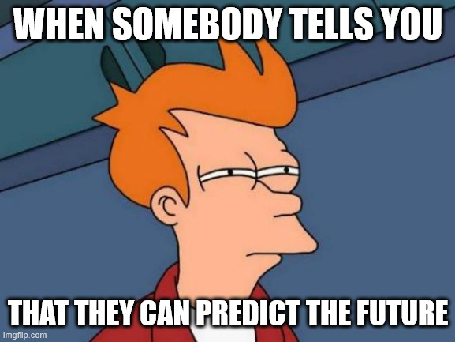
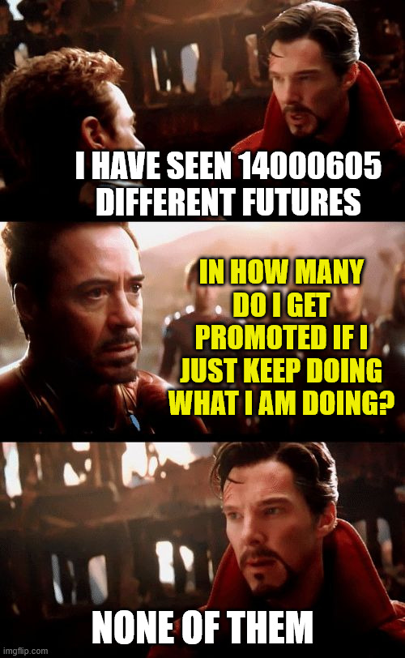
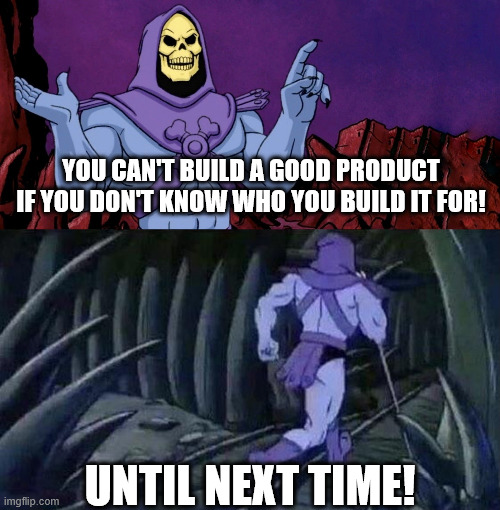
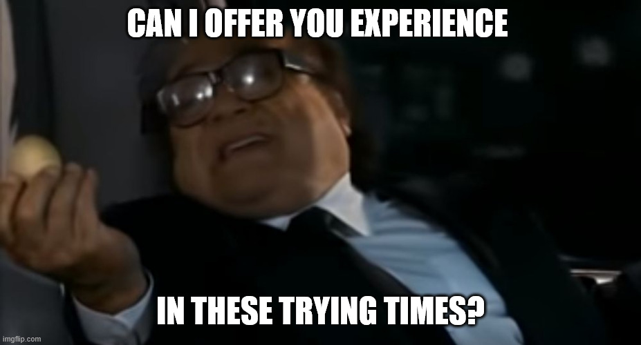

+++
title = 'Predict The Future'
date = 2025-05-29T06:47:00+01:00
lastmod = 2025-05-29T06:47:00+01:00
description = "Why bread looks a bit different every time - Or: Applying data to predict outcomes"
draft = false
tags = ["coaching", "data", "growth", "learning"]
author = "bjoern"
comment = false
toc = true
image = "cover.jpeg"
+++

My latest attempt at cooking failed miserably.
It had too little spice, the texture was off and the ingredients did not come together as I hoped.
I could eat it, but what a disappointment.

This outcome was avoidable. 
If only I had known that the chili peppers did not pack as much punch as I thought!
Or that my stove would not heat up fast enough!
Or that I threw in the vegetables too soon!
Or that I had no salt left (thanks, past me for not refilling)!

If only I had known the future!
Or, to give full disclosure, maybe I was simply lagging preparation and more experience in cooking.

To rephrase what I was missing: I was missing data.

## A slice of data, please

"Data" is a messed up word that can mean something different depending on the context.
In business context we mostly need it to predict the future.
I hope this sentence made you raise an eyebrow! 
Predicting the future, such nonesense... we will get back to that later.
Stay with me for this one, we are "predicting the future".

How many users will use a feature?
How much revenue will we generate?
How many people will our social media campaign reach?

Based on the answers decisions are made.
Should we handle an edge case for the feature before release?
How many people should we dedicate to the project?
Should we built the feature in the first place?

Reasonable questions.
And the answers can have a ton of impact.
Unfortunately it is hard (or even impossible) to give a definitive answer.
If you ask me how many likes this post will get and I answer 516, you instantly know I am lying.
Maybe I will be very lucky and the stars align to make the number happen.
But it is a *guess*, nothing more. 

## Baking Bread

Predicting the future is bogus, let's align on that.
But have you every partially predicted the future? 

I bet you do it a lot, without even noticing.
Partially predicting means you restrict the space of possible outcomes.
Let's take the example of likes for this post.
I don't know how many likes it will get in the first 4 weeks, but looking at previous posts I assume the number to be between 1 and 10. 
Not 100, not 1000. 
Could it happen? In theory, yes. But it won't, I know that and you know it as well.

In other terms: I made assumptions based on experience.

I realised that when I watched my partner bake bread:
If you mess up the basic ingredients and process, the outcome will not be what you hope for.
If you don't give the dough enough time to rise (or too much) you will not get the fluffy texture at the end. 
And, quite obvious, you have no flour, it will not even become bread. 

Let's assume you follow the recipe to the point. 
You do it once, you take a picture of the outcome and now you want the exact same bread again.
You are dealing with natural products. 
Their attributes vary slightly - the same type of flower may have a different grip from one year to the next.
What is the temperature in your kitchen when you made the dough? 
A few degree difference can affect the outcome.

An experienced baker notices these things, that something feels different and might be able to counter them.
How the bread turns out in the end still is a little magic every time.
It's always unique how the crust forms. 
You will create a bread that looks similar to the photo you have, but it will never look exactly the same.

Why is that?
The important part is that we don't have all information present all the time.
If we had, we could treat the process as deterministic.
It is non-deterministic.

That's not bad news!
It also means the more experience, the more previous data we have, the better we can predict the potential outcome.

## How can I use this?
Maybe you are not excited about baking as I am.
That's fine.
How can knowing these things still provide value to you?

The most important lesson is that you need experience.
You can get it by always succeeding, but then you will miss out on data that predicts failure. 
If you miss that data, you might not realize when you steer into that direction again.

To rephrase: whenever you feel like you failed at something, see it as a great opportunity to learn from your failure.
Try to understand all factors that have influenced the outcome.

Are you trying to start a new routine and do training three times a week?
What made you stop last time?
Did you get sick? Or did work take more time than usual? Was the program not really fun?
Was the weather too bad to leave home and go to the gym?
And even more important, what made you come back?
Understanding when you are driving into a similar situation can help your mind set up an alarm 
and prepare counter measures.

The same thing goes for work.
Are you trying to get a promotion, but it fails time and time again?
Have a transparent talk with you manager.
Ask how exactly the evaluation system at your company works.
Who was involved in the decision? 
What were the concerns?
Who was promoted? Why?
Try to have a talk with these people - The more you understand the situation, the easier it is
to know what is expected and how to score better next time.

If you don't know these things, the space of possible outcomes is too big.
You need to understand how you can take action to restrict it towards the desired goal.
In other words - you need to understand the required ingredients and how to handle them.

To take a more concrete example: "be more visible" usually means
"be more visible to the following people:...".
Which is a great point to start from.
Who should have seen your work but didn't?

## Variables

We already covered how cooking and baking are becoming harder to predict 
when you deal with natural ingredients.
They represent the variables.

For most other parts in your life, these variables are other humans.
You cannot control how they will behave, how they will think and decide.
But much like you can influence behaviour during cooking (eg by adding a tiny amount of additional water)
you can influence other people. 
This is no easy task but the better you know them, the more successful you will be.

This is why we have focus group for products - a group of people who we know a little bit more about.
If you know that your next app is providing recipes, you know your focus group are people who cook.
Shocking, I know. 
Knowing this allows you to find some people who fit that focus group and research their needs.
This way you might realize that a screen reader would be very helpful, because they can listen to the steps of the recipe while working with both their hands.
Will this work for all people? 
No. But it increases your chances for the focus group.

If you go for promotion or salary raise, your focus group is much smaller 
and you need much more information.
Does your manager value hands-on work more than leading and delegating?
What about your managers manager? 
What version of yourself do you need to show them?

## Failing means learning

A lot of knowledge exists that can support your goal without you needing to fail first.
We know that a simpler UI will improve UX.
Having a great UX increases your chances of having more active users.

But some questions are so specific to your situation, that you will have no other way than experimenting.
And failing is part of that. 
You can ask the person who was recently promoted what they have done.
Their learnings will help you.
But you cannot replicate the exact same thing, simply because you are not the same person.
And that is fine.

Just make sure to really treat every failure as learning.
If you only treat it as failure, you will likely miss important data 
and have a high chance to repeat the failure.
Do the same for your successes. Celebrate them, but also understand what made you successful.