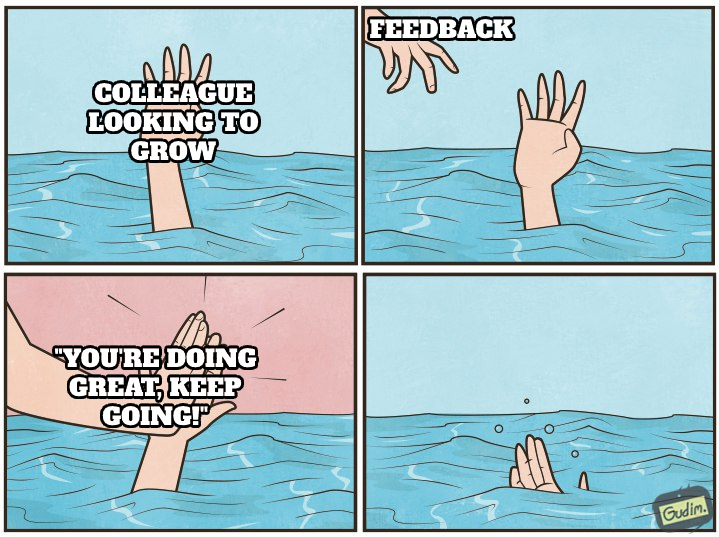

+++
title = 'Preparing Good Feedback - Beyond Theory'
date = 2024-09-21T18:02:00+01:00
lastmod = 2024-09-21T18:02:00+01:00
description = "Turning good into reat feedback to help others grow"
draft = false
tags = ["routines", "feedback", "leadership", "management", "review"]
author = "bjoern"
comment = false
toc = true
image = "cover.jpg"
+++

Receiving great feedback is one of the secrets to fast growth.
A critical look at what you are doing can save years, before you realize improvement opportunities yourself.
If you are lucky enough to realize them.

At a certain point in your career things will change.
So far you have been receiving feedback from others. 
Now you are one of the more senior people and others value your opinion.
They ask for your feedback.
It will start slowly. 
One person asking how you think they did in a project or what they can do to be better next time.
If you are doing well and climb the career ladder, it will become more.
Before you know it, lots of people are requesting your feedback during the company's performance review.

Knowing how much constructive feedback helped you, you want to give them great feedback as well.
So, how do you do that?

## Be Helpful

There are dozens of guides explaining how to give feedback that is helpful.
I will not dive into this topic today, instead I want to focus on the goal.

We want to provide somebody with feedback that helps them.
If you feel like your feedback would not give them new insights, consider not giving it.
A short "You're doing great, keep going" is a waste of your time and theirs.

Which doesn't mean you shouldn't point out good things, but be situational [1].
Have they done well in a certain project? Why?
And even if you think it they did a great job - How could they have leveled up?

On the same note, if you see something that could have been done better, make sure to point it out.
Great feedback tells clearly what to continue doing and what to improve.
Write it in a way that you would be fine to receive the feedback for yourself.

The one message that your feedback must convey: "I want to help you grow, here is how I personally think it could be done".

## Don't improvise

Especially pointing out specific situations in feedback can be hard.
It might have been months later that you are asked to give feedback.
I don't know how good your memory is, but mine is miserable.
But that's fine, this can be solved.

To quote Alexander Graham Bell: "Before anything else, preparation is the key to success".
You can give good feedback on the spot, but it's good - Not great.
Time to take some notes.

Similarly to having a brag bag [2] for yourself, you can start taking notes about the behaviour of your peers.
I have a hard time remembering what I did a month ago, the following things I just saw in my notes have been completely wiped from memory:
- 2024-09-03 Alice asked to be included in meeting X once a week to understand what happens in other teams
- 2024-09-05 Bob communicated very well in incident A2. He was clear on what was going on and answered questions quickly. To improve: announce when the next regular update will happen to manage expectations
- 2024-09-14 Alice has declined several meetings recently, focusing on project X. Decision for which meetings to skip and which to keep is reasonable given the time pressure, good priority management

These are minor things for me, but for Alice and Bob there might be valuable feedback.
And noting it down like this also allows me to point them to specific situations easily, because I have the date (and often the context) noted as well.

## Reduce Friction

Some people struggle with keeping their own brag bag up to date.
The thought of doing something similar for others in parallel sounds stressful.
And I admit, it is.
Often I update my personal review once a week and the feedback notes for others a day after I noticed something.
Sometimes my notes collect dust for 2 weeks.

But here is the thing - It doesn't need to capture everything.
If after 6 months my feedback notes contain two points, because Alice and I didn't work together a lot or because I didn't have time, then so be it.
It's still two notes more than nothing.

My message here is: don't go out of your way to make this happen.
And figure out what works best for you.
You don't need a perfect write up, that you can pull out of a magic hat at any given point in time.
Some people share their brag bag with peers and managers, I don't recommend doing that for these notes.
These notes exist to help you remember situations, they are not for others to understand.
When somebody asks for your feedback, you use them.
Nothing more and nothing less.

Collect them in a way that suits you.
Here are some ideas:
- Write text files (this is what I mostly do)
- write them on sticky notes and collect the sticky notes. Or have a notebook. Harder to organise, but hey, if it works, it works
- Leave voice messages to yourself, i recommend some kind of tagging though so you don't need to listen to 200 messages to find the feedback for a specific person. Speech-to-text tools can also help here
- Make screenshots of conversations
- collect links to code reviews

If you after two months look at your note or a screenshot, thinking "Oh yes, I remember what this is about", you did your job well.

## Be Specific

The best feedback can be given if you know the goals of the person you are giving feedback.
Sometimes this is quite straight forward (e.g. trying to reach the Senior level), sometimes it is more specific (e.g. having a better understanding of product management).

In my experience there are three reasons why you are being asked to give feedback:
1. You are responsible for the performance review evaluation of the person (e.g. because you are their direct manager)
2. You are being asked for your feedback by the persons manager (e.g. for a colleague in your team)
3. The person wants your input directly

In all three cases it is easiest if you know which area you are being asked to focus on.
As manager of Alice, I know she wants to move to the next level in her career, so I take notes of things that are supporting that move and things where she is still lacking.
As a peer in the same team, I pay attention to how Bob supports me, whether his work elevates the team or causes problems for me.
And lastly, if Carla wants my feedback directly, she will tell me why she is asking me specifically (e.g. because she thinks she can level up her way to communicate and thinks I am doing well in this area).

In all cases, I don't need to write notes on every little thing the person does.
I have tried this and it did not work out well - It's annoying and also a poor investment of my time.

This is important if you want feedback from other people - Let them know in advance.
Don't sneak up on them with a "Hey, can you give me feedback" unless it is a request about a specific situation or gives them time.
Things that I have seen working great are for example:
- "Hey, can you give me feedback for how I did stakeholder communication in project X?". If this comes soon after the project has ended, the memory is still fresh. It focuses on a specific thing
- "Hey, we will be working together for the next few weeks. Can I ask you to give me feedback for how I am doing afterwards?". It's asking for general feedback, but it gives a timeline.
- Best of both worlds: "Hey, we will be working together on project X. Can I ask you to take a look at how I manage stakeholder expectations and give me feedback in about 4 weeks?". This is perfect if the project is going for more than 4 weeks - if the other person notices something to improve, you might be able to turn the ship within the project

## Don't Surprise

Let's assume you go through all of this effort and then you are not being asked for your feedback for a person.
What a waste of time.
Good news is you don't need to wait - If you note something down that is actionable for the other person, let them know immediately.
The time for feedback is not only during a performance review.
The sooner feedback for a situation is given, the higher the chances the person can learn from it and correct course when it happens again.

Imagine Alice writes no description in her pull requests, leaving you to guess the context for the change.
Of course you can note that down and tell her in 2 months.
But the better thing is to tell her immediately and note that you told her - Then you can observe whether she is able to improve the situation.
A feedback at a performance review saying "I noticed you don't give context in your PRs and gave you the feedback. Your next PRs all had an insightful description, well done!" sounds great.

Some notes are not good for immediate feedback, for example when you are not even sure there is a situation for feedback.
Sometimes it is better to note down over a few weeks, to see if patterns are visible.
We are all humans and can have good days, but also bad days.
Giving somebody feedback when they just had a very rough day doesn't feel right.
Never forget: you do this to help.
This is what great leaders do.

## Bonus: Uno Reverse

This whole time we focused on helping others.
I also said that you should take care of yourself first, don't collect notes for others at the expense of your own brag bag suffering.
But you can take it a step further - You can help others help you.
The trick is fairly easy - you ask for regular feedback from others on specific situations.
You ask them to send you the feedback in text form (or you write down what they said in meetings).
This becomes your proxy brag bag.
You need to take care of organising the notes so that they are grouped by feedback giver.

Then, when the time for your company's performance review comes, you select peers to give you feedback and you send them the feedback they have given you over the last months!
This makes it super easy for them to recollect their memory, makes giving you feedback more efficient and probably also more fun.
And what is better than happy reviewers?

## Appendix

- [1] [Situation-Behavior-Impact Feedback Model](https://www.uab.edu/humanresources/home/images/LearnDev/PerformanceMgmt/_Tools.Learning.STAFF/Feedback_Model_SBI.pdf)
- [2] [Julia Evans - Get your work recognized: write a brag document](https://jvns.ca/blog/brag-documents/)
