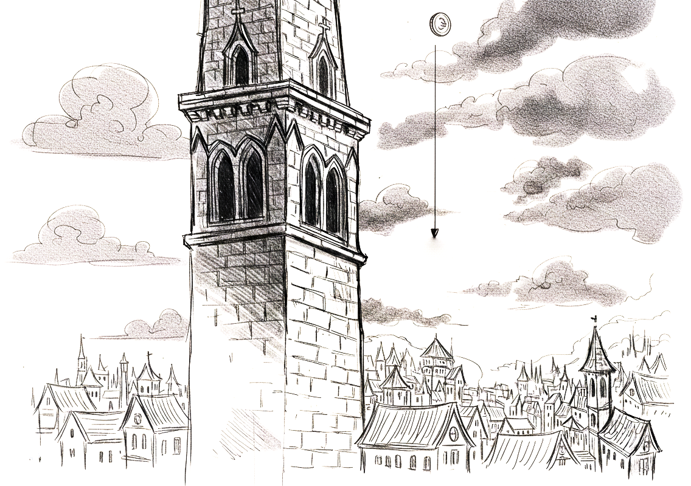
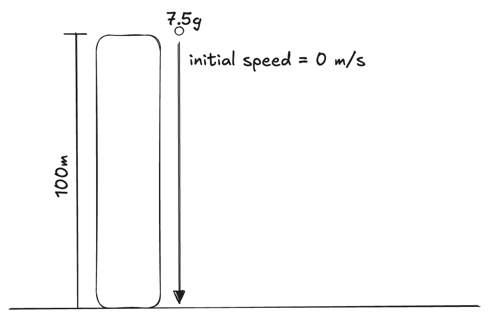
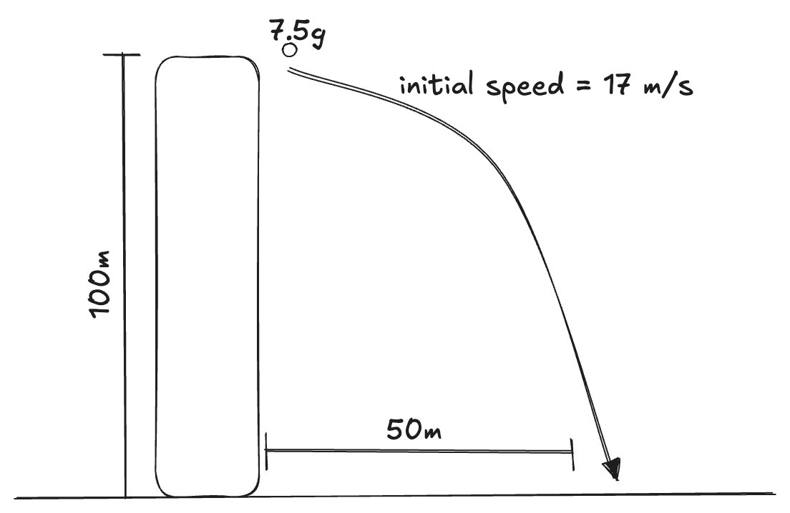
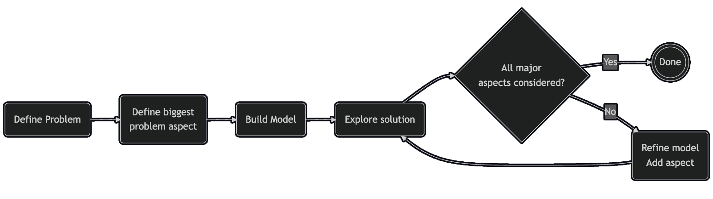

+++
title = 'It Cannot Be That Simple'
date = 2025-11-05T07:00:00+01:00
lastmod = 2025-11-05T07:00:00+01:00
description = "How simplifying a complex problem can avoid overwhelm while still giving impactful results"
draft = false
tags = ["engineering", "problem-solving"]
author = "bjoern"
comment = false
toc = true
image = "cover.png"
+++

Whenever I am facing a complex problem, I go back to the question “What would this look like if it were easy?” (quoting Tim Ferriss).

Not to say that there is an easy solution, but very often I find a simple foundational layer of the solution to build upon. 
It is very much like dealing with problems in physics - You can’t easily map a real-world problem into some numbers and formulas. 

## Throw The Coin

Let's say I want to know how fast a small coin will be when it hits the ground after throwing it from a tower. 

There are so many things you need to know and account for to get the right answer:
- variation in gravity depending on altitude
- direction of the coin when being thrown
- speed of the coin when being thrown
- air resistance, which also depends on humidity
- direction and strength of wind, which may change while the coin is falling
- earth rotation
- exact height of the tower
- temperature
- tumbling of the coin
- electrostatic forces
- ...

Turns out there are a lot of things to consider. 
But what if we can accept not getting the right answer, but an answer very close to it? Then we can start crossing out the effects that are negligible and focus only on the most relevant factors. This is abstracting the actual problem into a simpler problem - a model. 

## Model First, Then Get More Complex

Strip away the noise and focus on the most significant aspect of the problem, the one that is most interesting and challenging. For the coin fall, we focus on the most important aspects: How much will gravitation accelerate the coin until it hits the ground when we drop it? 

Suddenly we need to know a lot less and it becomes fairly easy to get an answer. From here on, we can think about whether the answer is satisfying, or if we want to include more factors. Let's say the next important factor is that we don't drop the coin, but throw it. Now it already has speed when it starts its journey. Next we think about how the coin not being thrown down, but away from the tower influences the outcome.

At some point we will have an answer where all major issues are considered. Yes, it's not the same answer as the real one, but it was a lot easier to get it and it probably solves the problem.

## Translating To Real Problems

What works in physics also often works with real-world problems. 

We abstract to focus on specific parts of a problem and not get overwhelmed by complexity that does not change the outcome.

- Defining user personas to analyze potential of a new product. Every person is an individual, but we can find groups of people that share certain characteristics that are relevant to our assessment
- Risk assessment before a launch. Many things can go wrong, but most of the time it makes more sense to focus on the likely scenarios rather than the rare ones (looking at you, `us-east-1`)
- Incident analysis. While each incident is unique, finding patterns requires analyzing individual events at a higher level of abstraction. 

## Walkthrough: Modeling a Feature Launch Risk

Assume the following scenario: You are launching a new feature. The goal is to reduce unexpected failure during the first launch week to prevent negative social media coverage.

Raw complexity (initial brain dump):
- traffic spikes, cache warm-up behavior, DB connection pool exhaustion
- partial dependency unavailability or even outages
- unexpected user input
- fraud attempts
- regional latency variance
- concurrency edge cases
- unexpected load scenarios overwhelming the service

We can group these risks into three categories;: Capacity, Correctness, Dependencies.

### Step 1 – Simplest model (drop the coin):
Looking at past launches, we assume the biggest problem to be capacity. We don't know how many requests we will actually deal with, but we need to understand where our healthy limits are to keep control (eg by slowing down marketing communication).

Action from this model:
- Run load tests with synthetic peak based on historic data for launches

### Step 2 – Add one factor (throw the coin):
Our next problem is correctness. While we have tested extensively, we are aware that real users often behave in unpredictable ways. 

Action from this model:
- Enable an internal launch and production test, allowing a selective set of users to play around

### Step 3 – Add another factor (throw the coin away):
Add dependencies into the model, split into External (payment, tax, ...) and Internal (transaction history, onboarding, ...).

New action:
- Run load test with dependencies included in the test
- Analyse past data for outages of dependencies
- Circuit breaker thresholds defined

### Step 4 – Add air resistance (only if needed):
Further additions (fraud anomaly modeling, regional latency decomposition) do not change the launch decision this week - and might overcomplicate. Instead, we defer and schedule another post-launch modeling when we have more information. 

### Outcome:
Clear, actionable checklist replacing an overwhelming list of loosely ranked worries.

## Apply This Yourself

1. Write the naive version.
2. Solve it.
3. List excluded factors.
4. Add only the next factor that can change a decision.
5. Stop when additions produce diminishing returns.

Applying this concept transforms an overwhelming problem into a manageable modeling exercise: simplify, validate, refine.

