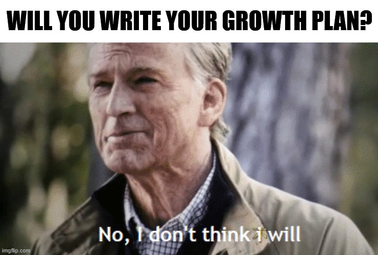
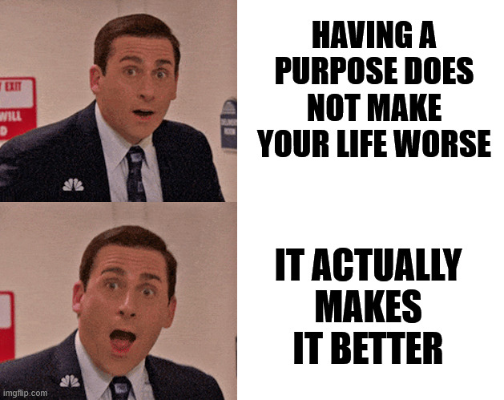

+++
title = 'Life With Purpose'
date = 2025-11-23T22:57:21+02:00
lastmod = 2025-11-23T22:57:21+02:00
description = "Whether having a goals in life is worth the effort of thinking about it - according to science"
draft = false
tags = ["coaching", "growth", "learning"]
author = "bjoern"
comment = false
toc = true
image = "pexels-ron-lach-7944396.jpg"
+++

In a recent coaching session, I asked my coachee if they have a growth plan. The usual answer is along the lines of "No, not yet", acknowledging they should have one but didn't prioritize it yet or don't know where to start.

This one was different. 
The answer was "No and I don't think I need one."

While I argued that it's their life and they should have one, but nobody can force them to create one, it felt shallow. 
The underlying question was simple - Do we actually need growth plans? Do we need always aim for more and never be satisfied? Does it make us better in any way or is it also fine to go with the flow and see where life takes us?

## What is a growth plan?

All questions that go through your mind again and again are worth spending more time on. To answer if we need a growth plan, we first need to understand what a growth plan actually is. 

At a first glance a growth plan is similar to a **Career Development Plan** - a list of steps and milestones to accelerate your professional career. And that can be true, but then you are missing out on a lot of learning opportunities that will help you later (as I've touched before in [this article](https://source.codencake.com/post/growth_vs_career/)).

I am also strong advocate for not seeing yourself only as a professional being, but including your private life. 
Both aspects can influence each other heavily and that needs to be considered. If I want to be present as a father, working 12 hours per day will align with that goal. 

To summarize, a growth plan is a list of goals, milestones and steps that define how I want to live my life over the next years and what I want to achieve. 

Do I need that?

## In for the long run

Of course you don't need that.
There are millions of people who don't need a growth plan, who don't need goals in life. 
You will be fine. 
That's probably not what you expected me to write, heh?

Yes, you would be fine. The real question is - Wouldn't it be better to have one?

If you set goals for your life, you have purpose. 
Is your life better if you have purpose?

Luckily we are not the first one to ask that and scientist have been looking into this question for quite some time.
As often in science, there is no clear "Yes" or "No", but there are strong indicators that living a life with purpose is beneficial for you:
- Having a purpose in life appears reduce mortality risk and can contribute to leading a longer life [1], [2]
- Setting goals in life changes your behaviour from being reactive to proactive - Which can positively impact the amount of promotions and salary increases your will get over your life [3]
- Setting a goal helps you see the bigger picture of your activies - It gives you a "Why", which can lead to increased subjective well-being [4]

The field of goal setting theory is interesting in itself, but it generally backs up what we already assumed - Having purpose in life is likely to be positive for you, especially in the long run.

## A Smart Investment

Given these indicators, all you can lose when thinking about your purpose is time - You will probably not dish out a whole plan in an hour. But you can and should get started (and I wrote about how in [this article](https://source.codencake.com/post/growth-planning/)). 
Because the potential gain might be years of additional lifetime. A smart investment.

## References

- [1] HILL, Patrick L.; TURIANO, Nicholas A. Purpose in life as a predictor of mortality across adulthood. Psychological science, 2014, 25. Jg., Nr. 7, S. 1482-1486.
- [2] BOYLE, Patricia A., et al. Purpose in life is associated with mortality among community-dwelling older persons. Biopsychosocial Science and Medicine, 2009, 71. Jg., Nr. 5, S. 574-579.
- [3] SEIBERT, Scott E.; CRANT, J. Michael; KRAIMER, Maria L. Proactive personality and career success. Journal of applied psychology, 1999, 84. Jg., Nr. 3, S. 416.
- [4] SHELDON, Kennon M.; LYUBOMIRSKY, Sonja. Is it possible to become happier?(And if so, how?). Social and Personality Psychology Compass, 2007, 1. Jg., Nr. 1, S. 129-145.