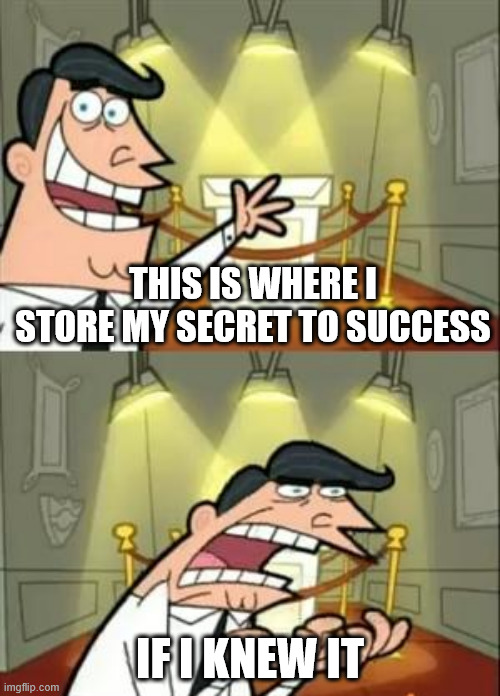
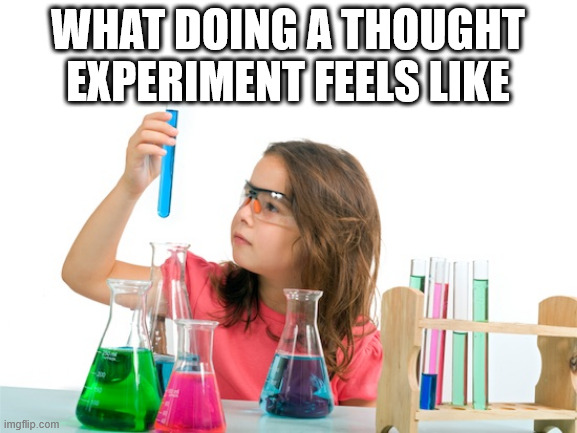
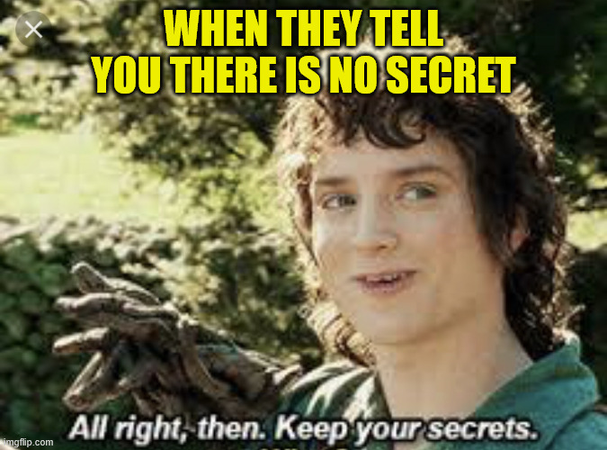

+++
title = 'Secret Success Sauce'
date = 2025-05-11T06:00:00+00:00
lastmod = 2025-05-11T06:00:00+00:00
description = "Can you advance your career with a single secret that succeassful people don't share?"
draft = false
tags = ["coaching", "growth", "career", "philosophy"]
author = "bjoern"
comment = false
toc = true
image = "cover.jpeg"
+++

Alex was working hard.
Working longer hours, putting in more effort every day than others.
Yet, when the time for promotion came, Alex was not the obvious choice.
Because Alex was missing something.
Something critical.

Why some people are more successful than others?
Because they know the secret success sauce. 
And today you will learn it as well - the one recipe, the one trick that makes everything possible.
The single thing that Alex was missing.

## Reality Check

I hope I triggered two things in your - curiosity and doubt. 
If you are not sceptical, let me tell you: you should be. 

There is no such thing are a single secret that unlocks everything for you. 
That is the sad reality.
Booh, reality sucks!
I agree, so we will ignore reality for a moment.
Let's entertain the thought and dive into a world that is the same as ours - With one key difference.
The secret success sauce exists. 

In this thought experiment we assume that you are successful if you know a specific thing. 
To make it simpler, we assume this knowledge is a recipe. 
You can be successful in life without knowing the recipe.
But you will hit a limit eventually and the only way to break through is the recipe. 
No matter how skilled or hard working you are, you NEED to know it.

If we assume that this is true, then that means every person that is successful knows the secret recipe.
If everybody knew it, everybody would be successful. 
This let's use conclude two different things:
1. Not everybody knows the secret
2. Not everybody wants to be successful

Why would somebody choose not to be successful?
Doesn't sound reasonable, so let's throw this thought away and follow the first one - Not everybody knows. 
Since the successful people are not always the same, this means new people learn the secret. 
So either they are told, or they figure it out on their own.

Either way, there must be a reason why the secret is a secret. 
If people learn the secret on their own, why would they decide not to share their findings?
If somebody told them the secret, there must be rules on how to share it to avoid making it public.

Could this be true? 
Secret rules defining how the secret sauce recipe is shared? 
And every single person who knows the secret follows these rules?
In a world where wearing masks was too hard? 
Where following the speed limit is not acceptable?

I find that extremely hard to believe. 
Even if you argue that this is different, because oversharing would reduce the success for everybody.
Yes, people are very egoistical.
Yet, then they would not share the secret at all. 

There is more.
I did not name it explicitly, but there was a lie in the text above. 
I said the world of the thought experiment only differs in one aspect from our world.
But there is another implicit assumption that I have made - That the definition of "success" is the same for everybody. 
In reality, this is not true - even if you narrow it down to a professional field (like software engineering) or even a field in the same company. 
Even if you say advancing your career and getting new titles is the definition of success.
Who is more successful - The engineer that becomes a senior engineering manager, or the engineer that becomes a senior staff engineer? 
Both are valid paths and can be considered successful. 

## The True Secret Sauce Recipe

The deeper I wander into the thought experiment, the more conflicts appear.
There is no such thing are a single secret that unlocks everything for you. 
Or rather - There is no such thing as a shared secret that all successful people keep from you. 
We are talking about life and for all I have learned in the last decades on this earth, life is freaking complex.

One theme that constantly appears in my other articles: every person is different. 
I truly believe that. 
This also means that the "secret to unlock your career" is different for every person - Because your goals differ, your situations differ. 

What's more, not only are you different from any other person - You are also different from your past and future self.
Today you may need tip A to advance, next year you need a different tip because you have changed. 

## Behind the Recipe

Cool. 
Little bit weird, but cool. 
What is the message? 

That there is no single thing to push you is not bad news.
It's the opposite - It means there are many things at any given stage of your life that you can learn and that will help you become a better version of yourself.

You need to be open for them.
When things don't go your way, don't narrow your focus on single things.
Keep an eye on the bigger picture and understand that you are not playing a video game, where boosting a single skill will help you beat an enemy. 
Your secret sauce is a mash-up of many things. 
And it evolves - So you should keep challenging and evolving yourself as well. 
You will fail at some things, at others you will succeed.

PS: This is explicitly not a secret sauce.

