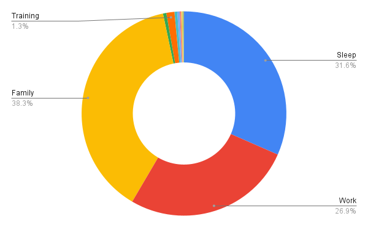

+++
title = 'Succeed At Personal Priorities'
date = 2024-06-16T11:00:00+01:00
lastmod = 2024-06-16T11:00:00+01:00
description = "Spending Time Where It Matters To You"
draft = false
tags = ["routines", "priorities", "balance"]
author = "bjoern"
comment = false
toc = true
image = "cover.webp"
+++

I have a habit of tracking time for many things I do - work, sleep, how much I read or train, ... 
Initially this was out of curiosity. How much time do I spend on which activities? Does that change when my life changes?
During stressful projects my sleep duration declined, but time spent reading books increased.
When I became a father, there was a notable dip in time I spent training or playing video games.
As my child grew older, time spent for training was rising again. 

There have been many moments when I was thinking about whether I should do a workout or show my Nintendo Switch some love again.
What I then did was check how much time I already invested in training this week, decided it was not enough and went for the workout.
Yet, it took me over two years to realize what I was actually doing - I was tracking how I live my priorities. 
In our professional lives, we are constantly tasked with choosing what to work on. This is decided by asking a simple question: What is more important? 

In this article I will discuss how this question can also help you feel more balanced, being happier with yourself and your decisions, by setting priorities in your personal life.

## Why are priorities important?

Knowing your priorities is a powerful tool.
It allows you to answer the difficult question "Do I have time for that?".
It is hopefully not a surprise, but your day has exactly 24 hours (let's not discuss whether this is [scientifically correct](https://bigthink.com/starts-with-a-bang/day-isnt-24-hours/) here). Not only your day, every person's day has the same length. 
You want to make these 24 hours valuable.
You want to feel productive, spending time on things that are important to you.

It may not sound like a big thing, but nowadays everybody is constantly fighting for your attention.
The average time spent on social networks is [over 2 hours per day](https://www.statista.com/statistics/433871/daily-social-media-usage-worldwide/). 
Whether this is time well spent depends on your priorities and what you gain from it.
But you should be aware and make a conscious choice.

My moment of awareness came after several months during which I had been unhappy with myself.
I was behind a lot of my personal goals and tasks and it stressed me. 
Yet it was hard to do something about it, I just didn't have enough time. 
Or did I?

When it is hard to recognize an issue yourself, others can help. 
In my case, a friend asked: "Well, what do you do with your time?".
I realized that my nights were often spent lying on the couch, going through different apps on my phone. 
My average screen time per week was between 3 and 4 hours per day. 
This was shocking to me, because not only did I spend a lot of time looking at my screen, I also did not really enjoy it. My screen time needed to go down.
It will never be zero, I know. Too many things about my phone are helpful in my daily life. 
But not all of them - browsing Reddit kept me up to date, but when I am honest with myself, the threads on the popular page contained so much news that made me sad, mad or both. 

And ultimately, knowing the most recent news is not really important. Social media is not a priority for me.

## What are my priorities?

To figure out what matters to me I followed three steps:
1. Think about what is important to you
2. Check how you currently spend your time
3. Think about the differences between these two

### What is important to me?

There is no single list of things important for all people. Every person lives a different life and can have different priorities. To find out what matters to you, you can see what others list. But use it as inspiration, not as a template. 
Be honest. You are doing this for yourself and you don't need to defend your choice. Still, it can be helpful to have an imaginary conversation and ask yourself why an item is important for you. If you have no answer, then maybe it isn't.

When I started, my personal (unordered) list of important things looked like this:
- family 
- sleep
- video games
- work
- movies
- training
- good food
- reading
- friends
- pen & paper games
- podcasting

There is no golden rule, but I advise you to focus on the 10 most important things (as you can see I picked 11 things).
The next step was to bring order to the list.
Comparing each item with the other items - What is more important to me? What is less important?
My ordered list looked like the following: 

1. family
2. friends
3. work
4. training
5. sleep
6. pen & paper games
7. reading
8. podcasting
9. good food
10. video games
11. Movies

### How do I currently spend my time?

Having a list of priorities is nice, but not worth much if you don't follow it. 
When I looked at the list, I knew that it was too long for my current lifestyle - which leads to frustration, because I feel like I am leaving things behind.
What my list needed was a check-in with reality.

Now my tracked data came in handy. Just going by how much time I allocate for each item on an average (taking all times for a month and then averaging it per day):

1. Family - ~8:30h
2. Sleep - 7:01h
3. Work - 5:58h (keep in mind that this includes Saturday and Sunday)
4. Training - 17min
5. Pen & Paper Games - 7min
6. Podcasting - 6min
7. Good food - ~5mim
8. Friends - ~3min
9. Movies < 3min
10. Reading < 2min
11. Video Games < 1min

What was not unexpected, but still a little shocking to see in numbers was how big the difference between the top 3 and everything else is. Also, how little time I dedicated to connecting with my friends.

Also a small disclaimer here, I don't actually track time I spend with friends and family, but it was fairly easy to get numbers that are close to reality from my calendar and phone data. Scaring how easy gathering data for yourself can be. 

### Goal Versus Reality

My goal list and my list for how I spent time differed a lot. 
And I think it makes sense, because priorities are there not to say how much time you will spend on something.
They exist to make decisions easier. 

I asked myself for each item in my goal priority list why it is there. I realized that video games ended up here because they have been a high priority in my early life and are part of my identity. Same for movies.
But they were not a priority - at least not at that moment. That's why I spent so little time for them. Which also means it makes no sense to have them in the list. 

I would also have liked to keep good food in there, because I really like it. But I rarely cook - my partner is mainly cooking and I like to help. And when I help, it is not really about cooking, it is about spending time together, talking. Being honest with myself, this item did not have an individual spot in the list.
My partner's list would look very different for this point.

I have noticed for a few other topics how they are not isolated, but influence each other. When I play Pen & Paper games, I do it with friends. When I invest time in sleeping or training, it means I am less stressed during the day, which benefits both work and family. 

Taking all these thoughts together, I created the following list:

1. Family
2. Sleep
3. Friends
4. Work
5. Training
6. Pen & Paper Games
7. Reading

Since I have set these priorities for myself and wrote them down, a lot of things have been easier. Yes, work and sleep are still by far the most time-consuming activities. But I am more conscious about them.
I take my lunch breaks more seriously, often to train during that time. I go to bed a little earlier.
I canceled a few meetings and took an early afternoon off to spend a weekend with my friends. I moved a Pen & Paper evening session to go to a team event. On another occasion I did the opposite, because I hadn't played for quite some time. 

## Be open to change

These "life priorities" are different from most work priorities. 
Work priorities are often tied to projects, which usually have a deadline. 
Life priorities don't have deadlines, which also means you cannot push everything for one priority now and give time to the others later. This is why balancing priorities matters. 
Sometimes it makes sense to decide for a lower-priority topic. 
Otherwise you would not do it at all. 
But in the long run you will more often decide in favour of higher priorities than the lowers. 
Keep in mind that all the items in your list are there, because they matter to you. Things that you can drop (for me videogames) are not on that list in the first place. Which doesn't mean you cannot do them from time to time. I like to watch a movie or binge-watch a series every now and then, but it is very different from a few years ago where I tried to watch the new releases as soon as possible. 

This already indicates another important thing: Your priorities will change. 
They are not set in stone and as soon as you feel like they force you to do things you don't want to do, it is time to rethink them. Your life changes - Moving into a new city, getting a new job, finding a new hobby, all these things can change your priorities. 

## Conclusion

Setting priorities was hard for me. 
It took me quite some time to be honest with myself about what I want and accepting that things have changed.
Since then, they helped my mental peace a lot knowing that I don't need to feel bad about NOT doing something in favour of something else. And that I am fine even when I don't do some things at all. 

Always remember that your priorities are yours alone. They exist as a tool to help you make decisions, not to restrict you.